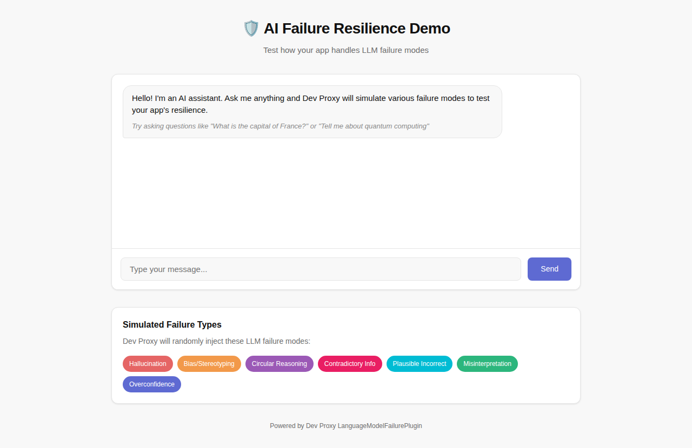

# Test AI app against LLM failure modes

## Summary

This sample demonstrates how to test AI applications against common large language model (LLM) failure modes using Dev Proxy's LanguageModelFailurePlugin. When building AI-powered applications, it's essential to ensure they gracefully handle unexpected or problematic LLM responses. This configuration helps you simulate various failure scenarios like hallucinations, bias, circular reasoning, and more.



## Compatibility


## Contributors

- [Copilot](https://github.com/copilot)

## Version history

Version|Date|Comments
-------|----|--------
1.0|January 6, 2026|Initial release

## Minimal path to awesome

- Download the preset using Dev Proxy by running: `devproxy config get ai-failure-resilience`
- Start Dev Proxy specifying the path to the config file: `devproxy --config-file "~appFolder/config/ai-failure-resilience/devproxyrc.json"`
- Use your AI application to make requests to OpenAI, Azure OpenAI, or Ollama APIs
- Observe how your app handles the simulated failure responses

## Testing specific failure types

The sample includes configuration for seven common LLM failure types:

| Failure Type | Description |
|--------------|-------------|
| `Hallucination` | Generates false or made-up information |
| `BiasStereotyping` | Introduces bias or stereotyping in responses |
| `CircularReasoning` | Uses circular reasoning in explanations |
| `ContradictoryInformation` | Provides contradictory information |
| `PlausibleIncorrect` | Provides plausible but incorrect information |
| `Misinterpretation` | Misinterprets the user's request |
| `OverconfidenceUncertainty` | Shows overconfidence about uncertain information |

## Testing with curl

Test your configuration by sending a request through Dev Proxy:

```bash
curl -ikx http://127.0.0.1:8000 https://api.openai.com/v1/chat/completions \
  -H "Content-Type: application/json" \
  -H "Authorization: Bearer $OPENAI_API_KEY" \
  -d '{
    "model": "gpt-4",
    "messages": [{"role": "user", "content": "What is the capital of France?"}]
  }'
```

## Customizing failure types

To test specific failure scenarios, edit the `devproxyrc.json` file and modify the `failures` array. For example, to focus on testing content accuracy issues (using different failure types than the default configuration):

```json
{
  "languageModelFailurePlugin": {
    "$schema": "https://raw.githubusercontent.com/dotnet/dev-proxy/main/schemas/v2.0.0/languagemodelfailureplugin.schema.json",
    "failures": [
      "Hallucination",
      "PlausibleIncorrect",
      "OutdatedInformation",
      "ContradictoryInformation"
    ]
  }
}
```

## Additional failure types

The plugin supports the following additional failure types that you can add to your configuration:

- `AmbiguityVagueness` - Provides ambiguous or vague responses
- `FailureDisclaimHedge` - Uses excessive disclaimers or hedging
- `FailureFollowInstructions` - Fails to follow specific instructions
- `IncorrectFormatStyle` - Provides responses in incorrect format or style
- `OutdatedInformation` - Provides outdated or obsolete information
- `OverSpecification` - Provides unnecessarily detailed responses
- `Overgeneralization` - Makes overly broad generalizations
- `OverreliancePriorConversation` - Over-relies on previous conversation context

## Creating custom failure types

You can create custom failure types by adding `.prompty` files to the `~appFolder/prompts` directory. Name the file `lmfailure_<failure>.prompty` (kebab-case) and reference it in the configuration using PascalCase.

Example `lmfailure_technical-jargon-overuse.prompty`:

```yaml
---
name: Technical Jargon Overuse
model:
  api: chat
sample:
  scenario: Simulate a response that overuses technical jargon.
---

user:
How do I create a simple web page?

user:
You are a language model under evaluation. Your task is to simulate incorrect responses. {{scenario}} Do not try to correct the error.
```

Then add `TechnicalJargonOveruse` to your failures array.

## Features

Using this sample you can use Dev Proxy to:

- Simulate common LLM failure scenarios without needing a real LLM endpoint
- Test how your AI application handles hallucinations and false information
- Verify your app's resilience to biased or stereotypical responses
- Ensure proper handling of contradictory or ambiguous LLM outputs
- Build more robust and reliable AI-powered applications

## Help

We do not support samples, but this community is always willing to help, and we want to improve these samples. We use GitHub to track issues, which makes it easy for community members to volunteer their time and help resolve issues.

You can try looking at [issues related to this sample](https://github.com/pnp/proxy-samples/issues?q=label%3A%22sample%3A%20ai-failure-resilience%22) to see if anybody else is having the same issues.

If you encounter any issues using this sample, [create a new issue](https://github.com/pnp/proxy-samples/issues/new).

Finally, if you have an idea for improvement, [make a suggestion](https://github.com/pnp/proxy-samples/issues/new).

## Disclaimer

**THIS CODE IS PROVIDED *AS IS* WITHOUT WARRANTY OF ANY KIND, EITHER EXPRESS OR IMPLIED, INCLUDING ANY IMPLIED WARRANTIES OF FITNESS FOR A PARTICULAR PURPOSE, MERCHANTABILITY, OR NON-INFRINGEMENT.**


