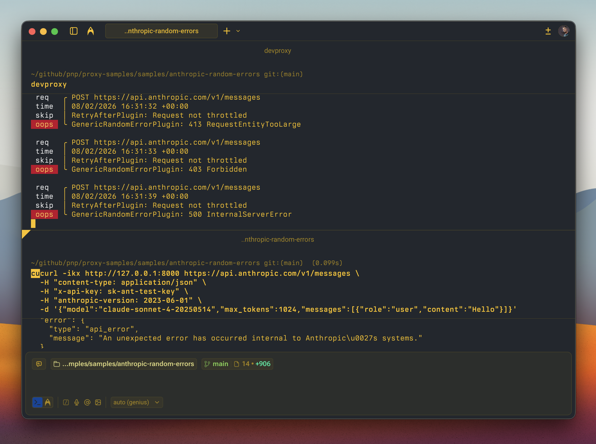

# Simulate random errors on the Anthropic Claude API

## Summary

This sample contains a preset and error responses to simulate random API errors on the Anthropic Claude API.

When building apps that integrate with the Claude API, it's important to verify that your app gracefully handles the full range of errors that the API can return. Using this preset you can simulate random errors from the Anthropic Claude API and see how your app handles them.



## Compatibility


## Contributors

- [Waldek Mastykarz](https://github.com/waldekmastykarz)

## Version history

Version|Date|Comments
-------|----|--------
1.2|March 26, 2026|Updated to Dev Proxy v2.3.0
1.1|March 11, 2026|Updated to Dev Proxy v2.2.0
1.0|February 8, 2026|Initial release

## Minimal path to awesome

- Get the sample:
  - Download just this sample:

      ```bash
      npx gitload-cli https://github.com/pnp/proxy-samples/tree/main/samples/anthropic-random-errors
      ```

    or

  - [Download as a .ZIP file](https://pnp.github.io/download-partial/?url=https://github.com/pnp/proxy-samples/tree/main/samples/anthropic-random-errors) and unzip it, or
  - Clone this repository
- Start Dev Proxy by running `devproxy`
- Test with: `curl -ikx http://127.0.0.1:8000 https://api.anthropic.com/v1/messages -d '{"model":"claude-sonnet-4-20250514","max_tokens":1024,"messages":[{"role":"user","content":"Hello"}]}' -H "content-type: application/json" -H "x-api-key: sk-ant-test" -H "anthropic-version: 2023-06-01"`

## Features

This preset includes all documented Anthropic Claude API error types:

- **400 Invalid Request** — malformed request body or parameters
- **401 Authentication Error** — invalid or missing API key
- **403 Permission Error** — API key lacks permission for the resource
- **404 Not Found** — requested resource doesn't exist
- **413 Request Too Large** — request exceeds the 32 MB size limit
- **429 Rate Limit** — rate limit exceeded, includes dynamic Retry-After header
- **500 API Error** — unexpected internal server error
- **529 Overloaded** — API temporarily overloaded, includes dynamic Retry-After header

The proxy randomly fails 50% of intercepted requests with one of these errors. You can adjust the failure rate by changing the `rate` property in the [.devproxy/devproxyrc.json](.devproxy/devproxyrc.json) file.

All error responses follow Anthropic's documented error shape (`type`, `error.type`, `error.message`, `request_id`). The 429 and 529 responses include a dynamic `Retry-After` header, which combined with the `RetryAfterPlugin`, lets you verify that your app correctly waits before retrying.

## Help

We do not support samples, but this community is always willing to help, and we want to improve these samples. We use GitHub to track issues, which makes it easy for  community members to volunteer their time and help resolve issues.

You can try looking at [issues related to this sample](https://github.com/pnp/proxy-samples/issues?q=label%3A%22sample%3A%20anthropic-random-errors%22) to see if anybody else is having the same issues.

If you encounter any issues using this sample, [create a new issue](https://github.com/pnp/proxy-samples/issues/new).

Finally, if you have an idea for improvement, [make a suggestion](https://github.com/pnp/proxy-samples/issues/new).

## Disclaimer

**THIS CODE IS PROVIDED *AS IS* WITHOUT WARRANTY OF ANY KIND, EITHER EXPRESS OR IMPLIED, INCLUDING ANY IMPLIED WARRANTIES OF FITNESS FOR A PARTICULAR PURPOSE, MERCHANTABILITY, OR NON-INFRINGEMENT.**


