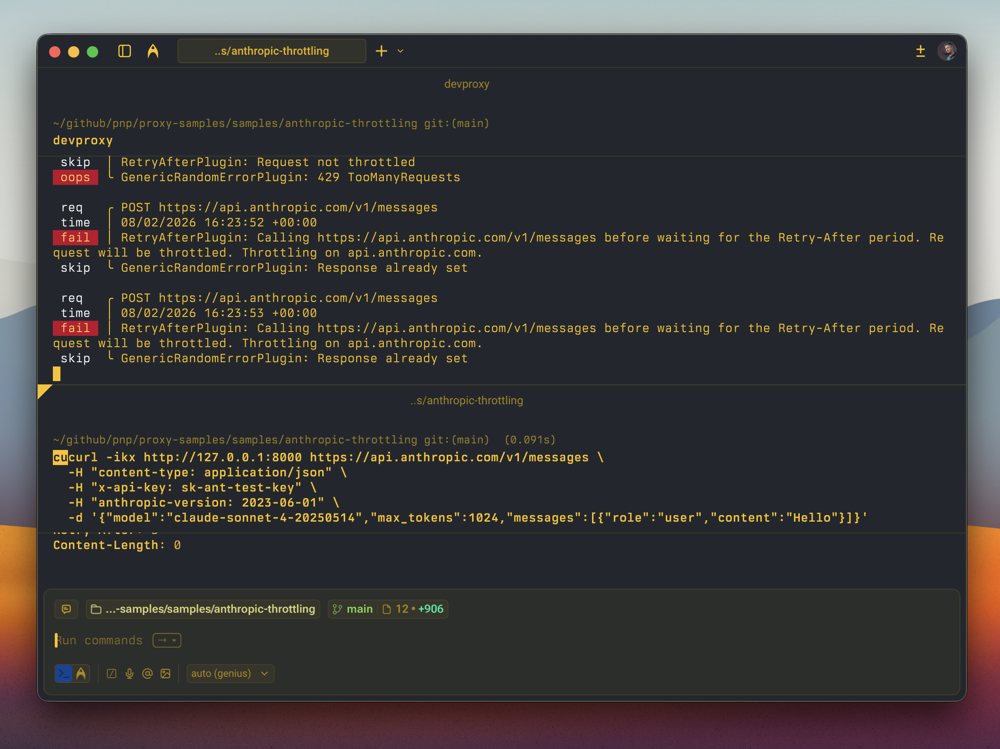

# Simulate throttling of the Anthropic Claude API

## Summary

This sample contains a preset and error responses to simulate the throttling of the Anthropic Claude API.

As more and more applications use the Claude API for AI-powered features, it's important that developers can verify that their apps properly handle cases when the API is throttled. Especially when the app is on a lower usage tier, throttling is more likely to happen so validating the app's behavior is crucial to ensure great user experience.

Using this preset you can simulate throttling of the Anthropic Claude API and see how your app will handle it.



## Compatibility


## Contributors

- [Waldek Mastykarz](https://github.com/waldekmastykarz)

## Version history

Version|Date|Comments
-------|----|--------
1.1|March 11, 2026|Updated to Dev Proxy v2.2.0
1.0|February 8, 2026|Initial release

## Minimal path to awesome

- Get the sample:
  - Download just this sample:

      ```bash
      npx gitload-cli https://github.com/pnp/proxy-samples/tree/main/samples/anthropic-throttling
      ```

    or

  - [Download as a .ZIP file](https://pnp.github.io/download-partial/?url=https://github.com/pnp/proxy-samples/tree/main/samples/anthropic-throttling) and unzip it, or
  - Clone this repository
- Start Dev Proxy by running `devproxy`
- Test with: `curl -ikx http://127.0.0.1:8000 https://api.anthropic.com/v1/messages`

## Features

This preset includes configuration for simulating 5 different throttling scenarios:

- **Requests per minute exceeded** (429) — the organization has exceeded the maximum number of requests per minute
- **Input tokens per minute exceeded** (429) — the request is rejected because the input token rate limit has been reached
- **Output tokens per minute exceeded** (429) — the request is rejected because the output token rate limit has been reached
- **Acceleration limit** (429) — the organization has a sharp increase in usage, includes a dynamic Retry-After header
- **API overloaded** (529) — Anthropic's API is temporarily overloaded, includes a dynamic Retry-After header

The proxy simulates throttling using one of these modes at random. Two of the scenarios include a dynamic `Retry-After` header, which combined with the `RetryAfterPlugin`, lets you verify that your app correctly waits before retrying requests.

The error responses follow Anthropic's error shape (`type`, `error.type`, `error.message`) and include realistic `anthropic-ratelimit-*` headers where applicable.

## Help

We do not support samples, but this community is always willing to help, and we want to improve these samples. We use GitHub to track issues, which makes it easy for  community members to volunteer their time and help resolve issues.

You can try looking at [issues related to this sample](https://github.com/pnp/proxy-samples/issues?q=label%3A%22sample%3A%20anthropic-throttling%22) to see if anybody else is having the same issues.

If you encounter any issues using this sample, [create a new issue](https://github.com/pnp/proxy-samples/issues/new).

Finally, if you have an idea for improvement, [make a suggestion](https://github.com/pnp/proxy-samples/issues/new).

## Disclaimer

**THIS CODE IS PROVIDED *AS IS* WITHOUT WARRANTY OF ANY KIND, EITHER EXPRESS OR IMPLIED, INCLUDING ANY IMPLIED WARRANTIES OF FITNESS FOR A PARTICULAR PURPOSE, MERCHANTABILITY, OR NON-INFRINGEMENT.**


