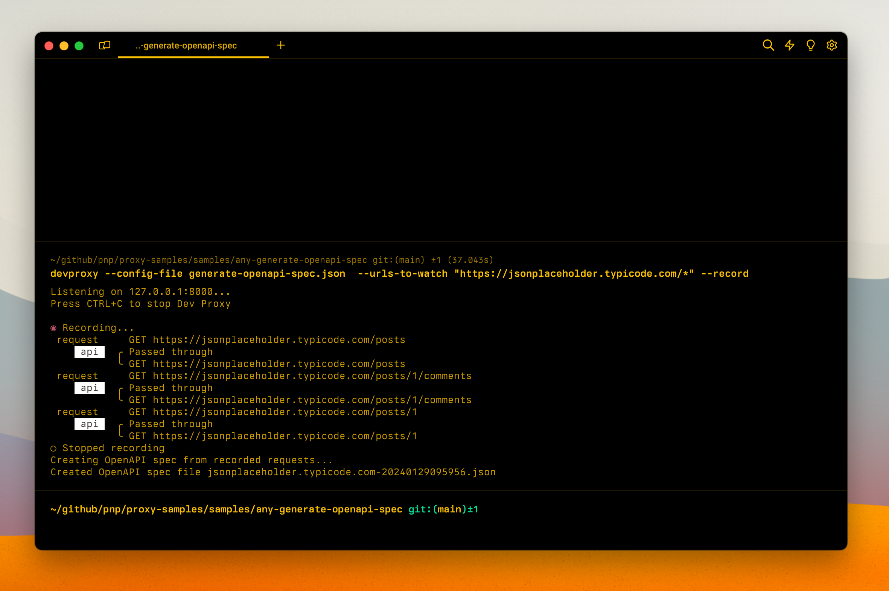

# Generate an OpenAPI spec for any API

## Summary

This sample contains a preset that allows you to generate an OpenAPI spec for any API. By specifying the URLs of the API for which you want to generate an OpenAPI spec, Dev Proxy will intercept all requests to that API and generate an OpenAPI spec based on the requests and responses.

## Compatibility

## Contributors

- [Waldek Mastykarz](https://github.com/waldekmastykarz)
- [Garry Trinder](https://github.com/garrytrinder)

## Version history

Version|Date|Comments
-------|----|--------
1.0|January 29, 2024|Initial release

## Minimal path to awesome

- Clone this repository (or [download this solution as a .ZIP file](https://pnp.github.io/download-partial/?url=https://github.com/pnp/proxy-samples/tree/main/samples/any-generate-openapi-spec) then unzip it)
- Start Dev Proxy specifying the path to the config file and the URL of the API for which you want to generate an OpenAPI spec, eg. `devproxy --config-file generate-openapi-spec.json --urls-to-watch "https://api.contoso.com/*" --record`
- Use your application to issue API requests
- Stop Dev Proxy
- Open the generated OpenAPI spec in the current working folder

## Features

This is a generic preset for generating OpenAPI specs for any API. The preset doesn't contain a URL and requires you to specify the URL using the `--urls-to-watch, -u` option.

For more information about the configuration options, see the [documentation of the OpenApiSpecGenerator](https://learn.microsoft.com/microsoft-cloud/dev/dev-proxy/technical-reference/openapispecgeneratorplugin).

## Help

We do not support samples, but this community is always willing to help, and we want to improve these samples. We use GitHub to track issues, which makes it easy for  community members to volunteer their time and help resolve issues.

You can try looking at [issues related to this sample](https://github.com/pnp/proxy-samples/issues?q=label%3A%22sample%3A%any-generate-openapi-spec%22) to see if anybody else is having the same issues.

If you encounter any issues using this sample, [create a new issue](https://github.com/pnp/proxy-samples/issues/new).

Finally, if you have an idea for improvement, [make a suggestion](https://github.com/pnp/proxy-samples/issues/new).

## Disclaimer

**THIS CODE IS PROVIDED *AS IS* WITHOUT WARRANTY OF ANY KIND, EITHER EXPRESS OR IMPLIED, INCLUDING ANY IMPLIED WARRANTIES OF FITNESS FOR A PARTICULAR PURPOSE, MERCHANTABILITY, OR NON-INFRINGEMENT.**

