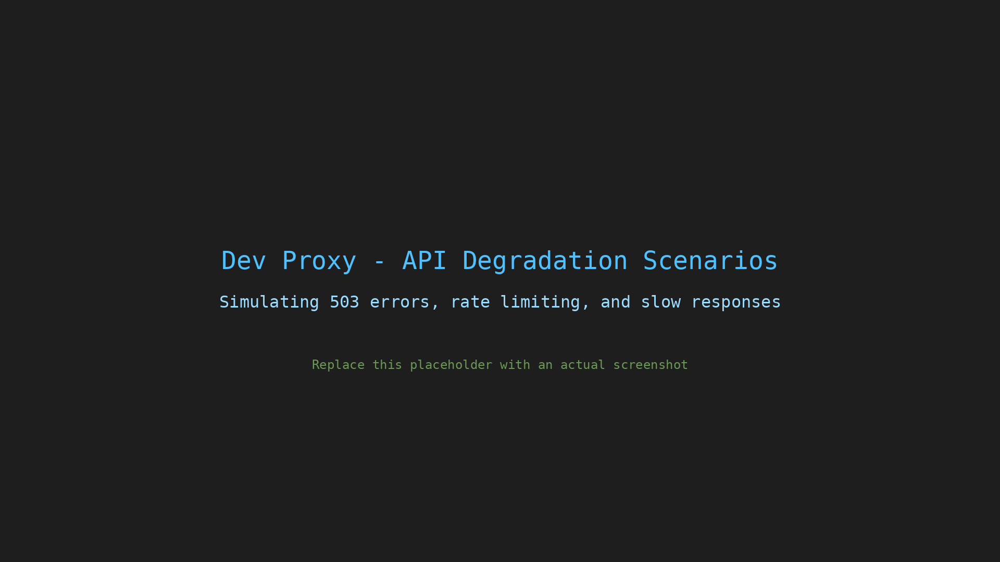

# Simulate API degradation scenarios

## Summary

This sample contains presets to simulate various API degradation scenarios to test how your application handles partial failures, intermittent errors, rate limiting, and slow responses. Use these configurations to build apps that gracefully degrade under stress and verify that your error handling and retry logic works before production.



## Compatibility


## Contributors

- [copilot](https://github.com/copilot)

## Version history

Version|Date|Comments
-------|----|--------
1.0|January 6, 2026|Initial release

## Minimal path to awesome

- Clone this repository (or [download this solution as a .ZIP file](https://pnp.github.io/download-partial/?url=https://github.com/pnp/proxy-samples/tree/main/samples/api-degradation-scenarios) then unzip it)
- Start Dev Proxy with one of the preset configurations:

### All degradation scenarios combined

This configuration combines all three degradation scenarios: intermittent 503 errors (30% of requests), rate limiting (10 requests per minute), and slow responses (3-5 seconds latency).

```bash
devproxy --config-file devproxyrc.json
```

Test with:

```bash
curl -ikx http://127.0.0.1:8000 https://api.example.com/data
```

### Intermittent 503 errors only

This configuration simulates random 503 Service Unavailable errors for 30% of requests.

```bash
devproxy --config-file intermittent-errors.devproxyrc.json
```

Test with:

```bash
curl -ikx http://127.0.0.1:8000 https://api.example.com/data
```

### Rate limiting only

This configuration simulates hitting rate limits with 429 Too Many Requests responses after 10 requests per minute.

```bash
devproxy --config-file rate-limiting.devproxyrc.json
```

Test with:

```bash
curl -ikx http://127.0.0.1:8000 https://api.example.com/data
```

### Slow responses only

This configuration adds random latency (3-5 seconds) to all responses.

```bash
devproxy --config-file slow-responses.devproxyrc.json
```

Test with:

```bash
curl -ikx http://127.0.0.1:8000 https://api.example.com/data
```

## Features

This sample demonstrates how to use Dev Proxy to simulate API degradation scenarios. Using this sample you can:

- Test your application's handling of intermittent 503 Service Unavailable errors
- Verify retry logic and exponential backoff implementation
- Test rate limit handling and proper use of Retry-After headers
- Measure application performance under slow network conditions
- Validate graceful degradation patterns in your application
- Demonstrate that your error handling works before deploying to production

### Configuration files

| File | Description |
|------|-------------|
| `devproxyrc.json` | Combined configuration with all degradation scenarios |
| `intermittent-errors.devproxyrc.json` | 503 errors at 30% failure rate |
| `rate-limiting.devproxyrc.json` | Rate limiting at 10 requests/minute |
| `slow-responses.devproxyrc.json` | Random latency between 3-5 seconds |
| `errors-503.json` | Error responses for the GenericRandomErrorPlugin |

### Plugins used

- **GenericRandomErrorPlugin** - Simulates random errors at a configurable rate
- **LatencyPlugin** - Adds random delays to responses
- **RateLimitingPlugin** - Simulates API rate limiting behavior
- **RetryAfterPlugin** - Validates that clients respect Retry-After headers

## Help

We do not support samples, but this community is always willing to help, and we want to improve these samples. We use GitHub to track issues, which makes it easy for community members to volunteer their time and help resolve issues.

You can try looking at [issues related to this sample](https://github.com/pnp/proxy-samples/issues?q=label%3A%22sample%3A%20api-degradation-scenarios%22) to see if anybody else is having the same issues.

If you encounter any issues using this sample, [create a new issue](https://github.com/pnp/proxy-samples/issues/new).

Finally, if you have an idea for improvement, [make a suggestion](https://github.com/pnp/proxy-samples/issues/new).

## Disclaimer

**THIS CODE IS PROVIDED *AS IS* WITHOUT WARRANTY OF ANY KIND, EITHER EXPRESS OR IMPLIED, INCLUDING ANY IMPLIED WARRANTIES OF FITNESS FOR A PARTICULAR PURPOSE, MERCHANTABILITY, OR NON-INFRINGEMENT.**


