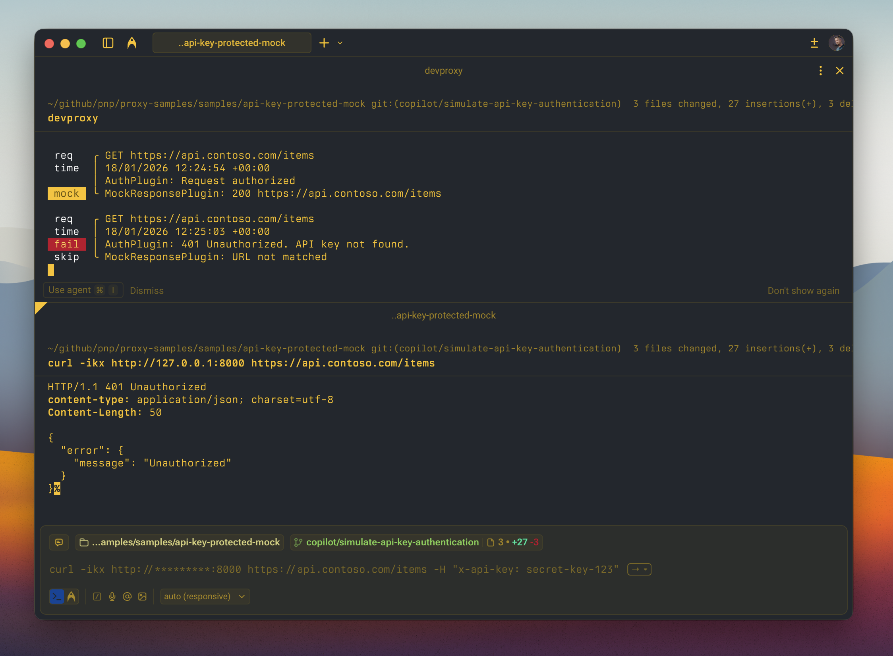

# Simulating API key authentication

## Summary

This sample demonstrates how to simulate API key authentication for mock APIs using Dev Proxy. The AuthPlugin validates API keys in header, query parameter, or cookie, while the MockResponsePlugin provides the API responses. This is useful for testing API key authentication flows without a real backend, such as Azure Functions, API Gateway integrations, and other services that use API keys for authentication.



## Compatibility


## Contributors

* [GitHub Copilot](https://github.com/copilot)

## Version history

Version|Date|Comments
-------|----|--------
1.0|January 6, 2026|Initial release

## Minimal path to awesome

* Clone this repository (or [download this solution as a .ZIP file](https://pnp.github.io/download-partial/?url=https://github.com/pnp/proxy-samples/tree/main/samples/api-key-protected-mock) then unzip it)
* Start Dev Proxy specifying the path to the config file: `devproxy --config-file devproxyrc.json`
* Test the API key authentication by making requests:

**With valid API key in header (should return 200):**
```bash
curl -ikx http://127.0.0.1:8000 https://api.contoso.com/items -H "x-api-key: secret-key-123"
```

**With valid API key in query parameter (should return 200):**
```bash
curl -ikx http://127.0.0.1:8000 "https://api.contoso.com/items?code=dev-key-456"
```

**With valid API key in cookie (should return 200):**
```bash
curl -ikx http://127.0.0.1:8000 https://api.contoso.com/items -H "Cookie: api_key=secret-key-123"
```

**Without API key (should return 401 Unauthorized):**
```bash
curl -ikx http://127.0.0.1:8000 https://api.contoso.com/items
```

**With invalid API key (should return 401 Unauthorized):**
```bash
curl -ikx http://127.0.0.1:8000 https://api.contoso.com/items -H "x-api-key: invalid-key"
```

## Features

This sample configures API key authentication that accepts keys in multiple locations:

**Supported API Key Locations:**
* `header` - Pass the API key in the `x-api-key` header
* `query` - Pass the API key as the `code` query parameter
* `cookie` - Pass the API key in the `api_key` cookie

**Allowed API Keys:**
* `secret-key-123` - Primary API key for testing
* `dev-key-456` - Secondary API key for development

**Mock API Endpoints:**
* `GET /items` - List all items
* `GET /items/{id}` - Get a specific item
* `POST /items` - Create a new item
* `PUT /items/{id}` - Update an item
* `DELETE /items/{id}` - Delete an item

Using this sample you can use Dev Proxy to:

* Test API key authentication flows without a real backend
* Simulate Azure Functions or API Gateway authentication
* Validate client applications properly include API keys in requests
* Verify applications handle 401 Unauthorized responses correctly
* Test different API key transmission methods (header, query, cookie)

## Configuration

The sample uses the following configuration to enable API key authentication:

```json
{
  "auth": {
    "type": "apiKey",
    "apiKey": {
      "parameters": [
        { "in": "header", "name": "x-api-key" },
        { "in": "query", "name": "code" },
        { "in": "cookie", "name": "api_key" }
      ],
      "allowedKeys": ["secret-key-123", "dev-key-456"]
    }
  }
}
```

You can customize the configuration by:
* Adding or removing parameter locations (header, query, cookie)
* Changing parameter names to match your API's requirements
* Adding or removing allowed API keys

## Help

We do not support samples, but this community is always willing to help, and we want to improve these samples. We use GitHub to track issues, which makes it easy for community members to volunteer their time and help resolve issues.

You can try looking at [issues related to this sample](https://github.com/pnp/proxy-samples/issues?q=label%3A%22sample%3A%20api-key-protected-mock%22) to see if anybody else is having the same issues.

If you encounter any issues using this sample, [create a new issue](https://github.com/pnp/proxy-samples/issues/new).

Finally, if you have an idea for improvement, [make a suggestion](https://github.com/pnp/proxy-samples/issues/new).

## Disclaimer

**THIS CODE IS PROVIDED *AS IS* WITHOUT WARRANTY OF ANY KIND, EITHER EXPRESS OR IMPLIED, INCLUDING ANY IMPLIED WARRANTIES OF FITNESS FOR A PARTICULAR PURPOSE, MERCHANTABILITY, OR NON-INFRINGEMENT.**


