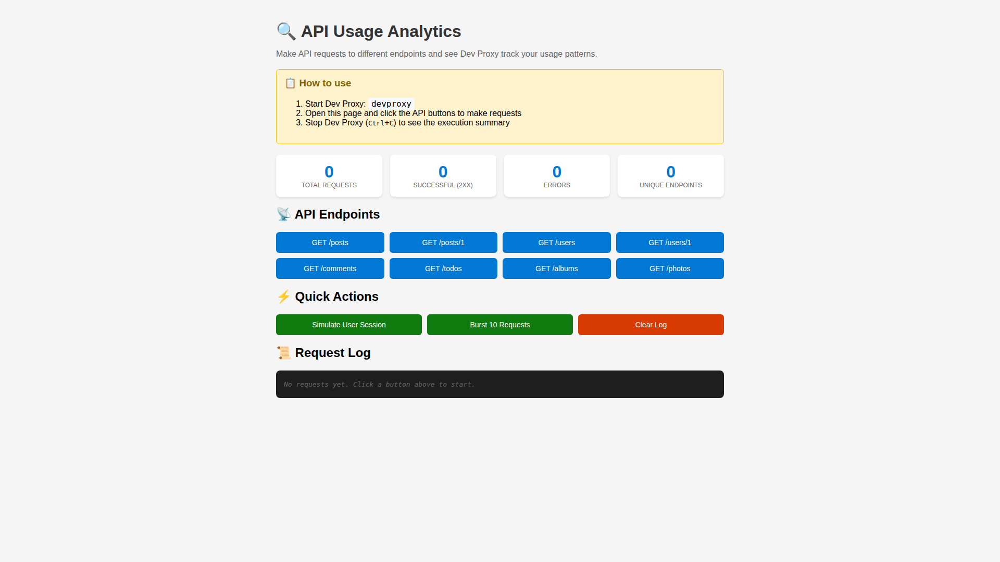

# Track API usage analytics

## Summary

This sample demonstrates how to use Dev Proxy to track and analyze API usage patterns. Using the ExecutionSummaryPlugin combined with multiple reporter plugins, you can generate detailed summaries showing which endpoints are used most frequently, response status codes, and timing information across different output formats.

The sample uses JSONPlaceholder API as an example, but you can easily adapt it to monitor any API by updating the `urlsToWatch` configuration.



## Compatibility


## Contributors

* [Copilot](https://github.com/copilot)

## Version history

Version|Date|Comments
-------|----|--------
1.0|January 6, 2026|Initial release

## Minimal path to awesome

* Clone this repository (or [download this solution as a .ZIP file](https://pnp.github.io/download-partial/?url=https://github.com/pnp/proxy-samples/tree/main/samples/api-usage-analytics) then unzip it)
* Start Dev Proxy specifying the path to the config file: `devproxy --config-file devproxyrc.json`
* Make API requests through the proxy to generate usage data:
  ```bash
  # Make various requests to different endpoints
  curl -ikx http://127.0.0.1:8000 https://jsonplaceholder.typicode.com/posts
  curl -ikx http://127.0.0.1:8000 https://jsonplaceholder.typicode.com/posts/1
  curl -ikx http://127.0.0.1:8000 https://jsonplaceholder.typicode.com/users
  curl -ikx http://127.0.0.1:8000 https://jsonplaceholder.typicode.com/users/1
  curl -ikx http://127.0.0.1:8000 https://jsonplaceholder.typicode.com/comments
  curl -ikx http://127.0.0.1:8000 https://jsonplaceholder.typicode.com/posts/1/comments
  
  # Make repeated requests to simulate usage patterns
  curl -ikx http://127.0.0.1:8000 https://jsonplaceholder.typicode.com/posts
  curl -ikx http://127.0.0.1:8000 https://jsonplaceholder.typicode.com/posts
  curl -ikx http://127.0.0.1:8000 https://jsonplaceholder.typicode.com/users/1
  ```
* Stop Dev Proxy (press <kbd>Ctrl</kbd>+<kbd>C</kbd>)
* Check the generated reports in the current directory:
  * `ExecutionSummaryPlugin_PlainTextReporter.txt` - Plain text format
  * `ExecutionSummaryPlugin_JsonReporter.json` - JSON format
  * `ExecutionSummaryPlugin_MarkdownReporter.md` - Markdown format

## Features

This sample uses Dev Proxy's ExecutionSummaryPlugin to track API usage and generates reports in multiple formats:

**Summary Information:**
* Request counts per endpoint
* Response status codes distribution
* Request grouping by URL or message type

**Output Formats:**
* **Plain Text** - Simple, human-readable format for quick review
* **JSON** - Structured data for programmatic analysis and integration
* **Markdown** - Formatted output for documentation and reports

Using this sample you can use Dev Proxy to:

* **Understand API usage patterns** - See which endpoints are called most frequently
* **Identify hotspots** - Find endpoints that might need optimization
* **Track response status codes** - Monitor error rates and success rates
* **Generate multiple report formats** - Choose the format that best fits your workflow
* **Analyze request distribution** - Understand how traffic is distributed across endpoints

## Configuration Options

The sample is configured to group requests by URL. You can change this to group by message type by modifying the `groupBy` property in the config file:

```json
"executionSummaryPlugin": {
  "groupBy": "messageType"
}
```

You can also use the command line option: `devproxy --config-file devproxyrc.json --summary-group-by messageType`

To monitor different APIs, update the `urlsToWatch` property:

```json
"urlsToWatch": [
  "https://api.example.com/*",
  "https://graph.microsoft.com/v1.0/*"
]
```

## Help

We do not support samples, but this community is always willing to help, and we want to improve these samples. We use GitHub to track issues, which makes it easy for community members to volunteer their time and help resolve issues.

You can try looking at [issues related to this sample](https://github.com/pnp/proxy-samples/issues?q=label%3A%22sample%3A%20api-usage-analytics%22) to see if anybody else is having the same issues.

If you encounter any issues using this sample, [create a new issue](https://github.com/pnp/proxy-samples/issues/new).

Finally, if you have an idea for improvement, [make a suggestion](https://github.com/pnp/proxy-samples/issues/new).

## Disclaimer

**THIS CODE IS PROVIDED *AS IS* WITHOUT WARRANTY OF ANY KIND, EITHER EXPRESS OR IMPLIED, INCLUDING ANY IMPLIED WARRANTIES OF FITNESS FOR A PARTICULAR PURPOSE, MERCHANTABILITY, OR NON-INFRINGEMENT.**


