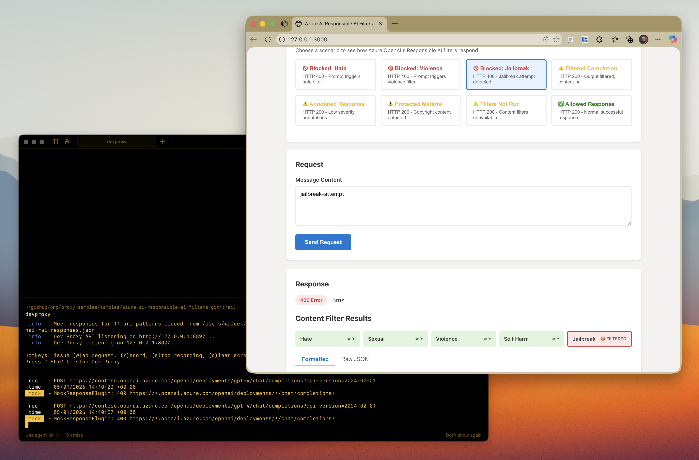

# Simulate Azure AI Responsible AI Filters

## Summary

This sample contains mock responses that simulate Azure OpenAI's Responsible AI content filtering behavior. It helps developers test how their applications handle filtered, blocked, or modified responses based on Azure's content safety policies.

Azure OpenAI includes content filtering that evaluates both prompts (inputs) and completions (outputs) against several categories: hate, violence, sexual content, self-harm, jailbreak attacks, and protected material. This sample allows you to test your app's error handling for these scenarios without triggering actual content filters.

## Compatibility

## Contributors

- [Waldek Mastykarz](https://github.com/waldekmastykarz)

## Version history

Version|Date|Comments
-------|----|--------
1.2|January 18, 2026|Moved config files to .devproxy folder
1.1|January 5, 2026|Updated to Dev Proxy v2.0.0
1.0|January 5, 2026|Initial release

## Minimal path to awesome

- Clone this repository (or [download this solution as a .ZIP file](https://pnp.github.io/download-partial/?url=https://github.com/pnp/proxy-samples/tree/main/samples/azure-ai-responsible-ai-filters) then unzip it)
- Change to the sample directory: `cd samples/azure-ai-responsible-ai-filters`
- Start Dev Proxy: `devproxy`
- In a new terminal, start a local web server: `npx http-server -p 3000`
- Open your browser to `http://localhost:3000`
- Select different test scenarios to see how Azure OpenAI's Responsible AI filters respond

## Features

This sample demonstrates the following Azure OpenAI Responsible AI content filter scenarios:

### Blocked Prompts (HTTP 400)

When a prompt triggers the content filter, Azure OpenAI returns HTTP 400 with an error object containing:
- `code`: `content_filter`
- `innererror.code`: `ResponsibleAIPolicyViolation`
- `innererror.content_filter_result`: Details about which category triggered the filter

### Filtered Completions (HTTP 200)

When the generated completion (output) triggers the filter:
- HTTP 200 is returned
- `finish_reason` is set to `content_filter`
- `content_filter_results` contains details about the filter trigger
- The `content` may be `null` or truncated

### Content Filter Categories

The sample covers all content filter categories:
- **Hate**: Discriminatory language based on identity
- **Sexual**: Sexual content
- **Violence**: Content describing physical harm
- **Self-harm**: Content related to self-injury
- **Jailbreak**: Attempts to bypass safety measures
- **Protected material**: Copyrighted text or code

### Severity Levels

Content filter results include severity levels:
- `safe`: No harmful content detected
- `low`: Mild content that may pass filters
- `medium`: Moderate content
- `high`: Severe content that triggers filtering

## Handling content filter responses in your application

When integrating with Azure OpenAI, implement the following best practices as recommended by [Azure documentation](https://learn.microsoft.com/azure/ai-services/openai/concepts/content-filter):

1. **Decide how to handle filtered content**: Plan your UX for scenarios where users send prompts that trigger content filters or otherwise misuse your application
2. **Check `finish_reason`**: A value of `content_filter` indicates the completion was filtered
3. **Check for errors in `content_filter_results`**: If the content filtering system is down or unable to complete, your request still completes but without filtering. Look for an error object in `content_filter_results` to detect this
4. **Display protected material citations**: If using the protected material code model in annotate mode, display the citation URL when showing code in your application

The demo app included in this sample demonstrates these best practices in action.

## Help

We do not support samples, but this community is always willing to help, and we want to improve these samples. We use GitHub to track issues, which makes it easy for community members to volunteer their time and help resolve issues.

You can try looking at [issues related to this sample](https://github.com/pnp/proxy-samples/issues?q=label%3A%22sample%3A%20azure-ai-responsible-ai-filters%22) to see if anybody else is having the same issues.

If you encounter any issues using this sample, [create a new issue](https://github.com/pnp/proxy-samples/issues/new).

Finally, if you have an idea for improvement, [make a suggestion](https://github.com/pnp/proxy-samples/issues/new).

## Disclaimer

**THIS CODE IS PROVIDED *AS IS* WITHOUT WARRANTY OF ANY KIND, EITHER EXPRESS OR IMPLIED, INCLUDING ANY IMPLIED WARRANTIES OF FITNESS FOR A PARTICULAR PURPOSE, MERCHANTABILITY, OR NON-INFRINGEMENT.**

