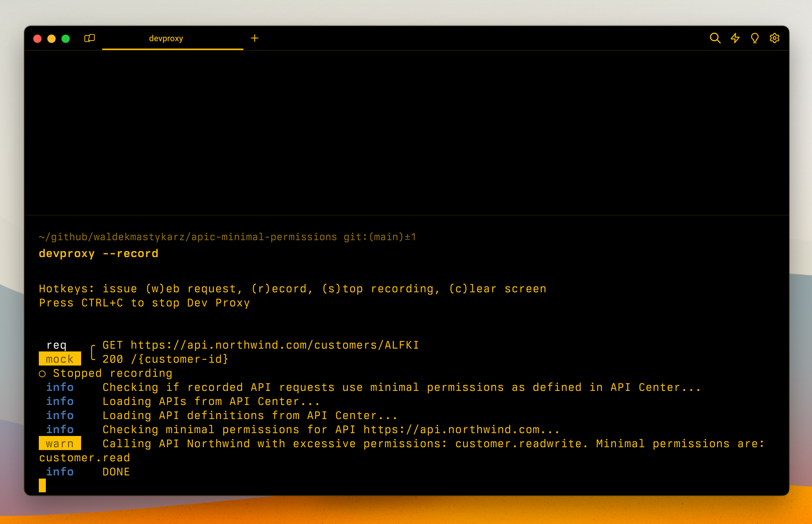

# Demo: Check if my app is calling APIs using minimal permissions

## Summary

This sample illustrates how to use Dev Proxy to check if your app is calling APIs using minimal permissions. The sample contains a mock CRUD API secured with Microsoft Entra. Different API operations require different scopes. The mock CRUD API is described using an OpenAPI spec including information about the available operations and the necessary scopes for each of them. By uploading the OpenAPI to Azure API Center, and calling the API, you can use Dev Proxy to check if your app is calling the API using the minimal permissions required.

## Compatibility

## Contributors

- [Waldek Mastykarz](https://github.com/waldekmastykarz)

## Version history

Version|Date|Comments
-------|----|--------
1.0|June 17, 2024|Initial release

## Prerequisites

- [Azure API Center](https://learn.microsoft.com/azure/api-center/)
- [REST Client](https://marketplace.visualstudio.com/items?itemName=humao.rest-client) extension for Visual Studio Code

## Minimal path to awesome

- Create Azure API Center instance
  - Get the API Center instance name, resource group name and subscription ID
- Get the preset using Dev Proxy by running `devproxy preset get demo-apicenter-minimalpermissions`
- Navigate to the Dev Proxy installation folder, and open the `presets/demo-apicenter-minimalpermissions` folder
- In the `devproxyrc.json` file, in the `apiCenterMinimalPermissionsPlugin` update the API Center information
- In API Center, create a new API and import the OpenAPI spec from the `api.northwind.com.json` file
- Start Dev Proxy by running `devproxy --config-file "~appFolder/presets/demo-apicenter-minimalpermissions/devproxyrc.json" --record`
- In VSCode, open the `northwind.http` file and run the requests to the API
- In the terminal where Dev Proxy is running, press `s` to stop recording
- Dev Proxy will generate a report of the minimal permissions needed to call the API

## Help

We do not support samples, but this community is always willing to help, and we want to improve these samples. We use GitHub to track issues, which makes it easy for  community members to volunteer their time and help resolve issues.

You can try looking at [issues related to this sample](https://github.com/pnp/proxy-samples/issues?q=label%3A%22sample%3A%20demo-apicenter-minimalpermissions%22) to see if anybody else is having the same issues.

If you encounter any issues using this sample, [create a new issue](https://github.com/pnp/proxy-samples/issues/new).

Finally, if you have an idea for improvement, [make a suggestion](https://github.com/pnp/proxy-samples/issues/new).

## Disclaimer

**THIS CODE IS PROVIDED *AS IS* WITHOUT WARRANTY OF ANY KIND, EITHER EXPRESS OR IMPLIED, INCLUDING ANY IMPLIED WARRANTIES OF FITNESS FOR A PARTICULAR PURPOSE, MERCHANTABILITY, OR NON-INFRINGEMENT.**

