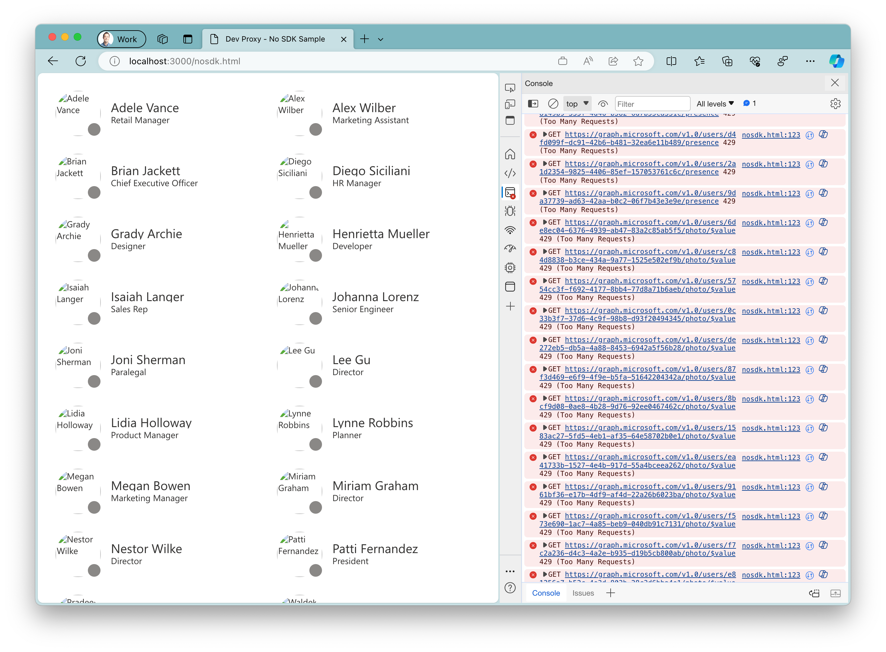

# Demo: Simulate random error responses from Microsoft 365 APIs

## Summary

This sample contains a demo web application connected to Microsoft Graph. Using Dev Proxy, you can simulate random errors returned by Microsoft Graph and see how the app handles them.



## Compatibility


## Contributors

- [Waldek Mastykarz](https://github.com/waldekmastykarz)

## Version history

Version|Date|Comments
-------|----|--------
1.0|January 26, 2024|Initial release

## Prerequisites

- [Microsoft 365 developer tenant](https://aka.ms/m365/devprogram)
- [Node.js LTS](https://nodejs.org)

## Minimal path to awesome

- Get the preset using Dev Proxy by running `devproxy preset get demo-m365-randomerror-js`
- Navigate to the Dev Proxy installation folder, and open the `presets/demo-m365-randomerror-js` folder
- Create a new Entra app registration (instructions below)
- Start the sample app by running `npx lite-server`
- Start Dev Proxy with the Microsoft 365 preset by running `devproxy -c "~appFolder/presets/m365.json"`
- In a web browser, navigate to `http://localhost:3000` and interact with the sample app to see how it handles random errors

### <a id="appreg">Configure Azure AD App Registration</a>

There are two ways which you can configure the App Registration required for the samples to work correctly, through automation using either a `bash` or `pwsh` script we provide for you in the `scripts` directory, or manually through Azure Portal.

> Note that the script will create a file called `env.js`, in the root of the `samples` directory. This file contains the client ID of the application registration that is created.

#### <a id="pwsh">PowerShell 7</a>

> The script uses CLI for Microsoft 365 to authenticate with and create the app registration in your tenant, therefore requires nodejs, v8 or greater to be installed

```sh
PS > cd ./samples/
PS > ./scripts/setup.ps1
```

Follow the prompts in the terminal.

#### <a id="bash">bash</a>

> The script uses CLI for Microsoft 365 to authenticate with and create the app registration in your tenant, therefore requires nodejs, v8 or greater to be installed

```sh
$ > cd ./samples/
$ > chmod +x /scripts/setup.sh
$ > ./scripts/setup.sh
```

Follow the prompts in the terminal.

#### <a id="manual">Manual</a>

The following table provides details of how to configure your app registration.

| Property | Value |
| ---- | ---- |
| Name | dev-proxy-samples |
| Account types | Accounts in any organizational directory (Any Azure AD directory - Multitenant) |
| Platform type | Single-page application |
| Redirect URIs | http://localhost:3000/withsdk.html <br> http://localhost:3000/nosdk.html |
| API Permissions | Microsoft Graph <br> User.Read.All (Delegate) w/ Admin Consent <br> Presence.Read.All |

After creating the app registration, create a file called `env.js` in the root of the `samples` directory with the following contents, replacing `<clientid>` with the value which can be copied from the portal.

```js
const appId = '<clientid>';
```

## Help

We do not support samples, but this community is always willing to help, and we want to improve these samples. We use GitHub to track issues, which makes it easy for  community members to volunteer their time and help resolve issues.

You can try looking at [issues related to this sample](https://github.com/pnp/proxy-samples/issues?q=label%3A%22sample%3A%20spfx%22) to see if anybody else is having the same issues.

If you encounter any issues using this sample, [create a new issue](https://github.com/pnp/proxy-samples/issues/new).

Finally, if you have an idea for improvement, [make a suggestion](https://github.com/pnp/proxy-samples/issues/new).

## Disclaimer

**THIS CODE IS PROVIDED *AS IS* WITHOUT WARRANTY OF ANY KIND, EITHER EXPRESS OR IMPLIED, INCLUDING ANY IMPLIED WARRANTIES OF FITNESS FOR A PARTICULAR PURPOSE, MERCHANTABILITY, OR NON-INFRINGEMENT.**


# Samples

## Table of Contents

- [Pre-requisites](#prereqs)
- [Configure Azure AD App Registration](#appreg)
    - [PowerShell 7](#pwsh)
    - [Bash](#bash)
    - [Manual](#manual)
- [Launch Sample](#launch)

## <a id="prereqs">Pre-requisites</a>

All the samples have been designed with keeping dependencies to an absolute minimum, however there are a few things that you will need.

You will need a Microsoft 365 Tenant and be able to use an account that has permissions to create an Azure AD App Registrations in your tenant.

We highly recommend that you use a Microsoft 365 Developer Tenant with content packs installed when testing these samples, you can create a developer tenant by [signing up to the Microsoft 365 Developer Program](https://aka.ms/m365/).


