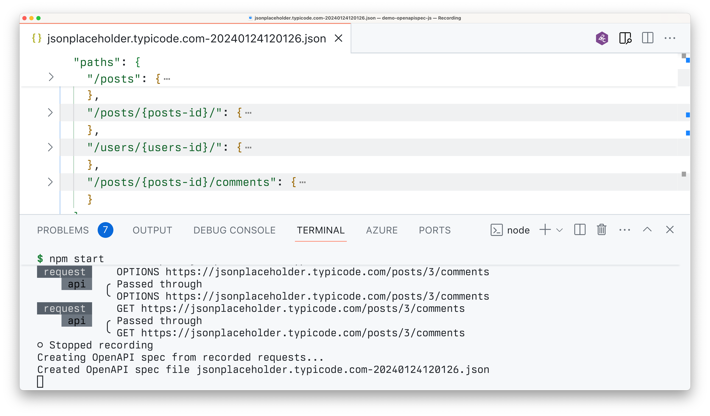

# Demo: Generate an OpenAPI spec for an API called from a JavaScript app

## Summary

This sample contains a demo web application connected to a placeholder API. Using Dev Proxy, you can record the API calls made by the sample app and generate an OpenAPI spec for them.

## Compatibility

## Contributors

- [Waldek Mastykarz](https://github.com/waldekmastykarz)

## Version history

Version|Date|Comments
-------|----|--------
1.0|January 24, 2024|Initial release

## Prerequisites

- [Node.js LTS](https://nodejs.org)

## Minimal path to awesome

- Get the preset using Dev Proxy by running `devproxy preset get demo-openapispec-js`
- Navigate to the Dev Proxy installation folder, and open the `presets/demo-openapispec-js` folder
- Start the sample app and Dev Proxy by running `npm start`
- After Dev Proxy starts, press `r` to start recording
- In a web browser, navigate to `http://localhost:3000` and interact with the sample app to generate some activity
- When you're ready, go back to the terminal where Dev Proxy is running and press `s` to stop recording
- Dev Proxy will generate an OpenAPI spec for the API calls made by the sample app and save it to a file

## Help

We do not support samples, but this community is always willing to help, and we want to improve these samples. We use GitHub to track issues, which makes it easy for  community members to volunteer their time and help resolve issues.

You can try looking at [issues related to this sample](https://github.com/pnp/proxy-samples/issues?q=label%3A%22sample%3A%20spfx%22) to see if anybody else is having the same issues.

If you encounter any issues using this sample, [create a new issue](https://github.com/pnp/proxy-samples/issues/new).

Finally, if you have an idea for improvement, [make a suggestion](https://github.com/pnp/proxy-samples/issues/new).

## Disclaimer

**THIS CODE IS PROVIDED *AS IS* WITHOUT WARRANTY OF ANY KIND, EITHER EXPRESS OR IMPLIED, INCLUDING ANY IMPLIED WARRANTIES OF FITNESS FOR A PARTICULAR PURPOSE, MERCHANTABILITY, OR NON-INFRINGEMENT.**

