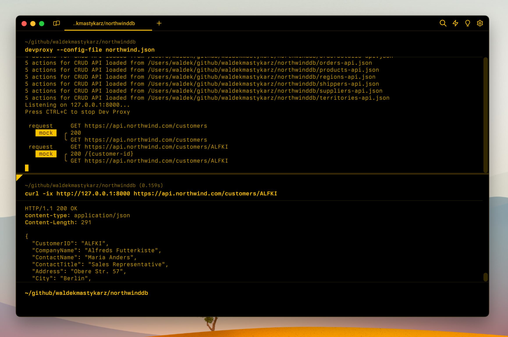

# CRUD API secured with Microsoft Entra

## Summary

This sample demonstrates how to simulate a CRUD API secured with Microsoft Entra authentication using Dev Proxy. It includes a demo web application that shows how to:

- Authenticate with Microsoft Entra using different scopes
- Call CRUD API endpoints with Bearer token authorization
- Handle different permission levels (read vs write operations)

Use this sample to build frontend applications before the backend API exists, with real Microsoft Entra authentication flow.



## Compatibility


## Contributors

- [Copilot](https://github.com/copilot)

## Version history

Version|Date|Comments
-------|----|--------
1.2|January 10, 2026|Updated for compliance with repository guidelines
1.1|January 8, 2026|Added demo web application
1.0|January 6, 2026|Initial release

## Prerequisites

- [Dev Proxy](https://aka.ms/devproxy)
- [Node.js LTS](https://nodejs.org) (for http-server)

## Minimal path to awesome

- Clone this repository (or [download this solution as a .ZIP file](https://pnp.github.io/download-partial/?url=https://github.com/pnp/proxy-samples/tree/main/samples/entra-secured-crud-api) then unzip it)
- Navigate to the sample folder: `cd samples/entra-secured-crud-api`
- Run `npm install` to install dependencies
- Run `npm start` to start Dev Proxy and the web server
- Open http://localhost:3000 in your browser
- Select a token scope (read, write, or both) and click **Generate Mock Token**
- Click the API operation buttons to see the responses

## Features

This sample demonstrates Microsoft Entra secured APIs using the CrudApiPlugin.

### API Endpoints

The API is exposed at `https://api.contoso.com/v1/customers` with the following operations:

Endpoint|Method|Required Scope|Description
--------|------|--------------|-------
`/v1/customers`|`GET`|`customer.read`|Get all customers
`/v1/customers/{id}`|`GET`|`customer.read`|Get a customer by ID
`/v1/customers`|`POST`|`customer.write`|Create a new customer
`/v1/customers/{id}`|`PATCH`|`customer.write`|Update a customer
`/v1/customers/{id}`|`PUT`|`customer.write`|Replace a customer
`/v1/customers/{id}`|`DELETE`|`customer.write`|Delete a customer

### Authentication Configuration

The sample uses the following Microsoft Entra configuration:

Property|Value
--------|-----
Audience|`https://api.contoso.com`
Issuer|`https://login.microsoftonline.com/contoso.com`
Read Scope|`api://contoso.com/customer.read`
Write Scope|`api://contoso.com/customer.write`

### Demo App Features

The included web application demonstrates:

- **Token generation** - Generate mock JWT tokens with different scopes
- **Scope selection** - Choose between read-only, write-only, or both scopes
- **CRUD operations** - Test all API operations (GET, POST, PATCH, DELETE)
- **Response visualization** - See full API responses including headers and status codes

### Customizing Token Validation

To enable full token validation (for use with real Microsoft Entra tokens), update the `.devproxy/customers-api.json` file to add validation options:

```json
{
  "entraAuthConfig": {
    "audience": "https://api.contoso.com",
    "issuer": "https://login.microsoftonline.com/YOUR-TENANT-ID/v2.0",
    "validateSigningKey": true,
    "validateLifetime": true
  }
}
```

> [!NOTE]
> Update the `audience` and `issuer` values to match your actual Microsoft Entra app registration when testing with real tokens.

## Help

We do not support samples, but this community is always willing to help, and we want to improve these samples. We use GitHub to track issues, which makes it easy for community members to volunteer their time and help resolve issues.

You can try looking at [issues related to this sample](https://github.com/pnp/proxy-samples/issues?q=label%3A%22sample%3A%20entra-secured-crud-api%22) to see if anybody else is having the same issues.

If you encounter any issues using this sample, [create a new issue](https://github.com/pnp/proxy-samples/issues/new).

Finally, if you have an idea for improvement, [make a suggestion](https://github.com/pnp/proxy-samples/issues/new).

## Disclaimer

**THIS CODE IS PROVIDED *AS IS* WITHOUT WARRANTY OF ANY KIND, EITHER EXPRESS OR IMPLIED, INCLUDING ANY IMPLIED WARRANTIES OF FITNESS FOR A PARTICULAR PURPOSE, MERCHANTABILITY, OR NON-INFRINGEMENT.**


