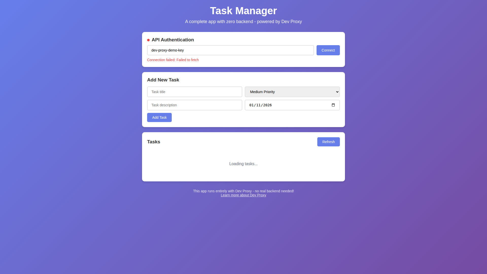

# Build complete app with zero backend

## Summary

This sample demonstrates how to build a complete task manager application with zero backend using Dev Proxy. It showcases Dev Proxy's full value proposition by combining multiple plugins to create a realistic development environment that runs entirely offline.

The sample includes:
- **CrudApiPlugin** - Full CRUD API with in-memory data store for tasks
- **AuthPlugin** - API key authentication to secure the API
- **LatencyPlugin** - Realistic response time simulation (200-800ms)
- **DevToolsPlugin** - Chrome DevTools integration for debugging



## Compatibility


## Contributors

- [Waldek Mastykarz](https://github.com/waldekmastykarz)

## Version history

Version|Date|Comments
-------|----|--------
1.0.0|January 19, 2026|Initial release

## Prerequisites

- [Dev Proxy](https://aka.ms/devproxy)
- [Node.js LTS](https://nodejs.org) (for http-server)

## Minimal path to awesome

- Clone this repository (or [download this solution as a .ZIP file](https://pnp.github.io/download-partial/?url=https://github.com/pnp/proxy-samples/tree/main/samples/full-stack-no-backend) and unzip it)
- Navigate to the sample folder: `cd samples/full-stack-no-backend`
- Run `npm install` to install dependencies
- Run `npm start` to start Dev Proxy and the web server
- Open http://localhost:3000 in your browser
- The app auto-connects using the default API key (`dev-proxy-demo-key`)

## Architecture

```
┌─────────────────┐     ┌─────────────────────────────────────┐
│                 │     │            Dev Proxy                │
│   Frontend      │     │  ┌─────────────────────────────┐   │
│   (Browser)     │────▶│  │      LatencyPlugin          │   │
│                 │     │  │   (200-800ms delay)         │   │
│   index.html    │     │  └─────────────┬───────────────┘   │
│                 │     │                │                    │
└─────────────────┘     │  ┌─────────────▼───────────────┐   │
                        │  │       AuthPlugin            │   │
                        │  │  (API key validation)       │   │
                        │  └─────────────┬───────────────┘   │
                        │                │                    │
                        │  ┌─────────────▼───────────────┐   │
                        │  │      CrudApiPlugin          │   │
                        │  │   (in-memory data store)    │   │
                        │  └─────────────┬───────────────┘   │
                        │                │                    │
                        │  ┌─────────────▼───────────────┐   │
                        │  │     DevToolsPlugin          │   │
                        │  │   (Chrome DevTools)         │   │
                        │  └─────────────────────────────┘   │
                        └─────────────────────────────────────┘
```

## Features

This sample illustrates the following concepts:

### Complete CRUD API
- **GET /tasks** - Retrieve all tasks
- **GET /tasks/{id}** - Retrieve a single task
- **POST /tasks** - Create a new task
- **PATCH /tasks/{id}** - Update a task
- **DELETE /tasks/{id}** - Delete a task

### API Key Authentication
- Requests must include `x-api-key: dev-proxy-demo-key` header
- Invalid keys return 401 Unauthorized

### Realistic Latency
- All responses are delayed by 200-800ms
- Simulates real-world network conditions
- Latency is displayed in the UI

### DevTools Integration
- Opens Chrome DevTools automatically
- View all intercepted requests and responses
- Debug API calls in real-time

### Vanilla JavaScript Frontend
- No framework dependencies
- Full task management UI
- Real-time status updates
- Responsive design

## Why this approach?

1. **Ship MVPs without backend team** - Start building your frontend immediately
2. **Complete offline development** - No internet required, works anywhere
3. **Realistic testing** - Latency and authentication behave like production
4. **Easy debugging** - DevTools integration shows exactly what's happening
5. **Single tool solution** - Everything runs through Dev Proxy

## Help

We do not support samples, but this community is always willing to help, and we want to improve these samples. We use GitHub to track issues, which makes it easy for community members to volunteer their time and help resolve issues.

You can try looking at [issues related to this sample](https://github.com/pnp/proxy-samples/issues?q=label%3A%22sample%3A%20full-stack-no-backend%22) to see if anybody else is having the same issues.

If you encounter any issues using this sample, [create a new issue](https://github.com/pnp/proxy-samples/issues/new).

Finally, if you have an idea for improvement, [make a suggestion](https://github.com/pnp/proxy-samples/issues/new).

## Disclaimer

**THIS CODE IS PROVIDED *AS IS* WITHOUT WARRANTY OF ANY KIND, EITHER EXPRESS OR IMPLIED, INCLUDING ANY IMPLIED WARRANTIES OF FITNESS FOR A PARTICULAR PURPOSE, MERCHANTABILITY, OR NON-INFRINGEMENT.**


