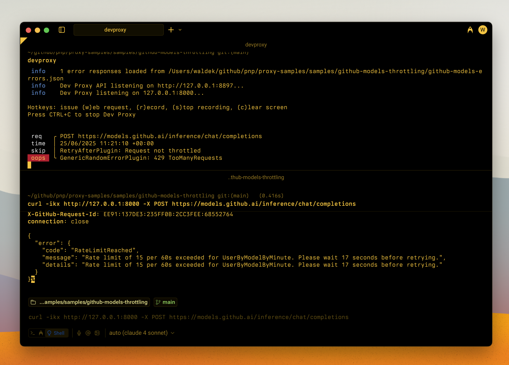
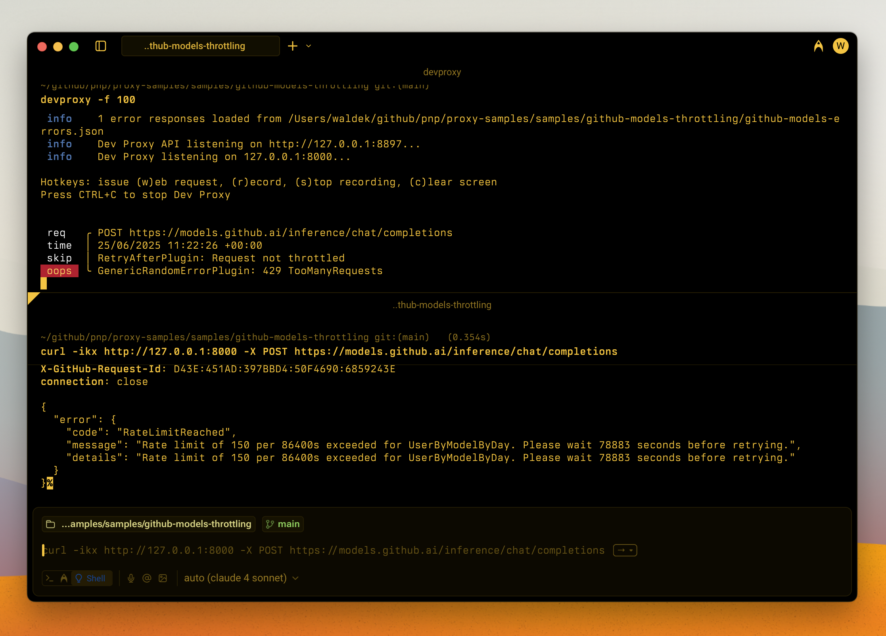

# Simulate throttling of the GitHub Models inference API

## Summary

This sample contains a preset and mocks to simulate the throttling of the GitHub Models inference API.

As more and more applications use GitHub Models inference API to use AI, it's important that developers can verify that their apps can properly handle cases when the API is throttled. Especially when the app is using lower-tier API plans, throttling is more likely to happen so validating the app's behavior is crucial to ensure great user experience.

Using this preset you can simulate throttling of the GitHub Models inference API and see how your app will handle it.

## Compatibility

## Contributors

- [Waldek Mastykarz](https://github.com/waldekmastykarz)

## Version history

Version|Date|Comments
-------|----|--------
1.0|June 25, 2025|Initial release

## Minimal path to awesome

- Clone this repository (or [download this solution as a .ZIP file](https://pnp.github.io/download-partial/?url=https://github.com/pnp/proxy-samples/tree/main/samples/github-models-throttling) then unzip it)
- Start Dev Proxy specifying the path to one of the mock files, eg. `devproxy`

## Features

This preset includes configuration for simulating 2 different throttling scenarios:

- exceeded requests per minute
  
- exceeded requests per day
  

Dev Proxy will simulate throttling the API using one of these modes at random.

## Help

We do not support samples, but this community is always willing to help, and we want to improve these samples. We use GitHub to track issues, which makes it easy for  community members to volunteer their time and help resolve issues.

You can try looking at [issues related to this sample](https://github.com/pnp/proxy-samples/issues?q=label%3A%22sample%3A%20github-models-throttling%22) to see if anybody else is having the same issues.

If you encounter any issues using this sample, [create a new issue](https://github.com/pnp/proxy-samples/issues/new).

Finally, if you have an idea for improvement, [make a suggestion](https://github.com/pnp/proxy-samples/issues/new).

## Disclaimer

**THIS CODE IS PROVIDED *AS IS* WITHOUT WARRANTY OF ANY KIND, EITHER EXPRESS OR IMPLIED, INCLUDING ANY IMPLIED WARRANTIES OF FITNESS FOR A PARTICULAR PURPOSE, MERCHANTABILITY, OR NON-INFRINGEMENT.**

