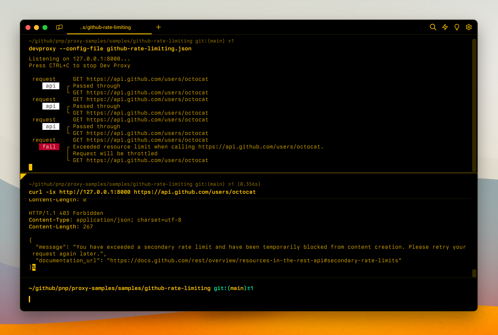

# Simulate rate limiting on GitHub APIs

## Summary

This sample contains a preset to simulate rate limiting on GitHub APIs.

Your GitHub script, bot, or integration works until it hits GitHub's rate limit: 60 requests per hour without authentication, or 5,000 with a personal access token. Then GitHub answers with a `403` or `429`, and code that doesn't read the `x-ratelimit-*` headers fails or keeps retrying.

Using this preset, you can see what your code does at the limit without using up your real one. Dev Proxy counts your requests to `api.github.com`, returns the `x-ratelimit-limit`, `x-ratelimit-remaining`, and `x-ratelimit-reset` headers, and answers with a `429` after 60 requests. Your code keeps calling the real GitHub API URLs.



## Compatibility


## Contributors

- [Waldek Mastykarz](https://github.com/waldekmastykarz)

## Version history

Version|Date|Comments
-------|----|--------
1.25|October 3, 2026|Rewrote the summary around the problem the preset solves, added `devproxy config get` steps
1.24|October 3, 2026|Aligned with GitHub primary rate limit response, added RetryAfterPlugin and secondary rate limit config
1.23|September 28, 2026|Updated to Dev Proxy v3.3.1
1.22|July 1, 2026|Updated to Dev Proxy v3.1.0
1.21|June 17, 2026|Updated to Dev Proxy v3.0.1
1.11|May 30, 2026|Updated to Dev Proxy v3.0.0
1.10|March 26, 2026|Updated to Dev Proxy v2.3.0
1.9|March 11, 2026|Updated to Dev Proxy v2.2.0
1.8|February 4, 2026|Updated to Dev Proxy v2.1.0
1.7|January 18, 2026|Moved config files to .devproxy folder
1.6|January 5, 2026|Updated to Dev Proxy v2.0.0
1.5|June 27, 2025|Updated to Dev Proxy v0.29.2
1.4|January 17, 2024|Updated plugin path
1.3|January 11, 2024|Updated to new format
1.2|December 22, 2023|Updated to new format
1.1|November 14, 2023|Renamed to Dev Proxy
1.0|September 16, 2023|Initial release

## Minimal path to awesome

- Get the sample:
  - Download just this sample:

      ```bash
      npx gitload-cli https://github.com/pnp/proxy-samples/tree/main/samples/github-rate-limiting
      ```

    or

  - [Download as a .ZIP file](https://pnp.github.io/download-partial/?url=https://github.com/pnp/proxy-samples/tree/main/samples/github-rate-limiting) and unzip it, or
  - Clone this repository
- Start Dev Proxy by running `devproxy` in the sample's folder

Alternatively, download the preset with Dev Proxy and start it from any folder:

```bash
devproxy config get github-rate-limiting
devproxy --config-file "~dataFolder/configs/github-rate-limiting/.devproxy/devproxyrc.json"
```
- Send more than 60 requests to the GitHub API, for example:

    ```bash
    curl -ikx http://127.0.0.1:8000 https://api.github.com/users/octocat
    ```

To simulate GitHub's secondary rate limits instead, start Dev Proxy by running `devproxy --config-file .devproxy/devproxyrc-secondary.json`.

## Features

This preset simulates rate limiting on GitHub APIs.

Using this sample you can use Dev Proxy to:

- Simulate GitHub's primary rate limit of 60 requests per hour. Each response includes the `x-ratelimit-limit`, `x-ratelimit-remaining`, and `x-ratelimit-reset` headers. After you exceed the limit, Dev Proxy returns a `429 Too Many Requests` response with the `API rate limit exceeded` message that GitHub sends.
- Detect when your app retries a request before the rate limit resets, using the `RetryAfterPlugin`.
- Simulate GitHub's secondary rate limits, using the `devproxyrc-secondary.json` config. Dev Proxy randomly returns a `429 Too Many Requests` response with a `retry-after` header and detects when your app retries too early.

For more information about GitHub API rate limits, see [Rate limits for the REST API](https://docs.github.com/rest/using-the-rest-api/rate-limits-for-the-rest-api).

For more information about the configuration options, see the documentation of the [RateLimitingPlugin](https://learn.microsoft.com/microsoft-cloud/dev/dev-proxy/technical-reference/ratelimitingplugin?WT.mc_id=devproxy-samples-github-rate-limiting), [RetryAfterPlugin](https://learn.microsoft.com/microsoft-cloud/dev/dev-proxy/technical-reference/retryafterplugin?WT.mc_id=devproxy-samples-github-rate-limiting), and [GenericRandomErrorPlugin](https://learn.microsoft.com/microsoft-cloud/dev/dev-proxy/technical-reference/genericrandomerrorplugin?WT.mc_id=devproxy-samples-github-rate-limiting).

## Help

We do not support samples, but this community is always willing to help, and we want to improve these samples. We use GitHub to track issues, which makes it easy for  community members to volunteer their time and help resolve issues.

You can try looking at [issues related to this sample](https://github.com/pnp/proxy-samples/issues?q=label%3A%22sample%3A%github-rate-limiting%22) to see if anybody else is having the same issues.

If you encounter any issues using this sample, [create a new issue](https://github.com/pnp/proxy-samples/issues/new).

Finally, if you have an idea for improvement, [make a suggestion](https://github.com/pnp/proxy-samples/issues/new).

## Disclaimer

**THIS CODE IS PROVIDED *AS IS* WITHOUT WARRANTY OF ANY KIND, EITHER EXPRESS OR IMPLIED, INCLUDING ANY IMPLIED WARRANTIES OF FITNESS FOR A PARTICULAR PURPOSE, MERCHANTABILITY, OR NON-INFRINGEMENT.**


