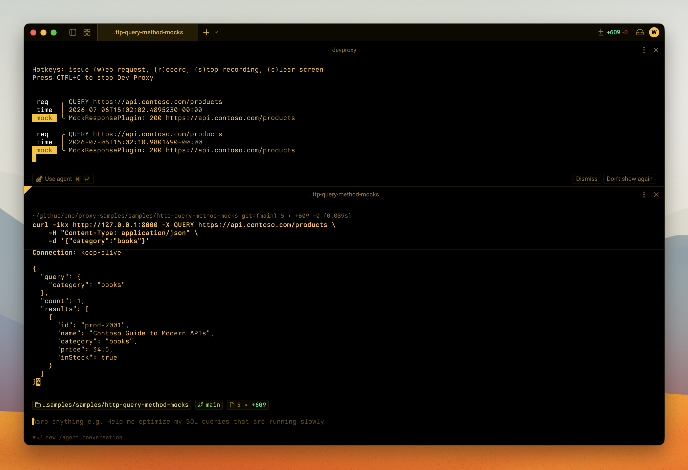

# Mock the HTTP QUERY method

## Summary

This sample shows how to use Dev Proxy to mock the new [HTTP `QUERY` method](https://datatracker.ietf.org/doc/draft-ietf-httpbis-safe-method-w-body/) so you can build and test your app before the API supports it.

`QUERY` is a new HTTP method that fills the gap between `GET` and `POST`. Like `GET`, it's safe and idempotent, so responses can be cached and requests can be retried. Like `POST`, it can carry a request body, which lets you send complex search criteria without cramming them into the URL or misusing `POST` for read operations.

Most APIs don't support `QUERY` yet. Whether you want to adopt it in your app, or you maintain an API and are considering adding `QUERY` support, you need something to build against. This sample mocks a fictitious Contoso product catalog API at `https://api.contoso.com` that answers `QUERY` requests for products and customers. It also mocks a `GET /products` response so you can compare the two methods side by side: `GET` returns the full collection, while `QUERY` returns a filtered subset based on the criteria in the request body.

The sample includes a small browser app that sends `QUERY` and `GET` requests so you can see the difference in action.



## Compatibility


Support for the `QUERY` method was added in Dev Proxy v3.2.0-beta.1.

## Contributors

* [Waldek Mastykarz](https://github.com/waldekmastykarz)

## Version history

Version|Date|Comments
-------|----|--------
1.0|July 6, 2026|Initial release

## Minimal path to awesome

* Get the sample:
  - Download just this sample:

      ```bash
      npx gitload-cli https://github.com/pnp/proxy-samples/tree/main/samples/http-query-method-mocks
      ```

    or

  - [Download as a .ZIP file](https://pnp.github.io/download-partial/?url=https://github.com/pnp/proxy-samples/tree/main/samples/http-query-method-mocks) and unzip it, or
  - Clone this repository
* Start Dev Proxy: `devproxy`
* Send a `QUERY` request with `curl` and pass the search criteria in the request body:

  ```bash
  # Search products in the "electronics" category
  curl -ikx http://127.0.0.1:8000 -X QUERY https://api.contoso.com/products \
    -H "Content-Type: application/json" \
    -d '{"category":"electronics"}'

  # Search products in the "books" category
  curl -ikx http://127.0.0.1:8000 -X QUERY https://api.contoso.com/products \
    -H "Content-Type: application/json" \
    -d '{"category":"books"}'

  # QUERY with no filter returns all products
  curl -ikx http://127.0.0.1:8000 -X QUERY https://api.contoso.com/products \
    -H "Content-Type: application/json" \
    -d '{}'

  # Search customers
  curl -ikx http://127.0.0.1:8000 -X QUERY https://api.contoso.com/customers \
    -H "Content-Type: application/json" \
    -d '{"city":"Seattle"}'

  # Compare with GET, which returns the full product collection
  curl -ikx http://127.0.0.1:8000 https://api.contoso.com/products
  ```

* Optionally, try the demo app: open `index.html` in a browser (with Dev Proxy running), pick a category, and use **Search products (QUERY)** and **Get all products (GET)** to compare the responses.

## Features

This sample mocks a fictitious Contoso product catalog API and demonstrates the new HTTP `QUERY` method:

* **`QUERY /products`** returns a filtered product list. The mock uses the `bodyFragment` property to return different results depending on the category sent in the request body (`electronics` or `books`), and falls back to the full list when no category is provided.
* **`QUERY /customers`** returns a filtered customer list.
* **`GET /products`** returns the full product collection, so you can compare `GET` and `QUERY` on the same endpoint.
* Responses include the `Accept-Query: application/json` header, which is how an API signals that it supports the `QUERY` method and which media types it accepts.

Using this sample you can use Dev Proxy to:

* Prototype and test your app against the `QUERY` method before the real API supports it
* Explore how `QUERY` differs from `GET` and `POST` for read operations that need a request body
* Decide whether adding `QUERY` support to your own API is worth it, by trying the client experience first
* Return different mock responses based on the contents of the `QUERY` request body using `bodyFragment`

## Help

We do not support samples, but this community is always willing to help, and we want to improve these samples. We use GitHub to track issues, which makes it easy for community members to volunteer their time and help resolve issues.

You can try looking at [issues related to this sample](https://github.com/pnp/proxy-samples/issues?q=label%3A%22sample%3A%20http-query-method-mocks%22) to see if anybody else is having the same issues.

If you encounter any issues using this sample, [create a new issue](https://github.com/pnp/proxy-samples/issues/new).

Finally, if you have an idea for improvement, [make a suggestion](https://github.com/pnp/proxy-samples/issues/new).

## Disclaimer

**THIS CODE IS PROVIDED *AS IS* WITHOUT WARRANTY OF ANY KIND, EITHER EXPRESS OR IMPLIED, INCLUDING ANY IMPLIED WARRANTIES OF FITNESS FOR A PARTICULAR PURPOSE, MERCHANTABILITY, OR NON-INFRINGEMENT.**


