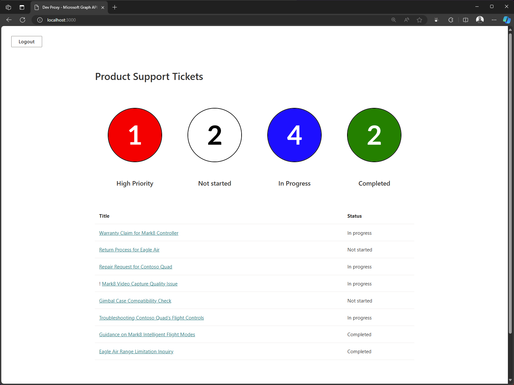
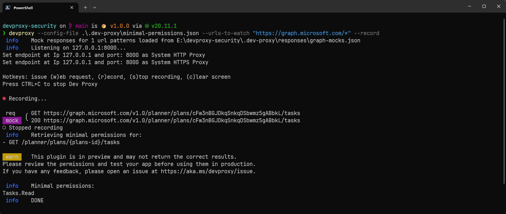
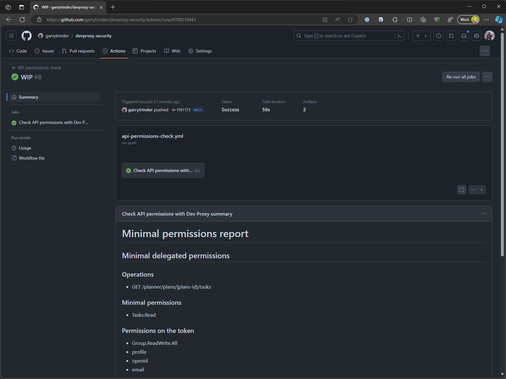
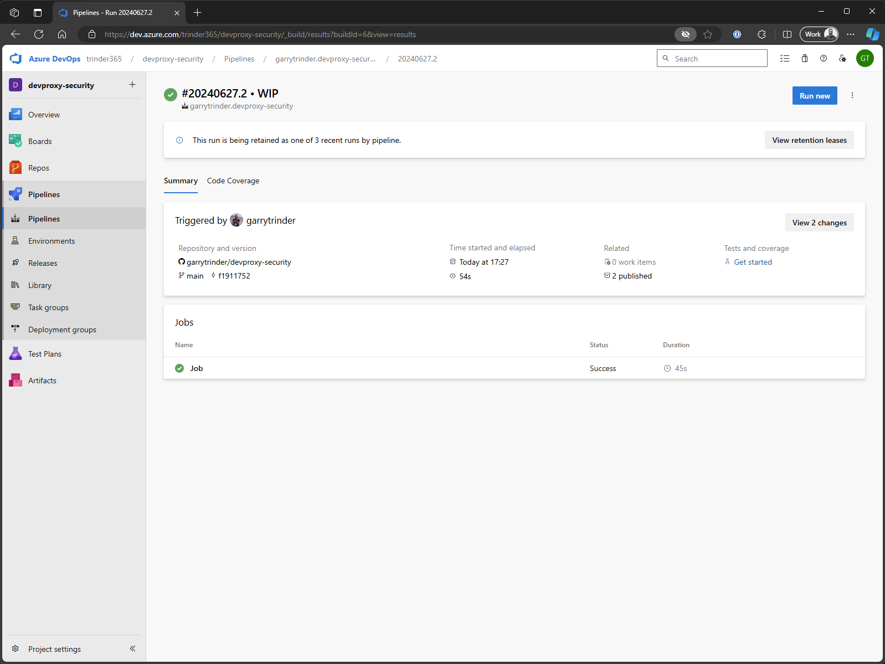

# Improve your app security when calling Microsoft Graph

## Summary

This sample demonstrates how to use Dev Proxy to improve your app security when calling Microsoft Graph API.

## Compatibility

## Contributors

* [Garry Trinder](https://github.com/garrytrinder)
* [Waldek Mastykarz](https://github.com/waldekmastykarz)

## Version history

Version|Date|Comments
-------|----|--------
1.2|January 5, 2026|Updated to Dev Proxy v2.0.0
1.1|October 28, 2024|Updated plugin name
1.0|July 3, 2024|Initial release

## Minimal path to awesome

1. Clone this repository (or [download this solution as a .ZIP file](https://pnp.github.io/download-partial/?url=https://github.com/pnp/proxy-samples/tree/main/samples/improve-app-security-graph) then unzip it)
1. [Install](https://learn.microsoft.com/microsoft-cloud/dev/dev-proxy/get-started) Dev Proxy
1. In a terminal session, open the sample folder
    1. If you cloned the repository, `cd samples/improve-app-security-graph`
1. Run `npm install` to install project dependencies
1. Run the setup script to create a Microsoft Entra app registration
    1. PowerShell
        1. Execute `.\scripts\setup.ps1`
    1. bash
        1. Execute `chmod +x ./scripts/setup.sh` to make the script an executable
        1. Execute `./scripts/setup.sh`

## Features

Using this sample you can use the Dev Proxy to:

1. Check for minimal permissions
2. Check if you are using excessive permissions
3. Prevent permission scope creep

## Scenarios

### Check for minimal permissions

If you work on a large solution that uses many endpoints, it can be difficult to build the exact list of minimal permissions for your application.

To check for minimal permissions locally:

1. Start the local web server, `npm start`
1. Start Dev Proxy, `devproxy --config-file .\.devproxy\minimal-permissions.json --urls-to-watch "https://graph.microsoft.com/*" --record`
1. Navigate to `http://localhost:3000`, login and wait for the table to be populated
1. Stop recording mode, press <kbd>S</kdb>
1. Stop Dev Proxy, press <kbd>Ctrl</kbd> + <kbd>C</kbd>

The minimal scopes for the tracked requests are shown in the console output.

> [!NOTE]
> Authentication flow is real, however the responses from Microsoft Graph are mocked.

### Check if you are using excessive permissions

A common approach to security is to apply the principle of least privilege (PoLP). This principle applies to users, processes and programs.

To check your access token for excessive permissions locally:

1. Start the local web server, `npm start`
1. Start Dev Proxy in recording mode, `devproxy -c .\.devproxy\excessive-permissions.json -u "https://graph.microsoft.com/*" --record`
1. Navigate to `http://localhost:3000`, login and wait for the table to be populated
1. Stop recording mode, press <kbd>S</kdb>
1. Stop Dev Proxy, press <kbd>Ctrl</kbd> + <kbd>C</kbd>
1. Stop the local web server, press <kbd>Ctrl</kbd> + <kbd>C</kbd>

The guidance is shown in the console output.

> [!NOTE]
> Authentication flow is real, however the responses from Microsoft Graph are mocked.

> [!TIP]
> To fix the permissions and verify the app functionality, [update the app registration permissions and requested scopes](#fixing-app-permissions), then repeat the above steps.
> To reset the permissions to the original state and verify the app functionality, [update the app registration permissions and requested scopes](#reset-app-permissions) and repeat the above steps.

### Prevent scope creep

This scenario uses Playwright end to end tests to automate the issuing of requests sent from your app to Microsoft Graph and generates a markdown report containing the minimal permission scopes and excessive scopes on the access token.

> [!IMPORTANT]
> For this scenario you will need to provide the username and password of an account which Playwright will use to login to your Microsoft 365 tenant and obtain an access token. MFA must not be enabled on this account.

> [!NOTE]
> This scenario uses the `devproxyrc.json` file in the root as its configuration

To run the tests locally:

1. In the project root folder, rename `.env.sample` to `.env`
1. In the `.env` file, replace `TEST_USERNAME` and `TEST_PASSWORD` environment variable values with those of your test account
1. Start Dev Proxy, `devproxy --record`
1. Run tests, `npm test`
1. Stop Dev Proxy, press <kbd>Ctrl</kbd> + <kbd>C</kbd>
1. Open `GraphMinimalPermissionsGuidancePlugin_MarkdownReporter.md` file to view the output

> [!NOTE]
> Authentication flow is real, however the responses from Microsoft Graph are mocked.

> [!TIP]
> To fix the permissions and verify the app functionality, [update the app registration permissions and requested scopes](#fixing-app-permissions), then repeat the above steps.
> To reset the permissions to the original state and verify the app functionality, [update the app registration permissions and requested scopes](#reset-app-permissions) and repeat the above steps.

A [GitHub Workflow](./.github/workflows/api-permissions-check.yml) and [Azure DevOps Pipeline](./azure-pipelines.yml) are provided to automatically run Playwright and Dev Proxy when new code is committed to the repo.

#### Github Actions

To use the workflow, you will need to:

* Create `TEST_PASSWORD` secret, set the value to the password of your test account. See [Creating secrets for a repository](https://docs.github.com/actions/security-guides/using-secrets-in-github-actions#creating-secrets-for-a-repository)
* Create `TEST_USERNAME` secret, set the value to the username of your test account.
* Create `APPID` variable, set the value to the ID of the Microsoft Entra app registration which is stored in the `env.js` file in the `src` directory. See [Creating configuration variables for a repository](https://docs.github.com/actions/learn-github-actions/variables#creating-configuration-variables-for-a-repository)

#### Azure Pipelines

To use the workflow, you will need to:

* Create `TEST_PASSWORD` secret variable, set the value to the password of your test account. See [Secret variable in the UI](https://learn.microsoft.com/azure/devops/pipelines/process/set-secret-variables?view=azure-devops&tabs=yaml%2Cbash#secret-variable-in-the-ui)
* Create `TEST_USERNAME` secret variable, set the value to the username of your test account.
* Create `APPID` variable, set the value to the ID of the Microsoft Entra app registration which is stored in the `env.js` file in the `src` directory.

## Fixing app permissions

To fix the app permissions and apply the principle of least privilege:

1. Run the fix script to update permissions and scopes
    1. PowerShell
        1. Execute `.\scripts\fix.ps1`
    1. bash
        1. Execute `chmod +x ./scripts/fix.sh` to make the script an executable
        1. Execute `./scripts/fix.sh`

The script will:

1. Replace the `Group.ReadWrite.All` scope with `Tasks.Read` in `src\env.js`
1. Remove the service principal
1. Create a new service principal
1. Add the `Tasks.Read` delegated permission and grant admin consent
1. Remove the `Group.ReadWrite.All` delegated permission

## Reset app permissions

To reset the app permissions to the original state:

1. Run the reset script to update permissions and scopes
    1. PowerShell
        1. Execute `.\scripts\reset.ps1`
    1. bash
        1. Execute `chmod +x ./scripts/reset.sh` to make the script an executable
        1. Execute `./scripts/reset.sh`

The script will:

1. Replace the `Tasks.Read` scope with `Group.ReadWrite.All` in `src\env.js`
1. Remove the service principal
1. Create a new service principal
1. Add the `Group.ReadWrite.All` delegated permission and grant admin consent
1. Remove the `Tasks.Read` delegated permission

## Help

We do not support samples, but this community is always willing to help, and we want to improve these samples. We use GitHub to track issues, which makes it easy for  community members to volunteer their time and help resolve issues.

You can try looking at [issues related to this sample](https://github.com/pnp/proxy-samples/issues?q=label%3A%22sample%3A%20pnp-devproxy-improve-app-security-graph) to see if anybody else is having the same issues.

If you encounter any issues using this sample, [create a new issue](https://github.com/pnp/proxy-samples/issues/new).

Finally, if you have an idea for improvement, [make a suggestion](https://github.com/pnp/proxy-samples/issues/new).

## Disclaimer

**THIS CODE IS PROVIDED *AS IS* WITHOUT WARRANTY OF ANY KIND, EITHER EXPRESS OR IMPLIED, INCLUDING ANY IMPLIED WARRANTIES OF FITNESS FOR A PARTICULAR PURPOSE, MERCHANTABILITY, OR NON-INFRINGEMENT.**

