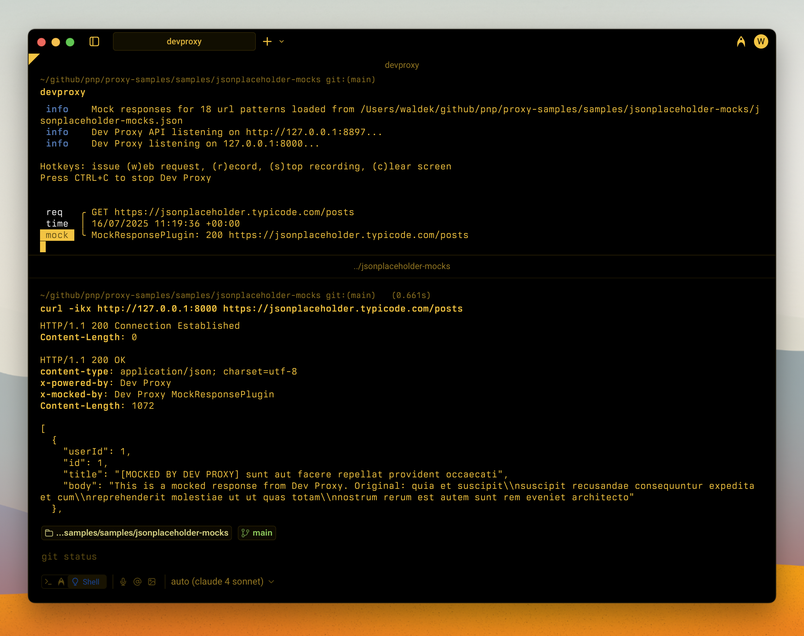

# JSONPlaceholder API mocks

## Summary

This sample demonstrates how Dev Proxy can mock API responses using the popular JSONPlaceholder API as an example. JSONPlaceholder is a free fake REST API commonly used for testing and prototyping, making it perfect for showcasing Dev Proxy's mocking capabilities.

The sample provides a complete working example of API mocking, where all responses clearly indicate they are generated by Dev Proxy through custom headers and modified response content. This makes it easy to see Dev Proxy in action and understand how it intercepts and replaces API calls with mock responses.



## Compatibility


## Contributors

* [Waldek Mastykarz](https://github.com/waldekmastykarz)

## Version history

Version|Date|Comments
-------|----|--------
1.2|January 18, 2026|Moved config files to .devproxy folder
1.1|January 5, 2026|Updated to Dev Proxy v2.0.0
1.0|July 16, 2025|Initial release

## Minimal path to awesome

* Clone this repository (or [download this solution as a .ZIP file](https://pnp.github.io/download-partial/?url=https://github.com/pnp/proxy-samples/tree/main/samples/jsonplaceholder-mocks) then unzip it)
* Start Dev Proxy: `devproxy`
* Test the mocks by making requests to JSONPlaceholder API endpoints:
  ```bash
  # Test GET requests
  curl -ikx http://127.0.0.1:8000 https://jsonplaceholder.typicode.com/posts
  curl -ikx http://127.0.0.1:8000 https://jsonplaceholder.typicode.com/users/1
  curl -ikx http://127.0.0.1:8000 https://jsonplaceholder.typicode.com/todos
  
  # Test POST request
  curl -ikx http://127.0.0.1:8000 -X POST https://jsonplaceholder.typicode.com/posts \
    -H "Content-Type: application/json" \
    -d '{"title":"Test Post","body":"Test content","userId":1}'
  
  # Test with headers to see Dev Proxy indicators
  curl -ikx http://127.0.0.1:8000 https://jsonplaceholder.typicode.com/posts
  ```

## Features

This sample provides comprehensive mocks for all major JSONPlaceholder API endpoints:

**Resource Collections:**
* `/posts` - Blog posts collection and individual posts
* `/comments` - Comments collection and post-specific comments  
* `/albums` - Photo albums collection and individual albums
* `/photos` - Photos collection and album-specific photos
* `/todos` - Todo items collection and individual todos
* `/users` - Users collection and individual users

**HTTP Methods:**
* `GET` - Retrieve data from all endpoints
* `POST` - Create new posts (returns mocked created response)
* `PUT` - Update existing posts (returns mocked updated response)
* `PATCH` - Partially update posts (returns mocked updated response)
* `DELETE` - Delete posts (returns empty success response)

**Key Features:**
* **Easy demonstration of Dev Proxy mocking** - Shows exactly how Dev Proxy intercepts API calls and returns mock responses
* **Clear visual indicators** - All responses include custom headers (`x-powered-by`, `x-mocked-by`) and modified content with `[MOCKED BY DEV PROXY]` prefixes
* **Comprehensive API coverage** - Supports all major JSONPlaceholder endpoints and HTTP methods
* **Realistic data structure** - Maintains the same JSON structure as the real JSONPlaceholder API
* **Development-friendly** - Modified emails, usernames, and company names to clearly indicate mock data

Using this sample you can use Dev Proxy to:

* **See Dev Proxy mocking in action** - Perfect introduction to understand how Dev Proxy works
* Learn how to configure API mocking for any REST API
* Test applications that integrate with JSONPlaceholder API without internet connectivity
* Develop and debug API integration code with predictable responses
* Demonstrate API mocking capabilities during presentations or training

## Help

We do not support samples, but this community is always willing to help, and we want to improve these samples. We use GitHub to track issues, which makes it easy for community members to volunteer their time and help resolve issues.

You can try looking at [issues related to this sample](https://github.com/pnp/proxy-samples/issues?q=label%3A%22sample%3A%20jsonplaceholder-mocks%22) to see if anybody else is having the same issues.

If you encounter any issues using this sample, [create a new issue](https://github.com/pnp/proxy-samples/issues/new).

Finally, if you have an idea for improvement, [make a suggestion](https://github.com/pnp/proxy-samples/issues/new).

## Disclaimer

**THIS CODE IS PROVIDED *AS IS* WITHOUT WARRANTY OF ANY KIND, EITHER EXPRESS OR IMPLIED, INCLUDING ANY IMPLIED WARRANTIES OF FITNESS FOR A PARTICULAR PURPOSE, MERCHANTABILITY, OR NON-INFRINGEMENT.**


