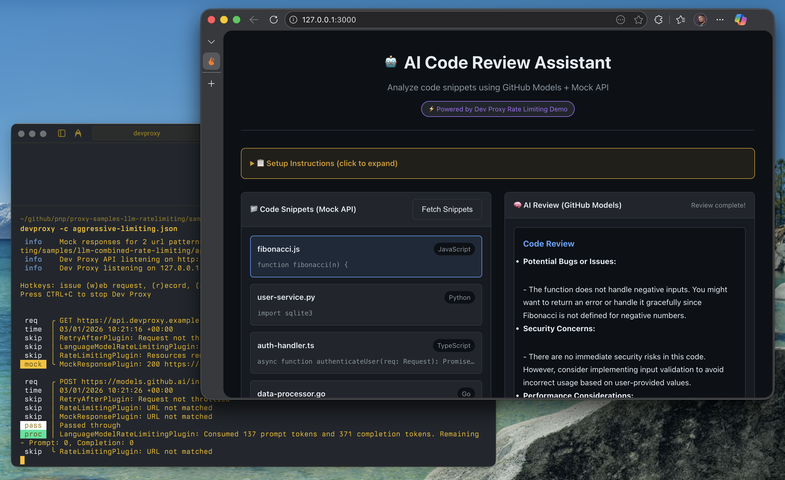
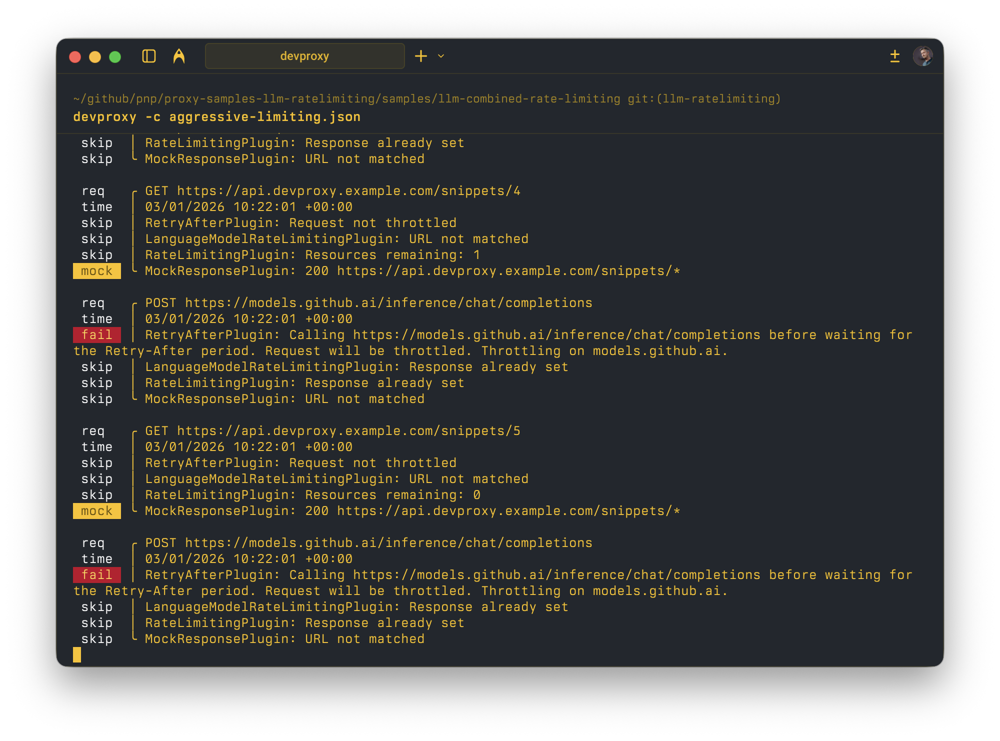

# Simulate combined token and request rate limiting for LLM applications

## Summary

This sample demonstrates how to combine the `LanguageModelRateLimitingPlugin` and `RateLimitingPlugin` to simulate realistic throttling scenarios that developers encounter when building applications that use language models (LLMs) in production. The sample includes:

- **Token-based rate limiting** for GitHub Models API (using `LanguageModelRateLimitingPlugin`)
- **Request-based rate limiting** for a mock API (using `RateLimitingPlugin`)
- **Interactive demo app** - an AI Code Review Assistant that showcases both rate limiting types in action

This combination helps developers test their applications' resilience when:
- LLM API token quotas are exceeded
- Supporting API request limits are reached
- Both types of limits are hit simultaneously


## Compatibility


## Contributors

- [Waldek Mastykarz](https://github.com/waldekmastykarz)

## Version history

Version|Date|Comments
-------|----|--------
1.0|January 3, 2026|Initial release

## Minimal path to awesome

### Prerequisites

1. **Get a GitHub Token** (for GitHub Models API):
   
   The easiest way is to use this pre-filled link that creates a token with the correct permissions:
   
   👉 **[Create GitHub Models Token](https://github.com/settings/personal-access-tokens/new?name=GitHub+Models+token&description=Used%20to%20call%20GitHub%20Models%20APIs&user_models=read)**
   
   Or create one manually:
   1. Go to [GitHub Settings → Developer settings → Personal access tokens → Fine-grained tokens](https://github.com/settings/tokens?type=beta)
   2. Click **Generate new token**
   3. Give it a name (e.g., "GitHub Models token")
   4. Set an expiration
   5. Under **Permissions → Account permissions**, find **Models** and set it to **Read**
   6. Click **Generate token** and copy the token

   > **Note**: The token needs the `models:read` permission to access [GitHub Models](https://github.com/marketplace/models).

2. **Install Dev Proxy** if you haven't already:
   - See [Dev Proxy setup guide](https://learn.microsoft.com/microsoft-cloud/dev/dev-proxy/get-started/set-up)

### Run the Demo

**1. Start Dev Proxy** with aggressive limiting to quickly trigger rate limits:

```bash
cd samples/llm-combined-rate-limiting
devproxy --config-file aggressive-limiting.json
```

> Dev Proxy automatically registers as a system proxy when started.

**2. Start the demo app:**

```bash
npx http-server -p 3000
```

**3. Open the app** at [http://localhost:3000](http://localhost:3000)

**4. Try the demo:**
   - Enter your GitHub token in the token field
   - Click **"Fetch Snippets"** to load code samples (tests API rate limiting)
   - Select a snippet and click **"Review with AI"** (tests LLM token rate limiting)
   - Click **"Review All (stress test)"** to rapidly hit both rate limits!

**5. Watch the Dev Proxy console** to see requests being intercepted and rate limits being applied

## Demo App Features

The **AI Code Review Assistant** demonstrates a real-world scenario where an application:

1. **Fetches code snippets** from a mock API (`api.devproxy.example.com`)
2. **Sends code to an LLM** for analysis (GitHub Models at `models.github.ai`)
3. **Displays results** to the user with real-time rate limit status

### Screenshots

**Successful code review:**


**Rate limiting in action (stress test):**


**Dev Proxy console output:**


### What the app shows

- 📊 **Real-time rate limit status** - See remaining requests/tokens
- 🚦 **Visual indicators** - Green/yellow/red status for rate limits
- ⚠️ **Error handling** - How throttling errors appear to users
- 🔄 **Stress testing** - "Review All" button to rapidly consume limits

### Sample code snippets

The demo includes intentionally problematic code to make AI reviews interesting:
- SQL injection vulnerability (Python)
- Hardcoded secrets (TypeScript)
- Inefficient algorithms (JavaScript)
- Error handling issues (Go)

## Configuration files

| File | Description |
|------|-------------|
| `devproxyrc.json` | Main configuration with production-like limits |
| `aggressive-limiting.json` | **Recommended for demo** - Low limits for quick testing |
| `api-mocks.json` | Mock responses for the code snippets API |
| `index.html` | Interactive demo app (AI Code Review Assistant) |

### Rate Limits Summary

| Config | API Requests | Token Limits (prompt/completion) | Reset Window |
|--------|--------------|----------------------------------|--------------|
| `devproxyrc.json` | 10/min | 1000/500 | 60s |
| `aggressive-limiting.json` | 5/30s | 100/50 | 30s |

## Features

This sample demonstrates the following Dev Proxy capabilities:

### LanguageModelRateLimitingPlugin

Simulates token-based rate limiting for LLM APIs:

- **Prompt token limit**: Maximum number of input tokens allowed per time window
- **Completion token limit**: Maximum number of output tokens allowed per time window
- **Token tracking**: Monitors actual token consumption from API responses
- **Throttling behavior**: Returns 429 responses when token limits are exceeded

### RateLimitingPlugin

Simulates request-based rate limiting for traditional APIs:

- **Request cost**: Configurable cost per request
- **Rate limit headers**: Exposes `X-RateLimit-Limit`, `X-RateLimit-Remaining`, and `X-RateLimit-Reset` headers
- **Warning threshold**: Starts returning rate limit headers when threshold is exceeded
- **Throttling behavior**: Returns 429 responses when request limits are exceeded

### MockResponsePlugin

Provides mock API responses for the code snippets service:
- Returns sample code snippets without needing a real backend
- Demonstrates how Dev Proxy can simulate complete APIs

### RetryAfterPlugin

Ensures that when your application receives a throttled response, subsequent requests made before the retry-after period expires are also blocked.

## Real-world scenarios

### Scenario 1: LLM-powered code review tool

The demo app simulates a realistic workflow:
1. Fetch code snippets from a repository API
2. Send code to an LLM for analysis
3. Display results to the user

Both APIs have rate limits - use this sample to test all failure modes.

### Scenario 2: Cost-conscious development

During development, you want to ensure your application:
- Gracefully handles rate limiting without crashing
- Implements proper retry logic with exponential backoff
- Shows appropriate user feedback when limits are reached
- Doesn't waste tokens on retries that will fail

### Scenario 3: Production readiness testing

Before deploying to production, test your application against realistic limits:
- Use the default configuration to simulate typical production limits
- Use aggressive limiting to stress-test your retry logic
- Use custom responses to verify error handling

## Troubleshooting

### Requests aren't being intercepted

Dev Proxy registers as a system proxy when started. If requests aren't being intercepted:

1. **Verify Dev Proxy is running** - Check the console output shows "Dev Proxy Listening on 127.0.0.1:8000..."
2. **Check system proxy settings** - Verify Dev Proxy is registered as your system proxy
3. **Browser-specific issues** - Some browsers may need to be restarted to pick up proxy changes

See the [Dev Proxy troubleshooting guide](https://learn.microsoft.com/microsoft-cloud/dev/dev-proxy/how-to/no-requests-intercepted) for more details.

## Tips for testing

1. **Watch the Dev Proxy output**: It shows when tokens are consumed and when limits are exceeded
2. **Use the aggressive config**: Makes it easy to trigger both types of rate limiting quickly
3. **Try the stress test**: Click "Review All" to see what happens when you hit limits rapidly
4. **Check the status bar**: The demo app shows real-time rate limit information

For more information about the configuration options, see:
- [LanguageModelRateLimitingPlugin documentation](https://learn.microsoft.com/microsoft-cloud/dev/dev-proxy/technical-reference/languagemodelratelimitingplugin)
- [RateLimitingPlugin documentation](https://learn.microsoft.com/microsoft-cloud/dev/dev-proxy/technical-reference/ratelimitingplugin)
- [MockResponsePlugin documentation](https://learn.microsoft.com/microsoft-cloud/dev/dev-proxy/technical-reference/mockresponseplugin)
- [RetryAfterPlugin documentation](https://learn.microsoft.com/microsoft-cloud/dev/dev-proxy/technical-reference/retryafterplugin)

## Help

We do not support samples, but this community is always willing to help, and we want to improve these samples. We use GitHub to track issues, which makes it easy for community members to volunteer their time and help resolve issues.

You can try looking at [issues related to this sample](https://github.com/pnp/proxy-samples/issues?q=label%3A%22sample%3A%20llm-combined-rate-limiting%22) to see if anybody else is having the same issues.

If you encounter any issues using this sample, [create a new issue](https://github.com/pnp/proxy-samples/issues/new).

Finally, if you have an idea for improvement, [make a suggestion](https://github.com/pnp/proxy-samples/issues/new).

## Disclaimer

**THIS CODE IS PROVIDED *AS IS* WITHOUT WARRANTY OF ANY KIND, EITHER EXPRESS OR IMPLIED, INCLUDING ANY IMPLIED WARRANTIES OF FITNESS FOR A PARTICULAR PURPOSE, MERCHANTABILITY, OR NON-INFRINGEMENT.**


