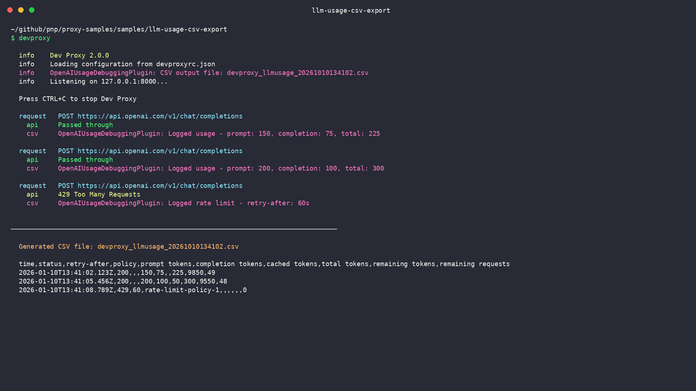

# Export LLM usage metrics to CSV

## Summary

This sample demonstrates how to use Dev Proxy to export LLM usage metrics to a CSV file for detailed analysis. The `OpenAIUsageDebuggingPlugin` captures usage data from OpenAI-compatible API requests and writes them to a CSV file, enabling offline analysis in spreadsheets or BI tools.



## Compatibility


## Contributors

- [Copilot](https://github.com/copilot)

## Version history

Version|Date|Comments
-------|----|--------
1.0|January 6, 2026|Initial release

## Minimal path to awesome

1. Clone this repository (or [download this solution as a .ZIP file](https://pnp.github.io/download-partial/?url=https://github.com/pnp/proxy-samples/tree/main/samples/llm-usage-csv-export) then unzip it)
1. Change to the sample directory: `cd samples/llm-usage-csv-export`
1. Start Dev Proxy: `devproxy`
1. Make requests to an OpenAI-compatible API through the proxy. For example, using curl:

   ```bash
   curl -ikx http://127.0.0.1:8000 https://api.openai.com/v1/chat/completions \
     -H "Authorization: Bearer YOUR_API_KEY" \
     -H "Content-Type: application/json" \
     -d '{"model": "gpt-4", "messages": [{"role": "user", "content": "Hello!"}]}'
   ```

   > **Note**: Replace `YOUR_API_KEY` with your actual API key. Never commit API keys to version control.

1. Stop Dev Proxy by pressing <kbd>Ctrl</kbd> + <kbd>C</kbd>
1. Find the generated CSV file in your working directory named `devproxy_llmusage_<timestamp>.csv`
1. Open the CSV file in a spreadsheet application for analysis

## CSV output format

The plugin generates a CSV file with the following columns:

| Column | Description |
|--------|-------------|
| `time` | ISO 8601 timestamp of the request |
| `status` | HTTP status code of the response |
| `retry-after` | Value of the retry-after header (for rate-limited requests) |
| `policy` | Value of the policy-id header (for rate-limited requests) |
| `prompt tokens` | Number of tokens in the prompt/input |
| `completion tokens` | Number of tokens in the completion/output |
| `cached tokens` | Number of cached tokens (from prompt cache) |
| `total tokens` | Total number of tokens used (prompt + completion) |
| `remaining tokens` | Remaining tokens in the rate limit window |
| `remaining requests` | Remaining requests in the rate limit window |

### Example CSV output

```csv
time,status,retry-after,policy,prompt tokens,completion tokens,cached tokens,total tokens,remaining tokens,remaining requests
2025-10-28T10:15:30.123Z,200,,,150,75,,225,9850,49
2025-10-28T10:15:35.456Z,200,,,200,100,50,300,9550,48
2025-10-28T10:15:40.789Z,429,60,rate-limit-policy-1,,,,,,0
```

## Features

This sample demonstrates how to use Dev Proxy to:

- Export LLM usage metrics to CSV for offline analysis
- Track token consumption (prompt, completion, cached, and total tokens)
- Monitor rate limit information (remaining tokens and requests)
- Analyze API responses including throttling scenarios
- Debug token usage without complex telemetry setup

## Use cases

- **Debugging token consumption**: Understanding how many tokens your prompts and completions consume
- **Monitoring rate limits**: Tracking remaining tokens and requests to avoid hitting rate limits
- **Cost analysis**: Analyzing token usage patterns to estimate costs
- **Performance optimization**: Identifying requests with high token counts
- **Prompt caching analysis**: Tracking cached token usage to optimize prompt caching strategies
- **Spreadsheet analysis**: Import CSV to Excel or Google Sheets for custom analysis
- **BI tool integration**: Import data to Power BI, Tableau, or other BI tools

## Comparison with OpenAITelemetryPlugin

Dev Proxy offers two complementary approaches for tracking LLM usage:

| Feature | OpenAIUsageDebuggingPlugin | OpenAITelemetryPlugin |
|---------|---------------------------|----------------------|
| Output format | CSV file | OpenTelemetry |
| Analysis | Offline, spreadsheet-based | Real-time dashboards |
| Rate limit info | Yes | No |
| Best for | Debugging, offline analysis | Monitoring, cost tracking |

Both plugins can be enabled simultaneously to get both real-time telemetry and detailed CSV logs.

## Help

We do not support samples, but this community is always willing to help, and we want to improve these samples. We use GitHub to track issues, which makes it easy for community members to volunteer their time and help resolve issues.

You can try looking at [issues related to this sample](https://github.com/pnp/proxy-samples/issues?q=label%3A%22sample%3A%20llm-usage-csv-export%22) to see if anybody else is having the same issues.

If you encounter any issues using this sample, [create a new issue](https://github.com/pnp/proxy-samples/issues/new).

Finally, if you have an idea for improvement, [make a suggestion](https://github.com/pnp/proxy-samples/issues/new).

## Disclaimer

**THIS CODE IS PROVIDED *AS IS* WITHOUT WARRANTY OF ANY KIND, EITHER EXPRESS OR IMPLIED, INCLUDING ANY IMPLIED WARRANTIES OF FITNESS FOR A PARTICULAR PURPOSE, MERCHANTABILITY, OR NON-INFRINGEMENT.**


