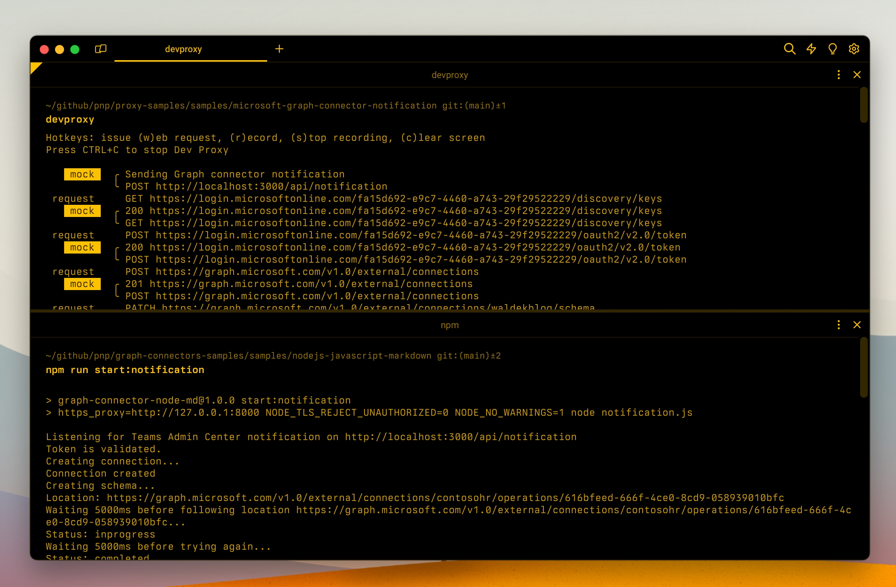

# Simulate handling Teams Admin Center notification for Graph connectors

## Summary

This sample contains mocks for simulating handling notifications from the Teams Admin Center (TAC) for Graph connectors. Using these mocks, you can simulate enabling and disabling a Graph connector through Teams Admin Center, without having to package your Graph connector as a Teams app and deploying it to Teams Admin Center first. This sample also contains mocks for handling creating the external connection, provisioning the schema, ingesting external items and deleting the connection.

## Compatibility

## Contributors

- [Waldek Mastykarz](https://github.com/waldekmastykarz)

## Version history

Version|Date|Comments
-------|----|--------
1.1|March 20, 2024|Added Graph connector guidance plugin
1.0|March 11, 2024|Initial release

## Before you start

This sample is built to work with a mock tenant with ID `fa15d692-e9c7-4460-a743-29f29522229` and a single-tenant Entra app registration with ID `ef1da9d4-ff77-4c3e-a005-840c3f830745`. If you want to use your own IDs, so that you don't need to change your code, update the references to these IDs in all preset files.

## Minimal path to awesome

- Get the preset using Dev Proxy by running `devproxy preset get microsoft-graph-connector-notification`

### To test enabling a Graph connector through Teams Admin Center

- In the `microsoft-graph-connector-notification/devproxyrc.json` file, enable the `GraphConnectorNotificationPlugin` plugin instance linked to the `graphConnectorNotificationEnabled` section (on line 6, change `enabled` to `true`)
- In the `microsoft-graph-connector-notification/devproxyrc.json` file, disable the `GraphConnectorNotificationPlugin` plugin instance linked to the `graphConnectorNotificationDisabled` section (on line 12, change `enabled` to `false`)
- In the `microsoft-graph-connector-notification/graph-connector-notification-enabled.json` file, in the `url` property, specify the URL of your API that handles the TAC notification
- Start your API that handles the TAC notification
- Start Dev Proxy with the config file, by running `devproxy --config-file "~appFolder/presets/microsoft-graph-connector-notification/devproxyrc.json"`
- Press `w` to issue the simulated TAC notification to your API

### To test disabling a Graph connector through Teams Admin Center

- In the `microsoft-graph-connector-notification/devproxyrc.json` file, disable the `GraphConnectorNotificationPlugin` plugin instance linked to the `graphConnectorNotificationEnabled` section (on line 6, change `enabled` to `false`)
- In the `microsoft-graph-connector-notification/devproxyrc.json` file, enable the `GraphConnectorNotificationPlugin` plugin instance linked to the `graphConnectorNotificationDisabled` section (on line 12, change `enabled` to `true`)
- In the `microsoft-graph-connector-notification/graph-connector-notification-disabled.json` file, in the `url` property, specify the URL of your API that handles the TAC notification
- Start your API that handles the TAC notification
- Start Dev Proxy with the config file, by running `devproxy --config-file "~appFolder/presets/microsoft-graph-connector-notification/devproxyrc.json"`
- Press `w` to issue the simulated TAC notification to your API

## Help

We do not support samples, but this community is always willing to help, and we want to improve these samples. We use GitHub to track issues, which makes it easy for  community members to volunteer their time and help resolve issues.

You can try looking at [issues related to this sample](https://github.com/pnp/proxy-samples/issues?q=label%3A%22sample%3A%microsoft-graph-connector-notification%22) to see if anybody else is having the same issues.

If you encounter any issues using this sample, [create a new issue](https://github.com/pnp/proxy-samples/issues/new).

Finally, if you have an idea for improvement, [make a suggestion](https://github.com/pnp/proxy-samples/issues/new).

## Disclaimer

**THIS CODE IS PROVIDED *AS IS* WITHOUT WARRANTY OF ANY KIND, EITHER EXPRESS OR IMPLIED, INCLUDING ANY IMPLIED WARRANTIES OF FITNESS FOR A PARTICULAR PURPOSE, MERCHANTABILITY, OR NON-INFRINGEMENT.**

