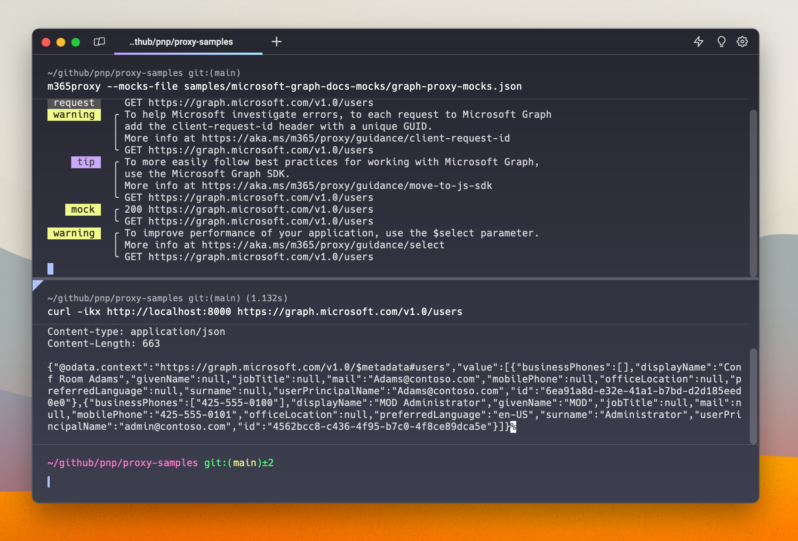

# Microsoft Graph mocks from Microsoft Graph API docs

## Summary

This sample contains mocks for the Microsoft Graph API based on the Microsoft Graph API documentation. Mocks are created based on sample requests and responses included in the Microsoft Graph documentation.

Using these mocks, you can simulate calling Microsoft Graph API without having to connect to the actual service. This is useful for testing and development purposes. These mocks are also helpful when you want to demo time-sensitive functionality such as recently opened files, without having to generate activity on your tenant for Microsoft Graph to return the data.

## Compatibility

## Contributors

- [Waldek Mastykarz](https://github.com/waldekmastykarz)

## Version history

Version|Date|Comments
-------|----|--------
1.9|January 5, 2026|Updated to Dev Proxy v2.0.0
1.8|June 27, 2025|Updated to Dev Proxy v0.29.2
1.7.1|April 9, 2025|Fixed bugs
1.7|February 19, 2025|Updated mocks, added preset
1.6|January 25, 2024|Updated schema version
1.5|January 11, 2024|Updated to new format
1.4|December 22, 2023|Updated to new format
1.3|November 17, 2023|Updated mocks
1.2|November 14, 2023|Renamed to Dev Proxy
1.1|September 20, 2023|Updated mocks
1.0|August 10, 2023|Initial release

## Minimal path to awesome

- Clone this repository (or [download this solution as a .ZIP file](https://pnp.github.io/download-partial/?url=https://github.com/pnp/proxy-samples/tree/main/samples/microsoft-graph-docs-mocks) then unzip it)
- Start Dev Proxy specifying the path to one of the mock files, eg. `devproxy --mocks-file graph-proxy-mocks.json`

## Features

The sample contains three mock files:

- mocks for Microsoft Graph v1.0 endpoints (`graph-v1_0-proxy-mocks.json`)
- mocks for Microsoft Graph beta endpoints (`graph-beta-proxy-mocks.json`)
- mocks combining both v1.0 and beta endpoints (`graph-proxy-mocks.json`)

If you only use v1.0 or beta Microsoft Graph endpoints, you can load the specific mocks file for better performance. If you want to mock requests to both v1.0 and beta endpoints, you can use the combined file instead.

## Help

We do not support samples, but this community is always willing to help, and we want to improve these samples. We use GitHub to track issues, which makes it easy for  community members to volunteer their time and help resolve issues.

You can try looking at [issues related to this sample](https://github.com/pnp/proxy-samples/issues?q=label%3A%22sample%3A%20microsoft-graph-docs-mocks%22) to see if anybody else is having the same issues.

If you encounter any issues using this sample, [create a new issue](https://github.com/pnp/proxy-samples/issues/new).

Finally, if you have an idea for improvement, [make a suggestion](https://github.com/pnp/proxy-samples/issues/new).

## Disclaimer

**THIS CODE IS PROVIDED *AS IS* WITHOUT WARRANTY OF ANY KIND, EITHER EXPRESS OR IMPLIED, INCLUDING ANY IMPLIED WARRANTIES OF FITNESS FOR A PARTICULAR PURPOSE, MERCHANTABILITY, OR NON-INFRINGEMENT.**

