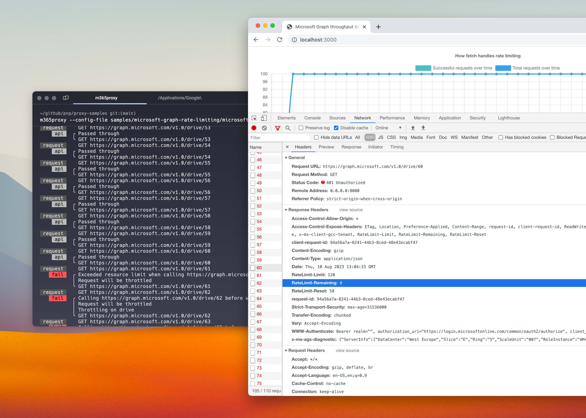

# Simulate rate limiting on Microsoft Graph APIs

## Summary

This sample contains a preset to simulate rate limiting on Microsoft Graph APIs.

Your app syncs files from OneDrive or SharePoint through Microsoft Graph. It works with a small test library, and then gets throttled in production, where a large library sends many more requests.

Using this preset, you can see how your app handles Microsoft Graph throttling on your machine. Dev Proxy limits requests to the Microsoft Graph drive, shares, and sites endpoints on all Microsoft clouds to 40 requests in 20 seconds, and then answers with a `429` and a `Retry-After` header. Your app keeps calling the real Microsoft Graph URLs.



## Compatibility


## Contributors

- [Waldek Mastykarz](https://github.com/waldekmastykarz)

## Version history

Version|Date|Comments
-------|----|--------
2.3|October 3, 2026|Rewrote the summary around the problem the preset solves, added `devproxy config get` steps
2.2|September 28, 2026|Updated to Dev Proxy v3.3.1
2.1|July 1, 2026|Updated to Dev Proxy v3.1.0
2.0|June 17, 2026|Updated to Dev Proxy v3.0.1
1.9|May 30, 2026|Updated to Dev Proxy v3.0.0
1.8|March 26, 2026|Updated to Dev Proxy v2.3.0
1.7|March 11, 2026|Updated to Dev Proxy v2.2.0
1.6|February 4, 2026|Updated to Dev Proxy v2.1.0
1.5|January 18, 2026|Moved config files to .devproxy folder
1.4|January 5, 2026|Updated to Dev Proxy v2.0.0
1.3|June 27, 2025|Updated to Dev Proxy v0.29.2
1.2|January 17, 2023|Updated plugin path
1.1|November 14, 2023|Renamed to Dev Proxy
1.0|August 10, 2023|Initial release

## Minimal path to awesome

- Get the sample:
  - Download just this sample:

      ```bash
      npx gitload-cli https://github.com/pnp/proxy-samples/tree/main/samples/microsoft-graph-rate-limiting
      ```

    or

  - [Download as a .ZIP file](https://pnp.github.io/download-partial/?url=https://github.com/pnp/proxy-samples/tree/main/samples/microsoft-graph-rate-limiting) and unzip it, or
  - Clone this repository
- Start Dev Proxy by running `devproxy` in the sample's folder

Alternatively, download the preset with Dev Proxy and start it from any folder:

```bash
devproxy config get microsoft-graph-rate-limiting
devproxy --config-file "~dataFolder/configs/microsoft-graph-rate-limiting/.devproxy/devproxyrc.json"
```

## Features

This preset simulates rate limiting on Microsoft Graph drive and shares endpoints on all Microsoft Clouds.

For more information about the configuration options, see the [documentation of the RateLimitingPlugin](https://learn.microsoft.com/microsoft-cloud/dev/dev-proxy/technical-reference/ratelimitingplugin?WT.mc_id=devproxy-samples-microsoft-graph-rate-limiting).

## Help

We do not support samples, but this community is always willing to help, and we want to improve these samples. We use GitHub to track issues, which makes it easy for  community members to volunteer their time and help resolve issues.

You can try looking at [issues related to this sample](https://github.com/pnp/proxy-samples/issues?q=label%3A%22sample%3A%20microsoft-graph-rate-limiting%22) to see if anybody else is having the same issues.

If you encounter any issues using this sample, [create a new issue](https://github.com/pnp/proxy-samples/issues/new).

Finally, if you have an idea for improvement, [make a suggestion](https://github.com/pnp/proxy-samples/issues/new).

## Disclaimer

**THIS CODE IS PROVIDED *AS IS* WITHOUT WARRANTY OF ANY KIND, EITHER EXPRESS OR IMPLIED, INCLUDING ANY IMPLIED WARRANTIES OF FITNESS FOR A PARTICULAR PURPOSE, MERCHANTABILITY, OR NON-INFRINGEMENT.**


