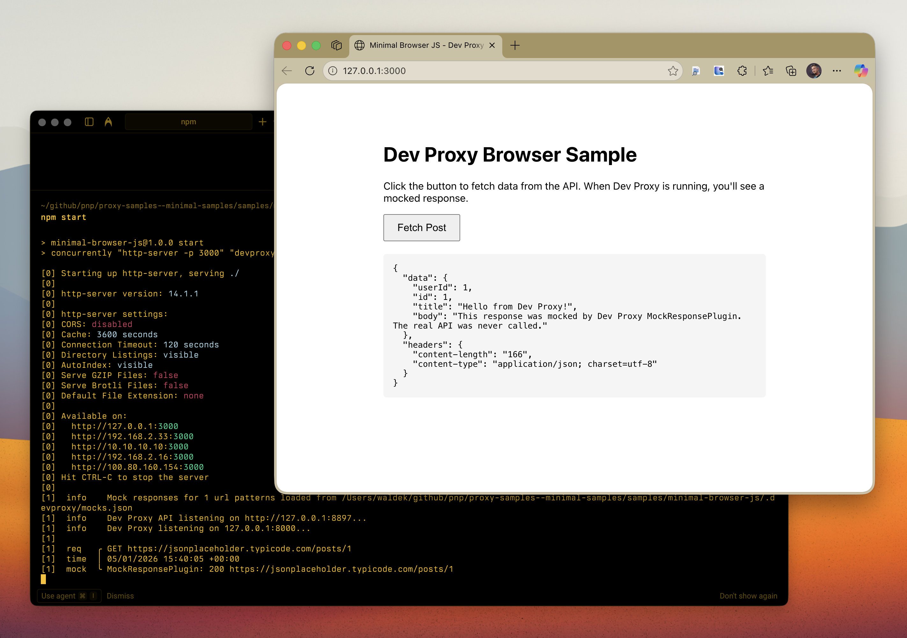

# Minimal JavaScript browser app using Dev Proxy

## Summary

This sample demonstrates the minimal setup to use Dev Proxy with JavaScript running in a browser. It shows how to:

- Configure Dev Proxy to intercept API requests from a browser
- Mock API responses using the MockResponsePlugin with CORS headers
- Run a simple web app through Dev Proxy

The sample makes a single API call to JSONPlaceholder and returns a mocked response, demonstrating how Dev Proxy intercepts and replaces the real API call in a browser environment.

## Compatibility

## Contributors

- [Waldek Mastykarz](https://github.com/waldekmastykarz)

## Version history

Version|Date|Comments
-------|----|--------
1.0|January 5, 2026|Initial release

## Prerequisites

- [Dev Proxy](https://aka.ms/devproxy)
- [Node.js LTS](https://nodejs.org) (for http-server)

## Minimal path to awesome

- Clone this repository (or [download this solution as a .ZIP file](https://pnp.github.io/download-partial/?url=https://github.com/pnp/proxy-samples/tree/main/samples/minimal-browser-js) and unzip it)
- Navigate to the sample folder: `cd samples/minimal-browser-js`
- Run `npm install` to install dependencies
- Run `npm start` to start Dev Proxy and the web server
- Open http://localhost:3000 in your browser
- Click the button to fetch data and observe the mocked response with headers `x-powered-by: Dev Proxy` and `x-mocked-by: Dev Proxy MockResponsePlugin`

## Features

This sample illustrates the following concepts:

- Configuring Dev Proxy with a `.devproxy/devproxyrc.json` file
- Using MockResponsePlugin to return custom API responses with CORS headers
- Running browser-based JavaScript applications through Dev Proxy
- Adding custom headers to mocked responses

## Help

We do not support samples, but this community is always willing to help, and we want to improve these samples. We use GitHub to track issues, which makes it easy for community members to volunteer their time and help resolve issues.

You can try looking at [issues related to this sample](https://github.com/pnp/proxy-samples/issues?q=label%3A%22sample%3A%20minimal-browser-js%22) to see if anybody else is having the same issues.

If you encounter any issues using this sample, [create a new issue](https://github.com/pnp/proxy-samples/issues/new).

Finally, if you have an idea for improvement, [make a suggestion](https://github.com/pnp/proxy-samples/issues/new).

## Disclaimer

**THIS CODE IS PROVIDED *AS IS* WITHOUT WARRANTY OF ANY KIND, EITHER EXPRESS OR IMPLIED, INCLUDING ANY IMPLIED WARRANTIES OF FITNESS FOR A PARTICULAR PURPOSE, MERCHANTABILITY, OR NON-INFRINGEMENT.**

