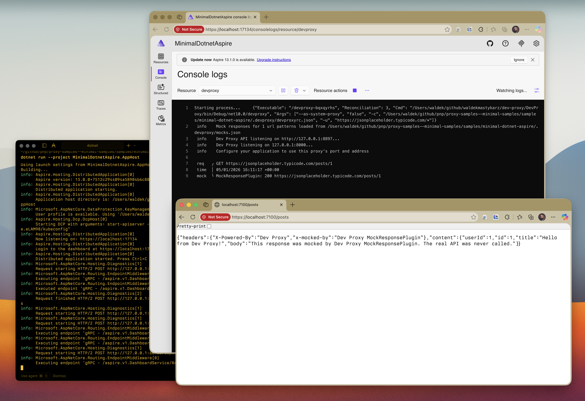

# Minimal .NET Aspire app using Dev Proxy

## Summary

This sample demonstrates the minimal setup to use Dev Proxy with .NET Aspire using the [DevProxy.Hosting](https://www.nuget.org/packages/DevProxy.Hosting) package. It shows how to:

- Add Dev Proxy as an Aspire resource using `AddDevProxyExecutable`
- Configure Dev Proxy to intercept API requests
- Mock API responses using the MockResponsePlugin
- Set up an Aspire AppHost that orchestrates Dev Proxy and a web API service

The sample makes a single API call to JSONPlaceholder and returns a mocked response, demonstrating how Dev Proxy intercepts and replaces the real API call in a distributed .NET Aspire application.

## Compatibility

## Contributors

- [Waldek Mastykarz](https://github.com/waldekmastykarz)

## Version history

Version|Date|Comments
-------|----|--------
1.1|January 18, 2026|Fixed sample metadata
1.0|January 5, 2026|Initial release

## Prerequisites

- [Dev Proxy](https://aka.ms/devproxy)
- [.NET 10 SDK](https://dotnet.microsoft.com/download/dotnet/10.0)

## Minimal path to awesome

- Clone this repository (or [download this solution as a .ZIP file](https://pnp.github.io/download-partial/?url=https://github.com/pnp/proxy-samples/tree/main/samples/minimal-dotnet-aspire) and unzip it)
- Navigate to the sample folder: `cd samples/minimal-dotnet-aspire`
- Run the app: `dotnet run --project MinimalDotnetAspire.AppHost`
- Open the Aspire dashboard (URL shown in the terminal output, e.g., `http://localhost:15170/login?t=...`)
- In the dashboard, find the **apiservice** row and click its endpoint URL
- Add `/posts` to the URL to see the mocked response with headers `x-powered-by: Dev Proxy` and `x-mocked-by: Dev Proxy MockResponsePlugin`

## Features

This sample illustrates the following concepts:

- Using the `DevProxy.Hosting` NuGet package to integrate Dev Proxy with .NET Aspire
- Adding Dev Proxy as an executable resource with `AddDevProxyExecutable`
- Configuring Dev Proxy with a `.devproxy/devproxyrc.json` file
- Using MockResponsePlugin to return custom API responses
- Setting up .NET Aspire AppHost to orchestrate Dev Proxy and services
- Using `HTTPS_PROXY` environment variable to route requests through Dev Proxy
- Adding custom headers to mocked responses

## Help

We do not support samples, but this community is always willing to help, and we want to improve these samples. We use GitHub to track issues, which makes it easy for community members to volunteer their time and help resolve issues.

You can try looking at [issues related to this sample](https://github.com/pnp/proxy-samples/issues?q=label%3A%22sample%3A%20minimal-dotnet-aspire%22) to see if anybody else is having the same issues.

If you encounter any issues using this sample, [create a new issue](https://github.com/pnp/proxy-samples/issues/new).

Finally, if you have an idea for improvement, [make a suggestion](https://github.com/pnp/proxy-samples/issues/new).

## Disclaimer

**THIS CODE IS PROVIDED *AS IS* WITHOUT WARRANTY OF ANY KIND, EITHER EXPRESS OR IMPLIED, INCLUDING ANY IMPLIED WARRANTIES OF FITNESS FOR A PARTICULAR PURPOSE, MERCHANTABILITY, OR NON-INFRINGEMENT.**

