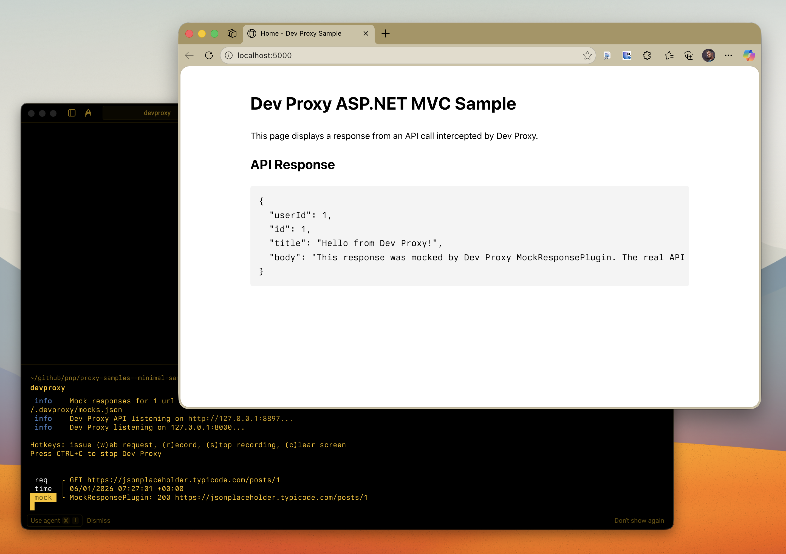

# Minimal Blazor app using Dev Proxy

## Summary

This sample demonstrates the minimal setup to use Dev Proxy with a Blazor WebAssembly application. It shows how to:

- Configure Dev Proxy to intercept API requests from a browser-based application
- Mock API responses using the MockResponsePlugin with CORS headers
- Make HTTP requests from a Blazor component using HttpClient

The sample makes a single API call to JSONPlaceholder and returns a mocked response, demonstrating how Dev Proxy intercepts and replaces the real API call in a browser context.

## Compatibility

## Contributors

- [Waldek Mastykarz](https://github.com/waldekmastykarz)

## Version history

Version|Date|Comments
-------|----|--------
1.1|January 18, 2026|Fixed sample metadata
1.0|January 5, 2026|Initial release

## Prerequisites

- [Dev Proxy](https://aka.ms/devproxy)
- [.NET 10.0 SDK](https://dotnet.microsoft.com/download/dotnet/10.0)

## Minimal path to awesome

- Clone this repository (or [download this solution as a .ZIP file](https://pnp.github.io/download-partial/?url=https://github.com/pnp/proxy-samples/tree/main/samples/minimal-dotnet-blazor) and unzip it)
- Navigate to the sample folder: `cd samples/minimal-dotnet-blazor`
- In one terminal, start Dev Proxy: `devproxy`
- In another terminal, run the app: `dotnet run`
- Open the app URL shown in the terminal (typically https://localhost:5001 or http://localhost:5000)
- Click the "Fetch Post from API" button
- Observe the mocked API response with headers `x-powered-by: Dev Proxy` and `x-mocked-by: Dev Proxy MockResponsePlugin`

## Features

This sample illustrates the following concepts:

- Configuring Dev Proxy with a `.devproxy/devproxyrc.json` file
- Using MockResponsePlugin to return custom API responses
- Including CORS headers in mocked responses for browser-based applications
- Making HTTP requests from Blazor components
- Displaying response data and headers in a Blazor UI

## Help

We do not support samples, but this community is always willing to help, and we want to improve these samples. We use GitHub to track issues, which makes it easy for community members to volunteer their time and help resolve issues.

You can try looking at [issues related to this sample](https://github.com/pnp/proxy-samples/issues?q=label%3A%22sample%3A%20minimal-dotnet-blazor%22) to see if anybody else is having the same issues.

If you encounter any issues using this sample, [create a new issue](https://github.com/pnp/proxy-samples/issues/new).

Finally, if you have an idea for improvement, [make a suggestion](https://github.com/pnp/proxy-samples/issues/new).

## Disclaimer

**THIS CODE IS PROVIDED *AS IS* WITHOUT WARRANTY OF ANY KIND, EITHER EXPRESS OR IMPLIED, INCLUDING ANY IMPLIED WARRANTIES OF FITNESS FOR A PARTICULAR PURPOSE, MERCHANTABILITY, OR NON-INFRINGEMENT.**

