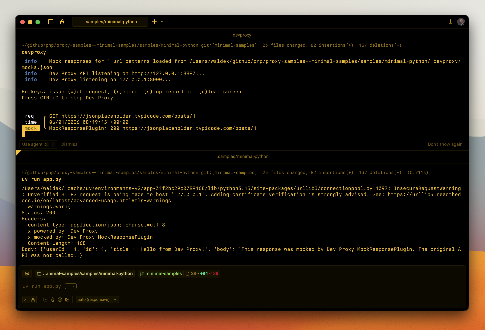

# Minimal Python app using Dev Proxy

## Summary

This sample demonstrates the minimal setup to use Dev Proxy with a Python application. It shows how to configure the `requests` library to route traffic through Dev Proxy and receive mocked API responses.



## Compatibility


## Contributors

- [Waldek Mastykarz](https://github.com/waldekmastykarz)

## Version history

Version|Date|Comments
-------|----|--------
1.0|January 5, 2026|Initial release

## Prerequisites

- [uv](https://docs.astral.sh/uv/)
- [Dev Proxy](https://aka.ms/devproxy)

## Minimal path to awesome

- Clone this repository (or [download this solution as a .ZIP file](https://pnp.github.io/download-partial/?url=https://github.com/pnp/proxy-samples/tree/main/samples/minimal-python) then unzip it)
- Navigate to the sample folder
- In one terminal, start Dev Proxy:

  ```bash
  devproxy
  ```

- In another terminal, run the app:

  ```bash
  uv run app.py
  ```

- Observe the mocked API response in the console

## Features

This sample demonstrates:

- Configuring Python's `requests` library to use Dev Proxy
- Disabling SSL verification for Dev Proxy's self-signed certificate
- Using MockResponsePlugin to return mocked API responses
- Adding custom headers to identify mocked responses

## Help

We do not support samples, but this community is always willing to help, and we want to improve these samples. We use GitHub to track issues, which makes it easy for community members to volunteer their time and help resolve issues.

You can try looking at [issues related to this sample](https://github.com/pnp/proxy-samples/issues?q=label%3A%22sample%3A%20minimal-python%22) to see if anybody else is having the same issues.

If you encounter any issues using this sample, [create a new issue](https://github.com/pnp/proxy-samples/issues/new).

Finally, if you have an idea for improvement, [make a suggestion](https://github.com/pnp/proxy-samples/issues/new).

## Disclaimer

**THIS CODE IS PROVIDED *AS IS* WITHOUT WARRANTY OF ANY KIND, EITHER EXPRESS OR IMPLIED, INCLUDING ANY IMPLIED WARRANTIES OF FITNESS FOR A PARTICULAR PURPOSE, MERCHANTABILITY, OR NON-INFRINGEMENT.**


