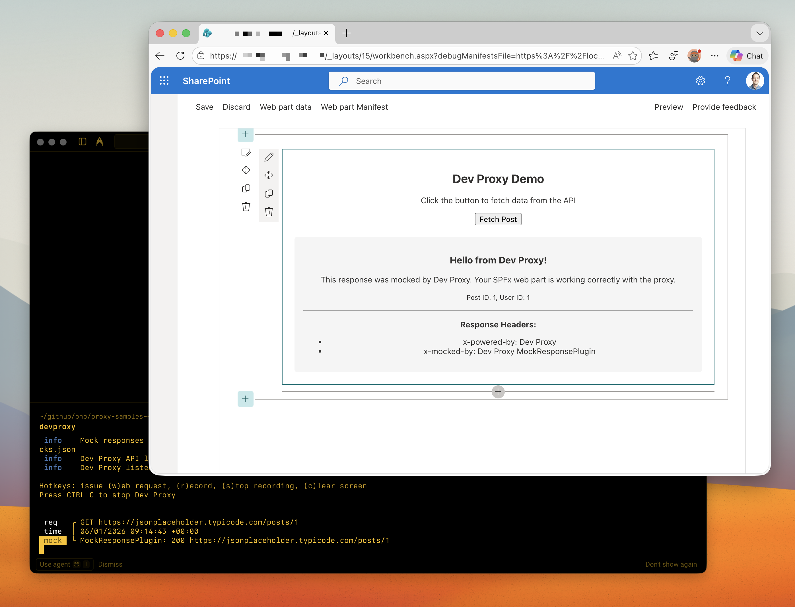

# Minimal SharePoint Framework web part using Dev Proxy

## Summary

This sample demonstrates the minimal setup to use Dev Proxy with a SharePoint Framework (SPFx) web part. It shows how to configure Dev Proxy to intercept API requests from an SPFx web part and mock responses using the MockResponsePlugin.

## Compatibility

## Contributors

- [Waldek Mastykarz](https://github.com/waldekmastykarz)

## Version history

Version|Date|Comments
-------|----|--------
1.1|January 18, 2026|Fixed sample metadata
1.0|January 6, 2026|Initial release

## Prerequisites

- [Dev Proxy](https://aka.ms/devproxy)
- [Node.js v22](https://nodejs.org/)

## Minimal path to awesome

- Clone this repository (or [download this solution as a .ZIP file](https://pnp.github.io/download-partial/?url=https://github.com/pnp/proxy-samples/tree/main/samples/minimal-spfx) and unzip it)
- Navigate to the sample folder: `cd samples/minimal-spfx`
- Install dependencies: `npm install`
- In one terminal, start Dev Proxy: `devproxy`
- In another terminal, serve the web part: `npm start`
- In the SharePoint workbench, add the **DevProxyDemo** web part
- Click the "Fetch Post" button
- Observe the mocked API response with headers `x-powered-by: Dev Proxy` and `x-mocked-by: Dev Proxy MockResponsePlugin`

## Features

This sample illustrates the following concepts:

- Configuring Dev Proxy with a `.devproxy/devproxyrc.json` file
- Using MockResponsePlugin to return custom API responses
- Including CORS headers in mocked responses for browser-based SPFx applications
- Making HTTP requests from SPFx web parts using HttpClient
- Displaying mocked response data and headers in a web part

## Help

We do not support samples, but this community is always willing to help, and we want to improve these samples. We use GitHub to track issues, which makes it easy for community members to volunteer their time and help resolve issues.

You can try looking at [issues related to this sample](https://github.com/pnp/proxy-samples/issues?q=label%3A%22sample%3A%20minimal-spfx%22) to see if anybody else is having the same issues.

If you encounter any issues using this sample, [create a new issue](https://github.com/pnp/proxy-samples/issues/new).

Finally, if you have an idea for improvement, [make a suggestion](https://github.com/pnp/proxy-samples/issues/new).

## Disclaimer

**THIS CODE IS PROVIDED *AS IS* WITHOUT WARRANTY OF ANY KIND, EITHER EXPRESS OR IMPLIED, INCLUDING ANY IMPLIED WARRANTIES OF FITNESS FOR A PARTICULAR PURPOSE, MERCHANTABILITY, OR NON-INFRINGEMENT.**

