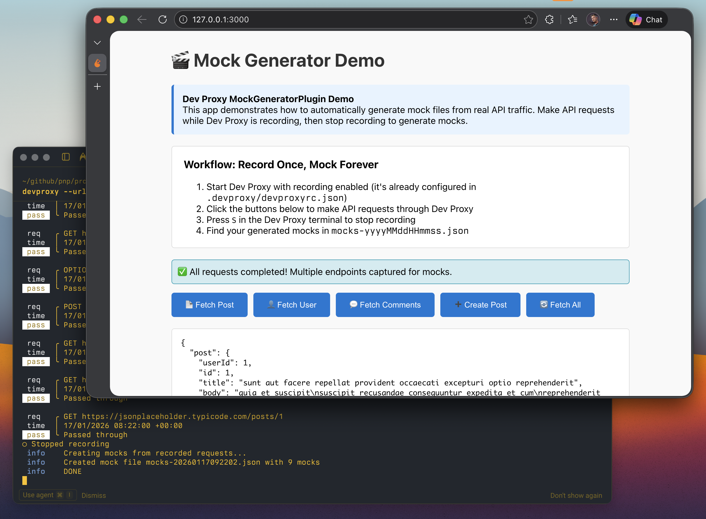

# Auto-generate mocks from production traffic

## Summary

This sample demonstrates how to use Dev Proxy's MockGeneratorPlugin to automatically generate mock files from real API traffic. Instead of manually creating mock responses, you can record actual API interactions and have Dev Proxy generate the mocks for you. This enables a powerful "record once, mock forever" workflow for offline development.



## Compatibility


## Contributors

* [Copilot](https://github.com/copilot)

## Version history

Version|Date|Comments
-------|----|--------
1.0|January 6, 2026|Initial release

## Minimal path to awesome

* Clone this repository (or [download this solution as a .ZIP file](https://pnp.github.io/download-partial/?url=https://github.com/pnp/proxy-samples/tree/main/samples/mock-from-real-api) then unzip it)
* Start Dev Proxy with recording enabled, specifying the path to the config file and the URL of the API you want to record: `devproxy --config-file devproxyrc.json --urls-to-watch "https://jsonplaceholder.typicode.com/*" --record`
* Use your application or make API requests to capture real responses:
  ```bash
  # Example: Make some requests to capture
  curl -ikx http://127.0.0.1:8000 https://jsonplaceholder.typicode.com/posts/1
  curl -ikx http://127.0.0.1:8000 https://jsonplaceholder.typicode.com/users/1
  curl -ikx http://127.0.0.1:8000 -X POST https://jsonplaceholder.typicode.com/posts \
    -H "Content-Type: application/json" \
    -d '{"title":"New Post","body":"Post content","userId":1}'
  ```
* Stop Dev Proxy by pressing `Ctrl+C` or by pressing `S` to stop recording
* Find the generated mock file `mocks-yyyyMMddHHmmss.json` in your current working folder
* Use the generated mocks for offline development by updating your Dev Proxy config to use MockResponsePlugin with the generated mocks file

## Features

This sample provides a preset for automatically generating mock files from intercepted API traffic.

**Workflow:**
1. **Record** - Start Dev Proxy with the `--record` flag to capture real API responses
2. **Interact** - Use your application normally, making requests to the APIs you want to mock
3. **Generate** - Stop recording and Dev Proxy automatically creates a mocks file
4. **Reuse** - Use the generated mocks file with MockResponsePlugin for offline development

**Key Benefits:**
* **No manual mock creation** - Mocks are generated automatically from actual API responses
* **Accurate responses** - Captured responses reflect real API behavior including headers and status codes
* **Quick setup** - Get working mocks in minutes instead of hours of manual work
* **Offline development** - Once mocks are generated, no internet connection needed
* **Consistent testing** - Use the same mocks across your team for reliable test results

Using this sample you can use Dev Proxy to:

* Capture real API responses and generate mock files automatically
* Enable offline development without manual mock file creation
* Create accurate mocks that match production API behavior
* Quickly prototype and test applications with realistic data

## Using generated mocks

After generating mocks, create a new config file to use them with MockResponsePlugin:

```json
{
  "$schema": "https://raw.githubusercontent.com/dotnet/dev-proxy/main/schemas/v2.0.0/rc.schema.json",
  "plugins": [
    {
      "name": "MockResponsePlugin",
      "enabled": true,
      "pluginPath": "~appFolder/plugins/DevProxy.Plugins.dll",
      "configSection": "mockResponsePlugin"
    }
  ],
  "urlsToWatch": [
    "https://jsonplaceholder.typicode.com/*"
  ],
  "mockResponsePlugin": {
    "$schema": "https://raw.githubusercontent.com/dotnet/dev-proxy/main/schemas/v2.0.0/mockresponseplugin.schema.json",
    "mocksFile": "mocks-yyyyMMddHHmmss.json"
  }
}
```

## Help

We do not support samples, but this community is always willing to help, and we want to improve these samples. We use GitHub to track issues, which makes it easy for community members to volunteer their time and help resolve issues.

You can try looking at [issues related to this sample](https://github.com/pnp/proxy-samples/issues?q=label%3A%22sample%3A%20mock-from-real-api%22) to see if anybody else is having the same issues.

If you encounter any issues using this sample, [create a new issue](https://github.com/pnp/proxy-samples/issues/new).

Finally, if you have an idea for improvement, [make a suggestion](https://github.com/pnp/proxy-samples/issues/new).

## Disclaimer

**THIS CODE IS PROVIDED *AS IS* WITHOUT WARRANTY OF ANY KIND, EITHER EXPRESS OR IMPLIED, INCLUDING ANY IMPLIED WARRANTIES OF FITNESS FOR A PARTICULAR PURPOSE, MERCHANTABILITY, OR NON-INFRINGEMENT.**


