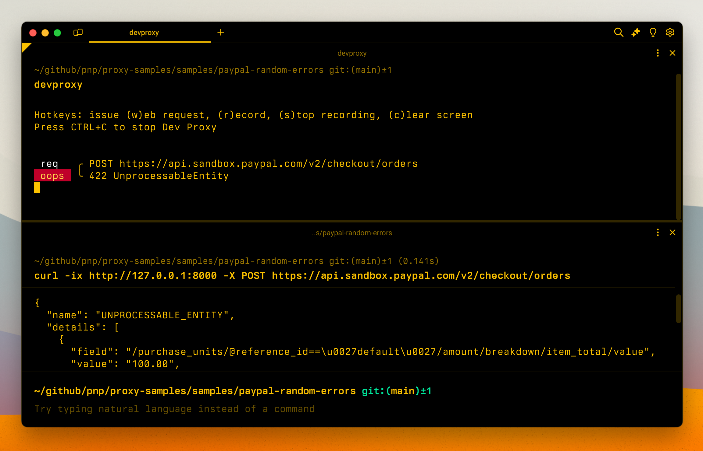

# Simulate random errors on PayPal APIs

## Summary

This sample contains a preset to simulate random errors on PayPal APIs. Sample errors are modeled after the information from the official [PayPal Postman collection](https://www.postman.com/paypal/workspace/paypal-public-api-workspace/overview).

## Compatibility

## Contributors

- [Waldek Mastykarz](https://github.com/waldekmastykarz)

## Version history

Version|Date|Comments
-------|----|--------
1.1|June 27, 2025|Updated to Dev Proxy v0.29.2
1.0|July 9, 2024|Initial release

## Minimal path to awesome

- Get the preset, by running `devproxy preset get paypal-random-errors`
- Start Dev Proxy with the preset, by running `devproxy --config-file "~appFolder/presets/paypal-random-errors/devproxyrc.json"`

## Features

- simulate relevant random errors for PayPal APIs

## Help

We do not support samples, but this community is always willing to help, and we want to improve these samples. We use GitHub to track issues, which makes it easy for  community members to volunteer their time and help resolve issues.

You can try looking at [issues related to this sample](https://github.com/pnp/proxy-samples/issues?q=label%3A%22sample%3A%paypal-random-errors%22) to see if anybody else is having the same issues.

If you encounter any issues using this sample, [create a new issue](https://github.com/pnp/proxy-samples/issues/new).

Finally, if you have an idea for improvement, [make a suggestion](https://github.com/pnp/proxy-samples/issues/new).

## Disclaimer

**THIS CODE IS PROVIDED *AS IS* WITHOUT WARRANTY OF ANY KIND, EITHER EXPRESS OR IMPLIED, INCLUDING ANY IMPLIED WARRANTIES OF FITNESS FOR A PARTICULAR PURPOSE, MERCHANTABILITY, OR NON-INFRINGEMENT.**

