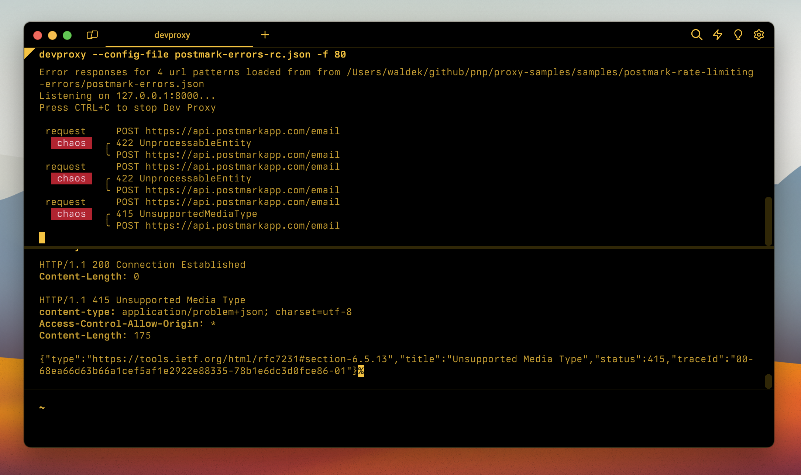
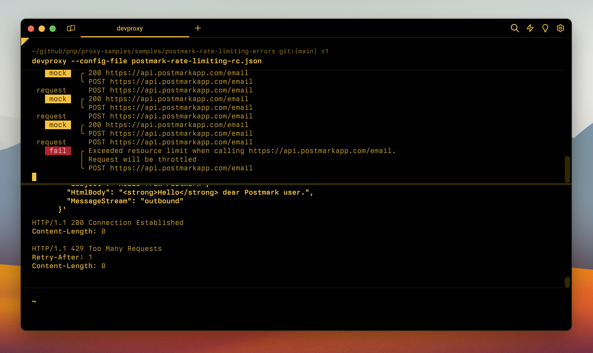

# Simulate rate limiting and errors on Postmark APIs

## Summary

This sample contains a preset to simulate rate limiting and random errors on Postmark APIs. Postmark APIs support rate limiting, which is a mechanism that informs developers of the available server resources and allows them to increase the data throughput by staying under the rate limits and avoiding throttling.

## Compatibility

## Contributors

- [Waldek Mastykarz](https://github.com/waldekmastykarz)

## Version history

Version|Date|Comments
-------|----|--------
1.0|January 7, 2024|Initial release

## Minimal path to awesome

- Clone this repository (or [download this solution as a .ZIP file](https://pnp.github.io/download-partial/?url=https://github.com/pnp/proxy-samples/tree/main/samples/postmark-rate-limiting-errors) then unzip it)
- Start Dev Proxy specifying the path to one of the config files, eg. `devproxy --config-file postmark-rate-limiting-rc.json`

## Features

- simulate rate limiting on Postmark APIs using the `postmark-rate-limiting-rc.json` preset
- simulate several Postmark API errors using the `postmark-errors-rc.json` preset

For more information about the configuration options, see the [documentation of the RateLimitingPlugin](https://learn.microsoft.com/microsoft-cloud/dev/dev-proxy/technical-reference/ratelimitingplugin).

## Help

We do not support samples, but this community is always willing to help, and we want to improve these samples. We use GitHub to track issues, which makes it easy for  community members to volunteer their time and help resolve issues.

You can try looking at [issues related to this sample](https://github.com/pnp/proxy-samples/issues?q=label%3A%22sample%3A%postmark-rate-limiting-errors%22) to see if anybody else is having the same issues.

If you encounter any issues using this sample, [create a new issue](https://github.com/pnp/proxy-samples/issues/new).

Finally, if you have an idea for improvement, [make a suggestion](https://github.com/pnp/proxy-samples/issues/new).

## Disclaimer

**THIS CODE IS PROVIDED *AS IS* WITHOUT WARRANTY OF ANY KIND, EITHER EXPRESS OR IMPLIED, INCLUDING ANY IMPLIED WARRANTIES OF FITNESS FOR A PARTICULAR PURPOSE, MERCHANTABILITY, OR NON-INFRINGEMENT.**

