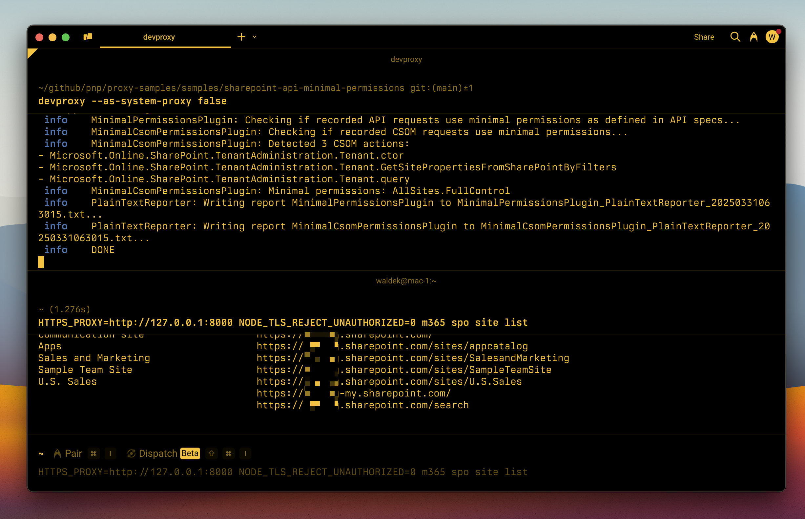

# SharePoint API minimal permissions

## Summary

Preset to detect minimal permissions for SharePoint REST and CSOM APIs.

## Compatibility

## Contributors

- [Waldek Mastykarz](https://github.com/waldekmastykarz)

## Version history

Version|Date|Comments
-------|----|--------
1.0|March 31, 2025|Initial release

## Minimal path to awesome

- Get the preset using Dev Proxy by running `devproxy preset get sharepoint-api-minimal-permissions`
- Start Dev Proxy with the config file, by running `devproxy --config-file "~appFolder/presets/sharepoint-api-minimal-permissions/devproxyrc.json" --env tenant=your-tenant-name`. `your-tenant-name` is the name of your Microsoft 365 tenant without `.onmicrosoft.com`, for example `contoso`.
- Call SharePoint APIs.
- Stop recording, by pressing `s` in the Dev Proxy session.
- Check out the output in the console and the generated reports for the minimal permissions required by the SharePoint APIs you called.

## Features

Detect minimal permissions for SharePoint REST and CSOM APIs. This preset contains an OpenAPI spec of SharePoint REST APIs and documentation of permissions required by SharePoint CSOM APIs. Using this information allows you to effortlessly find out the minimal permissions that your app needs to use the select SharePoint APIs.

> [!IMPORTANT]  
> Both the SharePoint REST API OpenAPI spec and the SharePoint CSOM API documentation are still in development. We'd appreciate your help in documenting the SharePoint REST API and CSOM surface.

For more information about the configuration options, see the documentation of the [MinimalPermissionsPlugin](https://learn.microsoft.com/microsoft-cloud/dev/dev-proxy/technical-reference/minimalpermissionsplugin) and [MinimalCsomPermissionsPlugin](https://learn.microsoft.com/microsoft-cloud/dev/dev-proxy/technical-reference/minimalcsompermissionsplugin).

## Help

We do not support samples, but this community is always willing to help, and we want to improve these samples. We use GitHub to track issues, which makes it easy for  community members to volunteer their time and help resolve issues.

You can try looking at [issues related to this sample](https://github.com/pnp/proxy-samples/issues?q=label%3A%22sample%3A%sharepoint-api-minimal-permissions%22) to see if anybody else is having the same issues.

If you encounter any issues using this sample, [create a new issue](https://github.com/pnp/proxy-samples/issues/new).

Finally, if you have an idea for improvement, [make a suggestion](https://github.com/pnp/proxy-samples/issues/new).

## Disclaimer

**THIS CODE IS PROVIDED *AS IS* WITHOUT WARRANTY OF ANY KIND, EITHER EXPRESS OR IMPLIED, INCLUDING ANY IMPLIED WARRANTIES OF FITNESS FOR A PARTICULAR PURPOSE, MERCHANTABILITY, OR NON-INFRINGEMENT.**

