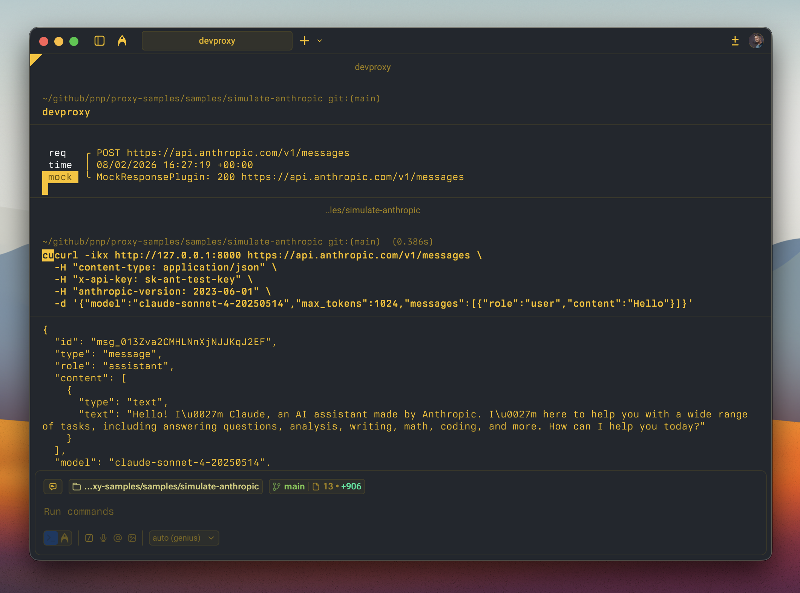

# Simulate the Anthropic Claude API

## Summary

This sample contains a preset and mock responses that allow you to simulate the Anthropic Claude Messages API using Dev Proxy. Simulating the Claude API is useful when you're working on parts of your app that don't require a real response from Claude and don't want to incur unnecessary API costs.



## Compatibility


## Contributors

- [Waldek Mastykarz](https://github.com/waldekmastykarz)

## Version history

Version|Date|Comments
-------|----|--------
1.3|May 30, 2026|Updated to Dev Proxy v3.0.0
1.2|March 26, 2026|Updated to Dev Proxy v2.3.0
1.1|March 11, 2026|Updated to Dev Proxy v2.2.0
1.0|February 8, 2026|Initial release

## Minimal path to awesome

- Get the sample:
  - Download just this sample:

      ```bash
      npx gitload-cli https://github.com/pnp/proxy-samples/tree/main/samples/simulate-anthropic
      ```

    or

  - [Download as a .ZIP file](https://pnp.github.io/download-partial/?url=https://github.com/pnp/proxy-samples/tree/main/samples/simulate-anthropic) and unzip it, or
  - Clone this repository
- Start Dev Proxy by running `devproxy`
- Test with: `curl -ikx http://127.0.0.1:8000 https://api.anthropic.com/v1/messages -d '{"model":"claude-sonnet-4-20250514","max_tokens":1024,"messages":[{"role":"user","content":"Hello"}]}' -H "content-type: application/json" -H "x-api-key: sk-ant-test" -H "anthropic-version: 2023-06-01"`

## Features

Using this sample you can:

- Simulate responses from the Anthropic Claude Messages API without needing an API key
- Avoid incurring API costs during development and testing
- Develop and test your app's UI and integration logic with realistic Claude response shapes

The mock response follows the official Anthropic Messages API response format, including the `usage` object with token counts and realistic `anthropic-ratelimit-*` headers.

To customize the mock response, edit the [.devproxy/mocks.json](.devproxy/mocks.json) file. You can add additional mock responses for different scenarios, such as tool use, extended thinking, or multi-turn conversations.

## Help

We do not support samples, but this community is always willing to help, and we want to improve these samples. We use GitHub to track issues, which makes it easy for  community members to volunteer their time and help resolve issues.

You can try looking at [issues related to this sample](https://github.com/pnp/proxy-samples/issues?q=label%3A%22sample%3A%20simulate-anthropic%22) to see if anybody else is having the same issues.

If you encounter any issues using this sample, [create a new issue](https://github.com/pnp/proxy-samples/issues/new).

Finally, if you have an idea for improvement, [make a suggestion](https://github.com/pnp/proxy-samples/issues/new).

## Disclaimer

**THIS CODE IS PROVIDED *AS IS* WITHOUT WARRANTY OF ANY KIND, EITHER EXPRESS OR IMPLIED, INCLUDING ANY IMPLIED WARRANTIES OF FITNESS FOR A PARTICULAR PURPOSE, MERCHANTABILITY, OR NON-INFRINGEMENT.**


