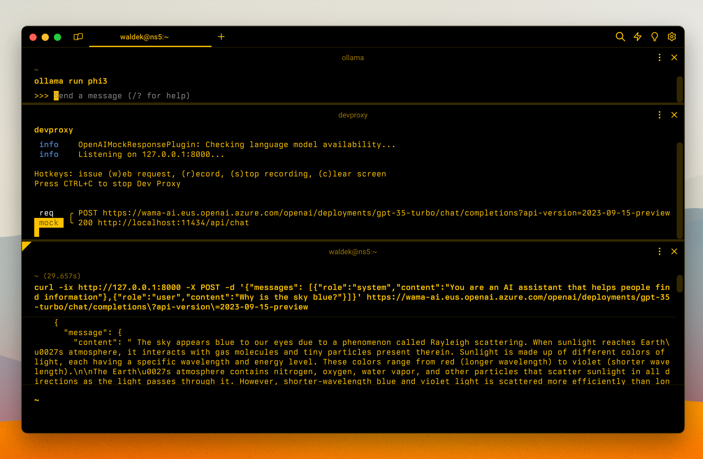

# Simulate Azure OpenAI API

## Summary

This sample contains a preset that allows you to easily simulate the Azure OpenAI API using Dev Proxy. Simulating Azure OpenAI using Dev Proxy is useful when you're working on parts of your app that don't require a real-response from an LLM and don't want to incur unnecessary costs.

## Compatibility

## Contributors

- [Waldek Mastykarz](https://github.com/waldekmastykarz)

## Version history

Version|Date|Comments
-------|----|--------
1.1|June 27, 2025|Updated to Dev Proxy v0.29.2
1.0|June 17, 2024|Initial release

## Minimal path to awesome

- Download the preset using Dev Proxy by running: `devproxy preset get simulate-azure-openai`
- Start Ollama with the llama3.2 model: `ollama run llama3.2`
- Start Dev Proxy specifying the path to the config file: `devproxy --config-file "~appFolder/presets/simulate-azure-openai/simulate-azure-openai.json"`
- Use your app

## Features

This is a generic preset for simulating Azure OpenAI API using Ollama. By default, the preset uses the llama3.2 model, but you can use a different model by updating the configuration file.

For more information about the configuration options, see the documentation of the [OpenAIMockResponsePlugin](https://learn.microsoft.com/microsoft-cloud/dev/dev-proxy/technical-reference/openaimockresponseplugin).

## Help

We do not support samples, but this community is always willing to help, and we want to improve these samples. We use GitHub to track issues, which makes it easy for  community members to volunteer their time and help resolve issues.

You can try looking at [issues related to this sample](https://github.com/pnp/proxy-samples/issues?q=label%3A%22sample%3A%simulate-azure-openai%22) to see if anybody else is having the same issues.

If you encounter any issues using this sample, [create a new issue](https://github.com/pnp/proxy-samples/issues/new).

Finally, if you have an idea for improvement, [make a suggestion](https://github.com/pnp/proxy-samples/issues/new).

## Disclaimer

**THIS CODE IS PROVIDED *AS IS* WITHOUT WARRANTY OF ANY KIND, EITHER EXPRESS OR IMPLIED, INCLUDING ANY IMPLIED WARRANTIES OF FITNESS FOR A PARTICULAR PURPOSE, MERCHANTABILITY, OR NON-INFRINGEMENT.**

