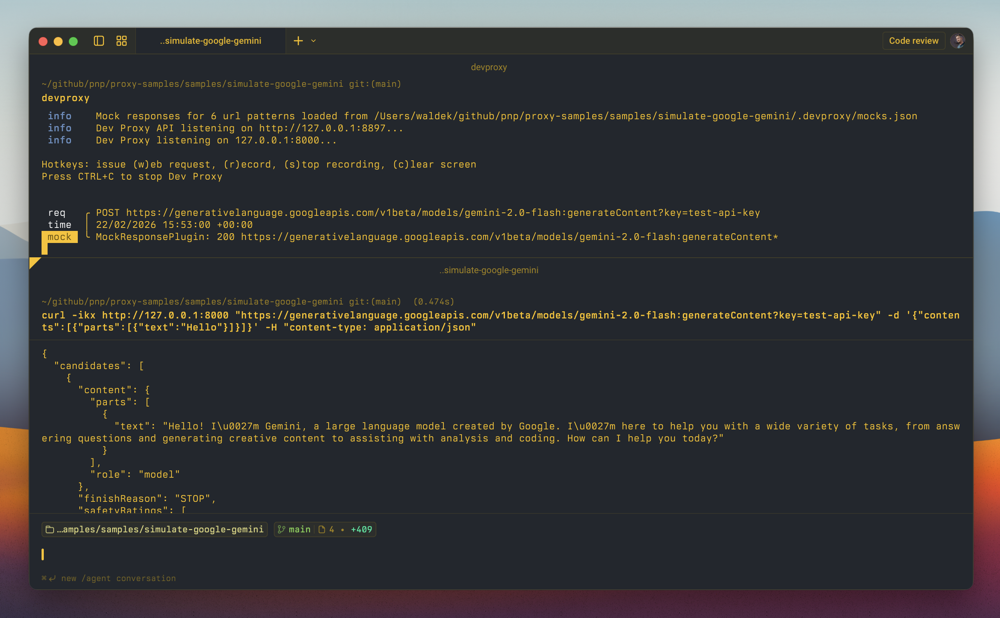

# Simulate the Google Gemini API

## Summary

This sample contains mock responses that allow you to simulate the Google Gemini API using Dev Proxy. Simulating the Gemini API is useful when you're working on parts of your app that don't require a real response from Gemini and don't want to incur unnecessary API costs.



## Compatibility


## Contributors

- [Waldek Mastykarz](https://github.com/waldekmastykarz)

## Version history

Version|Date|Comments
-------|----|--------
1.5|July 1, 2026|Updated to Dev Proxy v3.1.0
1.4|June 17, 2026|Updated to Dev Proxy v3.0.1
1.3|May 30, 2026|Updated to Dev Proxy v3.0.0
1.2|March 26, 2026|Updated to Dev Proxy v2.3.0
1.1|March 11, 2026|Updated to Dev Proxy v2.2.0
1.0|February 22, 2026|Initial release

## Minimal path to awesome

- Get the sample:
  - Download just this sample:

      ```bash
      npx gitload-cli https://github.com/pnp/proxy-samples/tree/main/samples/simulate-google-gemini
      ```

    or

  - [Download as a .ZIP file](https://pnp.github.io/download-partial/?url=https://github.com/pnp/proxy-samples/tree/main/samples/simulate-google-gemini) and unzip it, or
  - Clone this repository
- Start Dev Proxy by running `devproxy`
- Test with: `curl -ikx http://127.0.0.1:8000 "https://generativelanguage.googleapis.com/v1beta/models/gemini-2.0-flash:generateContent?key=test-api-key" -d '{"contents":[{"parts":[{"text":"Hello"}]}]}' -H "content-type: application/json"`

## Features

Using this sample you can:

- Simulate responses from the Google Gemini `generateContent` endpoint without needing an API key
- Simulate responses from the `countTokens` endpoint
- Simulate responses from the `embedContent` endpoint
- Simulate listing and retrieving model information
- Avoid incurring API costs during development and testing
- Develop and test your app's UI and integration logic with realistic Gemini response shapes

The mock responses follow the official Google Gemini API response format, including `usageMetadata` with token counts and `safetyRatings`.

To customize the mock responses, edit the [.devproxy/mocks.json](.devproxy/mocks.json) file. You can add additional mock responses for different scenarios, such as function calling, thinking, or multi-turn conversations.

## Help

We do not support samples, but this community is always willing to help, and we want to improve these samples. We use GitHub to track issues, which makes it easy for  community members to volunteer their time and help resolve issues.

You can try looking at [issues related to this sample](https://github.com/pnp/proxy-samples/issues?q=label%3A%22sample%3A%20simulate-google-gemini%22) to see if anybody else is having the same issues.

If you encounter any issues using this sample, [create a new issue](https://github.com/pnp/proxy-samples/issues/new).

Finally, if you have an idea for improvement, [make a suggestion](https://github.com/pnp/proxy-samples/issues/new).

## Disclaimer

**THIS CODE IS PROVIDED *AS IS* WITHOUT WARRANTY OF ANY KIND, EITHER EXPRESS OR IMPLIED, INCLUDING ANY IMPLIED WARRANTIES OF FITNESS FOR A PARTICULAR PURPOSE, MERCHANTABILITY, OR NON-INFRINGEMENT.**


