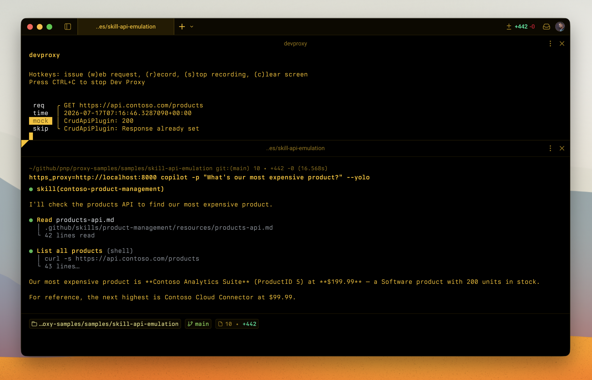
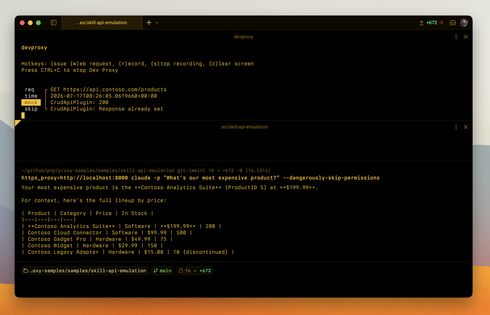
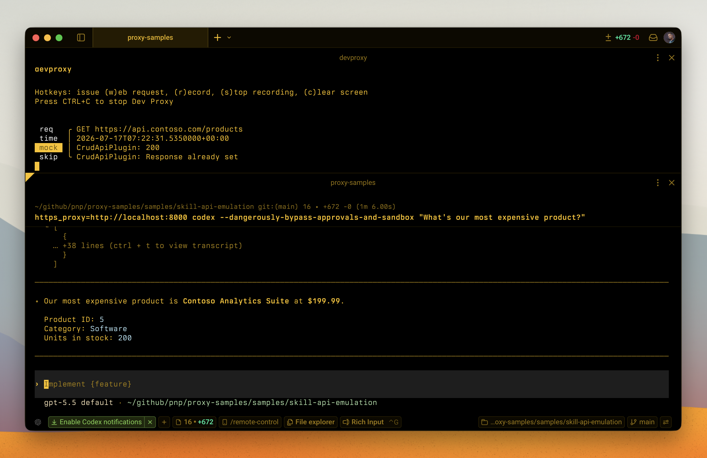

# Emulate an API used by an agent skill

## Summary

This sample shows how to use Dev Proxy to emulate a CRUD API that an agent skill interacts with. By emulating the API, you can develop and test your skill without needing access to the real backend. The sample includes a Dev Proxy configuration that emulates a product catalog and order management API, along with an agent skill that performs GET, PATCH, and DELETE operations against it.

## Compatibility

## Contributors

- [Waldek Mastykarz](https://github.com/waldekmastykarz)

## Version history

Version|Date|Comments
-------|----|--------
1.0|July 17, 2026|Initial release

## Minimal path to awesome

- Clone this repository (or [download this solution as a .ZIP file](https://pnp.github.io/download-partial/?url=https://github.com/pnp/proxy-samples/tree/main/samples/skill-api-emulation) then unzip it)
- From the sample folder:
  - Start Dev Proxy: `devproxy`
  - Start your agent with proxying the traffic through Dev Proxy, eg. `https_proxy=http://127.0.0.1:8000 copilot`

### Sample prompts

Try these prompts with your agent to see the skill in action:

Prompt|Description
------|----------
"Show me all products in the catalog"|Lists all available products
"What's the price of the Contoso Widget?"|Retrieves a specific product
"Update the Contoso Gadget Pro price to 59.99"|Updates a product property
"Discontinue the Legacy Adapter"|Sets a product as discontinued
"Show me all pending orders"|Lists orders filtered by status
"Mark order 1003 as shipped"|Updates an order status
"Cancel order 1004"|Deletes an order
"Which products are low on stock?"|Lists products and checks inventory levels

## Features

This sample supports the following coding agents:

- GitHub Copilot CLI
- OpenAI Codex CLI
- Anthropic Claude Code CLI

This sample demonstrates how to:

- Emulate a CRUD API using Dev Proxy's CrudApiPlugin
- Define a skill that operates against the emulated API
- Perform read (GET), update (PATCH), and delete (DELETE) operations from a skill
- Develop and test skills without access to the real backend API

### API endpoints

#### Products (`https://api.contoso.com/products`)

Method|Endpoint|Description
------|--------|----------
GET|`/products`|List all products
GET|`/products/{id}`|Get a specific product
POST|`/products`|Create a product
PATCH|`/products/{id}`|Update a product
DELETE|`/products/{id}`|Delete a product

#### Orders (`https://api.contoso.com/orders`)

Method|Endpoint|Description
------|--------|----------
GET|`/orders`|List all orders
GET|`/orders/{id}`|Get a specific order
POST|`/orders`|Create an order
PATCH|`/orders/{id}`|Update an order
DELETE|`/orders/{id}`|Delete an order

### Skill

The `SKILL.md` file contains an agent skill that manages products and orders. It includes operations for listing, retrieving, updating, and deleting items through the emulated API.

## Help

We do not support samples, but this community is always willing to help, and we want to improve these samples. We use GitHub to track issues and make improvements to the sample. If you encounter any issues while using this sample, [report a bug](https://github.com/pnp/proxy-samples/issues/new?assignees=&labels=Needs%3A+Triage+%3Amag%3A%2Ctype%3Abug-suspected&template=bug-report.yml&sample=skill-api-emulation&authors=@waldekmastykarz&title=skill-api-emulation+-+).

For questions regarding Dev Proxy, [join the Microsoft 365 Platform Community Discord server](https://aka.ms/community/discord).

If you encounter any issues while using Dev Proxy, please [report a bug](https://aka.ms/devproxy/issue).

## Disclaimer

**THIS CODE IS PROVIDED *AS IS* WITHOUT WARRANTY OF ANY KIND, EITHER EXPRESS OR IMPLIED, INCLUDING ANY IMPLIED WARRANTIES OF FITNESS FOR A PARTICULAR PURPOSE, MERCHANTABILITY, OR NON-INFRINGEMENT.**

