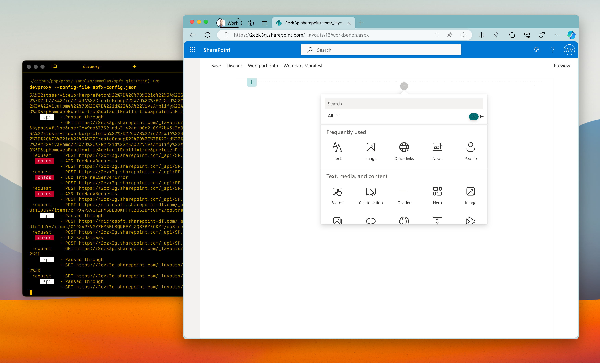

# Preset for SharePoint Framework solutions

## Summary

This sample contains a preset for simulating Microsoft Graph and SharePoint API errors for use with SharePoint Framework solutions. It contains specific URL exclusion rules to ensure that the API behind the hosted SPFx workbench is not intercepted by the proxy.

## Compatibility

## Contributors

- [Waldek Mastykarz](https://github.com/waldekmastykarz)

## Version history

Version|Date|Comments
-------|----|--------
1.6|January 18, 2026|Moved config files to .devproxy folder
1.5|January 5, 2026|Updated to Dev Proxy v2.0.0
1.4|June 27, 2025|Updated to Dev Proxy v0.29.2
1.3|October 28, 2024|Updated plugin name
1.2|January 17, 2024|Updated plugin path
1.1|November 14, 2023|Renamed to Dev Proxy
1.0|August 10, 2023|Initial release

## Minimal path to awesome

- Clone this repository (or [download this solution as a .ZIP file](https://pnp.github.io/download-partial/?url=https://github.com/pnp/proxy-samples/tree/main/samples/spfx) then unzip it)
- Start Dev Proxy specifying the path to one of the mock files, eg. `devproxy`

## Features

This preset contains the default Dev Proxy configuration extended with an exclusion of the pattern that matches APIs required by the hosted SharePoint Workbench so that they're not intercepted by the proxy and don't break the workbench.

## Help

We do not support samples, but this community is always willing to help, and we want to improve these samples. We use GitHub to track issues, which makes it easy for  community members to volunteer their time and help resolve issues.

You can try looking at [issues related to this sample](https://github.com/pnp/proxy-samples/issues?q=label%3A%22sample%3A%20spfx%22) to see if anybody else is having the same issues.

If you encounter any issues using this sample, [create a new issue](https://github.com/pnp/proxy-samples/issues/new).

Finally, if you have an idea for improvement, [make a suggestion](https://github.com/pnp/proxy-samples/issues/new).

## Disclaimer

**THIS CODE IS PROVIDED *AS IS* WITHOUT WARRANTY OF ANY KIND, EITHER EXPRESS OR IMPLIED, INCLUDING ANY IMPLIED WARRANTIES OF FITNESS FOR A PARTICULAR PURPOSE, MERCHANTABILITY, OR NON-INFRINGEMENT.**

