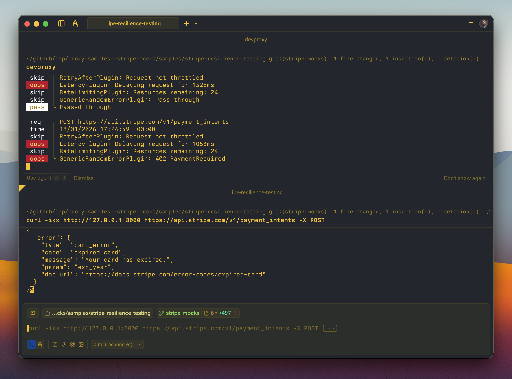

# Stripe API resilience testing

## Summary

Test how your app handles Stripe API errors, rate limiting, and slow responses using Dev Proxy. This sample complements [stripe-mock](https://github.com/stripe/stripe-mock) by adding chaos engineering capabilities that help you build more resilient payment integrations.



## Compatibility


## Contributors

- [Waldek Mastykarz](https://github.com/waldekmastykarz)

## Version history

Version|Date|Comments
-------|----|--------
1.0|January 18, 2026|Initial release

## Minimal path to awesome

1. Clone this repository (or [download this solution as a .ZIP file](https://pnp.github.io/download-partial/?url=https://github.com/pnp/proxy-samples/tree/main/samples/stripe-resilience-testing) then unzip it)
1. Start Dev Proxy:

    ```bash
    cd stripe-resilience-testing
    devproxy
    ```

1. Make requests to the Stripe API through the proxy to see random errors:

    ```bash
    # Try creating a payment intent - may get card_declined, insufficient_funds, etc.
    curl -ikx http://127.0.0.1:8000 https://api.stripe.com/v1/payment_intents -X POST

    # Try creating a charge - may get card errors or server errors
    curl -ikx http://127.0.0.1:8000 https://api.stripe.com/v1/charges -X POST

    # Run multiple requests quickly to trigger rate limiting
    for i in {1..30}; do curl -ikx http://127.0.0.1:8000 https://api.stripe.com/v1/customers; done
    ```

## Features

This sample simulates realistic failure scenarios for the Stripe API:

### Latency simulation

All requests are delayed between 200ms and 1500ms to simulate real-world network conditions and slow API responses.

### Rate limiting

The proxy simulates Stripe's rate limiting behavior:

- Limit: 25 requests per second
- Returns `429 Too Many Requests` with proper Stripe error format when exceeded
- Includes `RateLimit-*` headers and `stripe-should-retry: true`

### Random error injection (50% failure rate)

#### Payment-specific errors (402 Payment Required)

- `card_declined` - Generic decline
- `card_declined` with `insufficient_funds`
- `card_declined` with `lost_card`
- `card_declined` with `do_not_honor`
- `expired_card` - Card has expired
- `processing_error` - Temporary processing issue

#### Server errors (500, 503)

- `api_error` - Unexpected server error
- `api_error` - Service unavailable with `Retry-After` header

#### Request errors (400, 401, 409)

- `parameter_missing` - Missing required parameters
- `invalid_api_key` - Authentication failure
- `idempotency_error` - Idempotency key conflict

#### Resource-specific errors

- `charge_already_refunded` - Refund on already-refunded charge
- `invoice_no_customer_line_items` - Nothing to invoice

## Configuration

### Adjusting the failure rate

Change the error rate in [.devproxy/devproxyrc.json](.devproxy/devproxyrc.json):

```json
"stripeErrors": {
  "rate": 50  // Percentage of requests that will fail (0-100)
}
```

### Adjusting latency

Modify the latency range:

```json
"latencyPlugin": {
  "minMs": 200,
  "maxMs": 1500
}
```

### Adjusting rate limits

Configure rate limiting behavior:

```json
"rateLimitingStripe": {
  "rateLimit": 25,              // Requests allowed per window
  "resetTimeWindowSeconds": 1   // Window duration
}
```

### Running with specific plugins disabled

```bash
# No latency (faster testing)
devproxy --no-latency

# No random errors (only rate limiting)
devproxy -f 0
```

## Use cases

This sample is useful for:

- **Building resilient payment flows** - Test retry logic, error handling, and user-facing error messages
- **CI/CD pipeline testing** - Verify your app handles Stripe failures gracefully
- **Load testing** - Simulate rate limiting before hitting production limits
- **Chaos engineering** - Randomly inject failures to find weak points
- **Developer training** - Help developers understand Stripe error responses

## Complementing stripe-mock

[stripe-mock](https://github.com/stripe/stripe-mock) is great for:

- ✅ Request/response validation
- ✅ Happy path testing
- ✅ Complete API coverage from OpenAPI spec

This Dev Proxy sample adds:

- ✅ Random error injection
- ✅ Latency simulation
- ✅ Rate limiting simulation
- ✅ Chaos engineering scenarios

**Use both together** for comprehensive Stripe integration testing!

## Help

We do not support samples, but this community is always willing to help, and we want to improve these samples. We use GitHub to track issues, which makes it easy for community members to volunteer their time and help resolve issues.

You can try looking at [issues related to this sample](https://github.com/pnp/proxy-samples/issues?q=label%3A%22sample%3A%20stripe-resilience-testing%22) to see if anybody else is having the same issues.

If you encounter any issues using this sample, [create a new issue](https://github.com/pnp/proxy-samples/issues/new).

Finally, if you have an idea for improvement, [make a suggestion](https://github.com/pnp/proxy-samples/issues/new).

## Disclaimer

**THIS CODE IS PROVIDED *AS IS* WITHOUT WARRANTY OF ANY KIND, EITHER EXPRESS OR IMPLIED, INCLUDING ANY IMPLIED WARRANTIES OF FITNESS FOR A PARTICULAR PURPOSE, MERCHANTABILITY, OR NON-INFRINGEMENT.**


