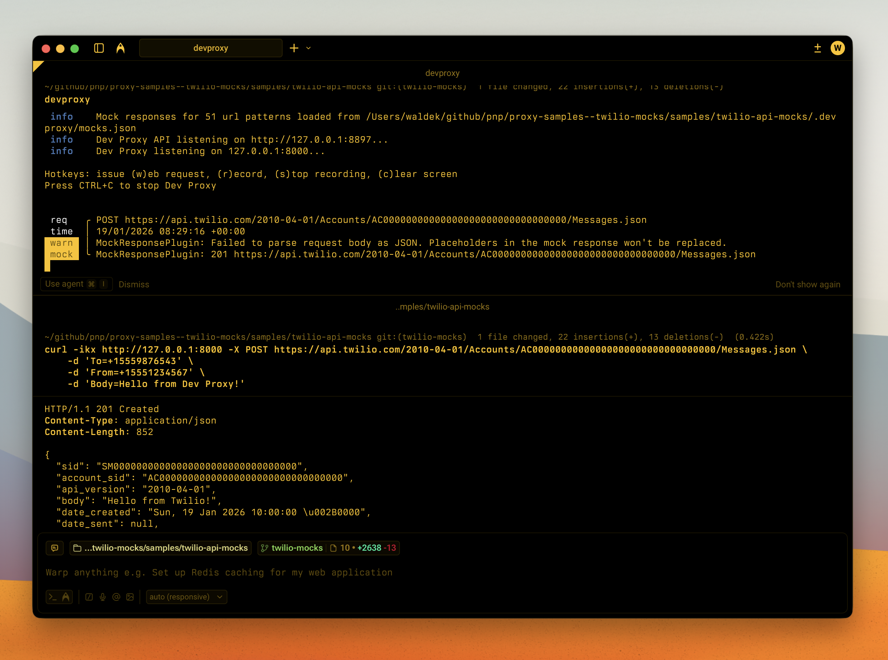

# Twilio API Mocks

Comprehensive mock responses for Twilio REST API to test messaging, voice, and phone number operations without live API calls



## Summary

This sample provides extensive mocks for the Twilio REST API (2010-04-01), enabling developers to build and test applications that integrate with Twilio without making actual API calls. It covers SMS messaging, voice calls, phone number management, conferences, queues, and recordings.

The mocks include realistic responses for common operations like sending messages, initiating calls, purchasing phone numbers, managing conference participants, and handling queue members.

For error simulation, rate limiting, and chaos engineering, see the [twilio-resilience-testing](../twilio-resilience-testing) sample.

## Compatibility


## Contributors

- [Waldek Mastykarz](https://github.com/waldekmastykarz)

## Version history

| Version | Date | Comments |
| ------- | ---------------- | --------------- |
| 1.0 | January 19, 2026 | Initial release |

## Minimal path to awesome

- Clone this repository (or [download this solution as a .ZIP file](https://pnp.github.io/download-partial/?url=https://github.com/pnp/proxy-samples/tree/main/samples/twilio-api-mocks) then unzip it)
- Start Dev Proxy with the configuration file from the sample:

  ```bash
  devproxy
  ```

- Send requests to the Twilio API with any tool, for example using curl:

  ```bash
  # List all messages
  curl -ikx http://127.0.0.1:8000 https://api.twilio.com/2010-04-01/Accounts/AC00000000000000000000000000000000/Messages.json

  # Send a message
  curl -ikx http://127.0.0.1:8000 -X POST https://api.twilio.com/2010-04-01/Accounts/AC00000000000000000000000000000000/Messages.json \
    -d 'To=+15559876543' \
    -d 'From=+15551234567' \
    -d 'Body=Hello from Dev Proxy!'

  # Make a call
  curl -ikx http://127.0.0.1:8000 -X POST https://api.twilio.com/2010-04-01/Accounts/AC00000000000000000000000000000000/Calls.json \
    -d 'To=+15559876543' \
    -d 'From=+15551234567' \
    -d 'Url=http://example.com/twiml'

  # Search available phone numbers
  curl -ikx http://127.0.0.1:8000 https://api.twilio.com/2010-04-01/Accounts/AC00000000000000000000000000000000/AvailablePhoneNumbers/US/Local.json

  # List conferences
  curl -ikx http://127.0.0.1:8000 https://api.twilio.com/2010-04-01/Accounts/AC00000000000000000000000000000000/Conferences.json
  ```

## Features

This sample provides mock responses for the following Twilio API resources:

### Accounts

- Create subaccounts (`POST /Accounts.json`)
- Fetch account details (`GET /Accounts/{AccountSid}.json`)
- List accounts (`GET /Accounts.json`)
- Update account (`POST /Accounts/{AccountSid}.json`)

### Messages

- Send SMS/MMS (`POST /Accounts/{AccountSid}/Messages.json`)
- Fetch message (`GET /Accounts/{AccountSid}/Messages/{MessageSid}.json`)
- List messages (`GET /Accounts/{AccountSid}/Messages.json`)
- Update message (redact) (`POST /Accounts/{AccountSid}/Messages/{MessageSid}.json`)
- Delete message (`DELETE /Accounts/{AccountSid}/Messages/{MessageSid}.json`)
- List message media (`GET /Accounts/{AccountSid}/Messages/{MessageSid}/Media.json`)
- Fetch media (`GET /Accounts/{AccountSid}/Messages/{MessageSid}/Media/{MediaSid}.json`)
- Delete media (`DELETE /Accounts/{AccountSid}/Messages/{MessageSid}/Media/{MediaSid}.json`)

### Calls

- Make a call (`POST /Accounts/{AccountSid}/Calls.json`)
- Fetch call (`GET /Accounts/{AccountSid}/Calls/{CallSid}.json`)
- List calls (`GET /Accounts/{AccountSid}/Calls.json`)
- Update call (`POST /Accounts/{AccountSid}/Calls/{CallSid}.json`)
- Delete call (`DELETE /Accounts/{AccountSid}/Calls/{CallSid}.json`)
- List call recordings (`GET /Accounts/{AccountSid}/Calls/{CallSid}/Recordings.json`)

### Incoming Phone Numbers

- Purchase phone number (`POST /Accounts/{AccountSid}/IncomingPhoneNumbers.json`)
- Fetch phone number (`GET /Accounts/{AccountSid}/IncomingPhoneNumbers/{PhoneNumberSid}.json`)
- List phone numbers (`GET /Accounts/{AccountSid}/IncomingPhoneNumbers.json`)
- List local numbers (`GET /Accounts/{AccountSid}/IncomingPhoneNumbers/Local.json`)
- List toll-free numbers (`GET /Accounts/{AccountSid}/IncomingPhoneNumbers/TollFree.json`)
- List mobile numbers (`GET /Accounts/{AccountSid}/IncomingPhoneNumbers/Mobile.json`)
- Update phone number (`POST /Accounts/{AccountSid}/IncomingPhoneNumbers/{PhoneNumberSid}.json`)
- Release phone number (`DELETE /Accounts/{AccountSid}/IncomingPhoneNumbers/{PhoneNumberSid}.json`)

### Available Phone Numbers

- List countries (`GET /Accounts/{AccountSid}/AvailablePhoneNumbers.json`)
- Fetch country (`GET /Accounts/{AccountSid}/AvailablePhoneNumbers/{CountryCode}.json`)
- Search local numbers (`GET /Accounts/{AccountSid}/AvailablePhoneNumbers/{CountryCode}/Local.json`)
- Search toll-free numbers (`GET /Accounts/{AccountSid}/AvailablePhoneNumbers/{CountryCode}/TollFree.json`)

### Conferences

- Fetch conference (`GET /Accounts/{AccountSid}/Conferences/{ConferenceSid}.json`)
- List conferences (`GET /Accounts/{AccountSid}/Conferences.json`)
- Update conference (`POST /Accounts/{AccountSid}/Conferences/{ConferenceSid}.json`)
- Add participant (`POST /Accounts/{AccountSid}/Conferences/{ConferenceSid}/Participants.json`)
- Fetch participant (`GET /Accounts/{AccountSid}/Conferences/{ConferenceSid}/Participants/{CallSid}.json`)
- List participants (`GET /Accounts/{AccountSid}/Conferences/{ConferenceSid}/Participants.json`)
- Update participant (mute/hold) (`POST /Accounts/{AccountSid}/Conferences/{ConferenceSid}/Participants/{CallSid}.json`)
- Remove participant (`DELETE /Accounts/{AccountSid}/Conferences/{ConferenceSid}/Participants/{CallSid}.json`)

### Queues

- Create queue (`POST /Accounts/{AccountSid}/Queues.json`)
- Fetch queue (`GET /Accounts/{AccountSid}/Queues/{QueueSid}.json`)
- List queues (`GET /Accounts/{AccountSid}/Queues.json`)
- Update queue (`POST /Accounts/{AccountSid}/Queues/{QueueSid}.json`)
- Delete queue (`DELETE /Accounts/{AccountSid}/Queues/{QueueSid}.json`)
- List members (`GET /Accounts/{AccountSid}/Queues/{QueueSid}/Members.json`)
- Fetch member (`GET /Accounts/{AccountSid}/Queues/{QueueSid}/Members/{CallSid}.json`)
- Fetch front member (`GET /Accounts/{AccountSid}/Queues/{QueueSid}/Members/Front.json`)
- Dequeue member (`POST /Accounts/{AccountSid}/Queues/{QueueSid}/Members/{CallSid}.json`)
- Dequeue front (`POST /Accounts/{AccountSid}/Queues/{QueueSid}/Members/Front.json`)

### Recordings

- Fetch recording (`GET /Accounts/{AccountSid}/Recordings/{RecordingSid}.json`)
- List recordings (`GET /Accounts/{AccountSid}/Recordings.json`)
- Delete recording (`DELETE /Accounts/{AccountSid}/Recordings/{RecordingSid}.json`)

## Sample Data

The mocks use the following sample SIDs that you can use in your requests:

| Resource | SID |
| -------- | --- |
| Account | `AC00000000000000000000000000000000` |
| Subaccount | `AC00000000000000000000000000000001` |
| Call | `CA00000000000000000000000000000000` |
| Message | `SM00000000000000000000000000000000` |
| Conference | `CF00000000000000000000000000000000` |
| Queue | `QU00000000000000000000000000000000` |
| Phone Number | `PN00000000000000000000000000000000` |
| Recording | `RE00000000000000000000000000000000` |
| Media | `ME00000000000000000000000000000000` |

## Help

We do not support samples, but this community is always willing to help, and we want to improve these samples. We use GitHub to track issues, which makes it easy for community members to volunteer their time and help resolve issues.

You can try looking at [issues related to this sample](https://github.com/pnp/proxy-samples/issues?q=label%3A%22sample%3A%20twilio-api-mocks%22) to see if anybody else is having the same issues.

If you encounter any issues using this sample, [create a new issue](https://github.com/pnp/proxy-samples/issues/new).

Finally, if you have an idea for improvement, [make a suggestion](https://github.com/pnp/proxy-samples/issues/new).

## Disclaimer

**THIS CODE IS PROVIDED *AS IS* WITHOUT WARRANTY OF ANY KIND, EITHER EXPRESS OR IMPLIED, INCLUDING ANY IMPLIED WARRANTIES OF FITNESS FOR A PARTICULAR PURPOSE, MERCHANTABILITY, OR NON-INFRINGEMENT.**


