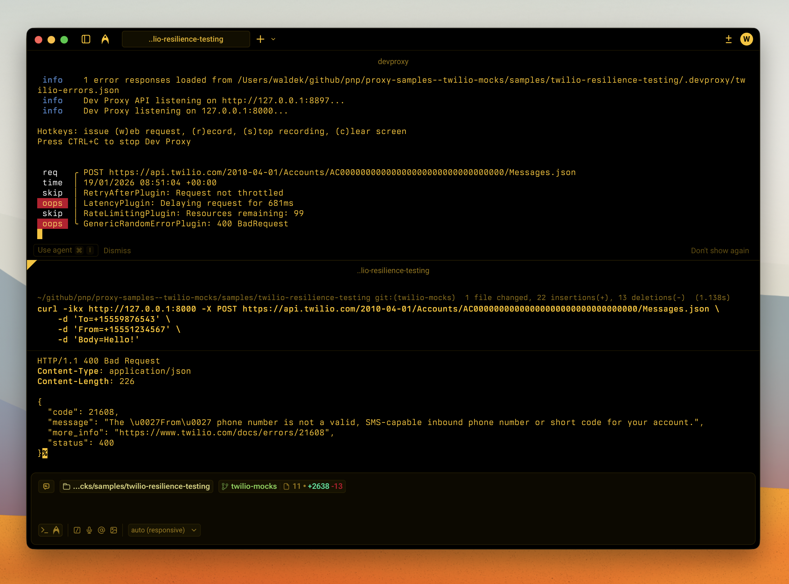

# Twilio API resilience testing

Test how your app handles Twilio API errors, rate limiting, and slow responses using Dev Proxy



## Summary

Test how your app handles Twilio API errors, rate limiting, and slow responses using Dev Proxy. This sample complements the [twilio-api-mocks](../twilio-api-mocks) sample by adding chaos engineering capabilities that help you build more resilient communication integrations.

## Compatibility


## Contributors

- [Waldek Mastykarz](https://github.com/waldekmastykarz)

## Version history

| Version | Date | Comments |
| ------- | ---------------- | --------------- |
| 1.0 | January 19, 2026 | Initial release |

## Minimal path to awesome

- Clone this repository (or [download this solution as a .ZIP file](https://pnp.github.io/download-partial/?url=https://github.com/pnp/proxy-samples/tree/main/samples/twilio-resilience-testing) then unzip it)
- Start Dev Proxy:

  ```bash
  devproxy
  ```

- Make requests to the Twilio API through the proxy to see random errors:

  ```bash
  # Try sending a message - may get authentication errors, invalid phone, etc.
  curl -ikx http://127.0.0.1:8000 -X POST https://api.twilio.com/2010-04-01/Accounts/AC00000000000000000000000000000000/Messages.json \
    -d 'To=+15559876543' \
    -d 'From=+15551234567' \
    -d 'Body=Hello!'

  # Try making a call - may get various errors
  curl -ikx http://127.0.0.1:8000 -X POST https://api.twilio.com/2010-04-01/Accounts/AC00000000000000000000000000000000/Calls.json \
    -d 'To=+15559876543' \
    -d 'From=+15551234567' \
    -d 'Url=http://example.com/twiml'

  # Run multiple requests quickly to trigger rate limiting
  for i in {1..150}; do curl -ikx http://127.0.0.1:8000 https://api.twilio.com/2010-04-01/Accounts/AC00000000000000000000000000000000.json; done
  ```

## Features

This sample simulates realistic failure scenarios for the Twilio API:

### Latency simulation

All requests are delayed between 200ms and 1500ms to simulate real-world network conditions and slow API responses.

### Rate limiting

The proxy simulates Twilio's rate limiting behavior:

- Limit: 100 requests per second
- Returns `429 Too Many Requests` with proper Twilio error format when exceeded
- Includes `Retry-After` header

### Random error injection (50% failure rate)

#### Authentication errors (401)

- `20003` - Authentication required

#### Request errors (400)

- `21211` - Invalid phone number
- `21602` - Message body required
- `21608` - From phone number not verified
- `30004` - Message blocked

#### Authorization errors (403)

- `20005` - Account not active

#### Not found errors (404)

- `20404` - Resource not found

#### Server errors (500, 503)

- `20500` - Internal server error
- `20503` - Service unavailable (with `Retry-After` header)

## Configuration

### Adjusting the failure rate

Change the error rate in [.devproxy/devproxyrc.json](.devproxy/devproxyrc.json):

```json
"twilioErrors": {
  "rate": 50  // Percentage of requests that will fail (0-100)
}
```

### Adjusting latency

Modify the latency range:

```json
"latencyPlugin": {
  "minMs": 200,
  "maxMs": 1500
}
```

### Adjusting rate limits

Configure rate limiting behavior:

```json
"rateLimitingTwilio": {
  "rateLimit": 100,             // Requests allowed per window
  "resetTimeWindowSeconds": 1   // Window duration
}
```

## Use cases

This sample is useful for:

- **Building resilient communication flows** - Test retry logic, error handling, and user-facing error messages
- **CI/CD pipeline testing** - Verify your app handles Twilio failures gracefully
- **Load testing** - Simulate rate limiting before hitting production limits
- **Chaos engineering** - Randomly inject failures to find weak points
- **Developer training** - Help developers understand Twilio error responses

## Complementing twilio-api-mocks

The [twilio-api-mocks](../twilio-api-mocks) sample is great for:

- ✅ Happy path testing with mock responses
- ✅ Offline development without Twilio credentials
- ✅ Consistent, predictable API responses

This Dev Proxy sample adds:

- ✅ Random error injection
- ✅ Latency simulation
- ✅ Rate limiting simulation
- ✅ Chaos engineering scenarios

**Use both together** for comprehensive Twilio integration testing!

## Help

We do not support samples, but this community is always willing to help, and we want to improve these samples. We use GitHub to track issues, which makes it easy for community members to volunteer their time and help resolve issues.

You can try looking at [issues related to this sample](https://github.com/pnp/proxy-samples/issues?q=label%3A%22sample%3A%20twilio-resilience-testing%22) to see if anybody else is having the same issues.

If you encounter any issues using this sample, [create a new issue](https://github.com/pnp/proxy-samples/issues/new).

Finally, if you have an idea for improvement, [make a suggestion](https://github.com/pnp/proxy-samples/issues/new).

## Disclaimer

**THIS CODE IS PROVIDED *AS IS* WITHOUT WARRANTY OF ANY KIND, EITHER EXPRESS OR IMPLIED, INCLUDING ANY IMPLIED WARRANTIES OF FITNESS FOR A PARTICULAR PURPOSE, MERCHANTABILITY, OR NON-INFRINGEMENT.**


