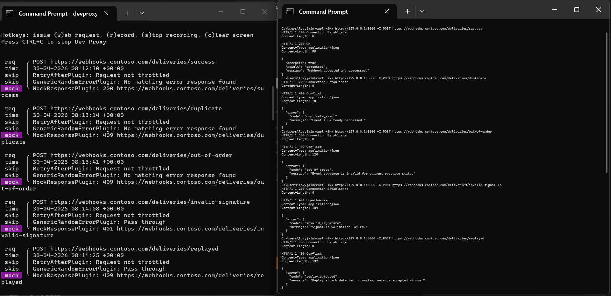
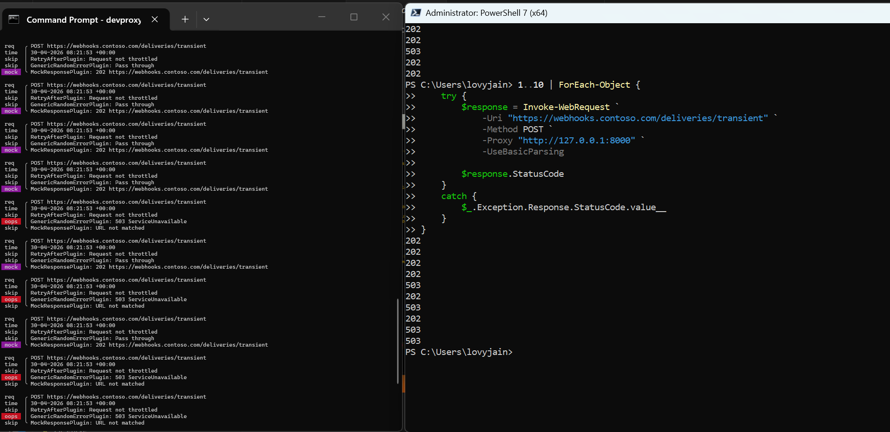

# Webhook delivery resilience testing

Test how your app handles it when the webhook endpoint you're calling rejects duplicates, returns auth errors, or is temporarily unavailable — using Dev Proxy.



## Summary

This sample simulates how a remote webhook endpoint can respond to your delivery attempts. Use it to validate how your sender handles duplicate-rejection errors, sequence conflicts, signature failures, and transient overloads.

Dev Proxy intercepts calls to `https://webhooks.contoso.com/deliveries/*` and 
returns the configured responses, so you can test locally before these failures 
surface in production.

## Typical use case

Imagine your app is a platform that notifies downstream services, like a merchant 
dashboard or a fulfilment system whenever key events occur. Your app sends events 
like `payment.created` or `payment.succeeded` to an external webhook endpoint it 
owns or manages. In real life, that endpoint may:

- Reject a delivery because it already processed that event ID
- Reject a delivery because events arrived out of order
- Reject a delivery because the signature doesn't match
- Be temporarily overloaded and ask you to retry later

This sample lets you test how your delivery code handles those responses locally 
before they happen in production.

## Compatibility


## Contributors

- [Lovy Jain](https://github.com/lovyjain)

## Version history

Version|Date|Comments
-------|----|--------
1.0|April 30, 2026|Initial release

## Minimal path to awesome

- Get the sample:
  - Download just this sample:

      ```bash
      npx gitload-cli https://github.com/pnp/proxy-samples/tree/main/samples/webhook-delivery-resilience
      ```

    or

  - [Download as a .ZIP file](https://pnp.github.io/download-partial/?url=https://github.com/pnp/proxy-samples/tree/main/samples/webhook-delivery-resilience) and unzip it, or
  - Clone this repository
- Start Dev Proxy:

  ```bash
  devproxy
  ```

- Exercise each scenario using curl through Dev Proxy:

  ```bash
  # Happy path
  curl -ikx http://127.0.0.1:8000 -X POST https://webhooks.contoso.com/deliveries/success

  # Duplicate event ID
  curl -ikx http://127.0.0.1:8000 -X POST https://webhooks.contoso.com/deliveries/duplicate

  # Out-of-order event sequence
  curl -ikx http://127.0.0.1:8000 -X POST https://webhooks.contoso.com/deliveries/out-of-order

  # Invalid signature
  curl -ikx http://127.0.0.1:8000 -X POST https://webhooks.contoso.com/deliveries/invalid-signature

  # Replay detection
  curl -ikx http://127.0.0.1:8000 -X POST https://webhooks.contoso.com/deliveries/replayed

  # Transient failure / eventual success path
  curl -ikx http://127.0.0.1:8000 -X POST https://webhooks.contoso.com/deliveries/transient

  # Run transient several times to see both outcomes (503 and 202)
  for i in {1..10}; do curl -ikx http://127.0.0.1:8000 -X POST https://webhooks.contoso.com/deliveries/transient; done
  ```

## Features

This sample includes deterministic and transient webhook behaviors:

- Duplicate event rejection (`409 duplicate_event`)
- Out-of-order event rejection (`409 out_of_order`)
- Signature validation failure (`401 invalid_signature`)
- Replay attack detection (`409 replay_detected`)
- Transient receiver overload with dynamic `Retry-After` (`503 delivery_backpressure`)
- Eventual success for transient delivery attempts (`202 queued`)

Note: the transient route uses a 50% error rate, so repeated calls intentionally alternate between temporary failure and success.



Using this sample you can:

- Verify idempotency implementation for webhook event IDs
- Test sequence validation logic for related event types
- Validate signature verification and replay-window checks
- Exercise retry logic that respects `Retry-After` headers

## Help

We do not support samples, but this community is always willing to help, and we want to improve these samples. We use GitHub to track issues, which makes it easy for community members to volunteer their time and help resolve issues.

You can try looking at [issues related to this sample](https://github.com/pnp/proxy-samples/issues?q=label%3A%22sample%3A%20webhook-delivery-resilience%22) to see if anybody else is having the same issues.

If you encounter any issues using this sample, [create a new issue](https://github.com/pnp/proxy-samples/issues/new).

Finally, if you have an idea for improvement, [make a suggestion](https://github.com/pnp/proxy-samples/issues/new).

## Disclaimer

**THIS CODE IS PROVIDED *AS IS* WITHOUT WARRANTY OF ANY KIND, EITHER EXPRESS OR IMPLIED, INCLUDING ANY IMPLIED WARRANTIES OF FITNESS FOR A PARTICULAR PURPOSE, MERCHANTABILITY, OR NON-INFRINGEMENT.**


